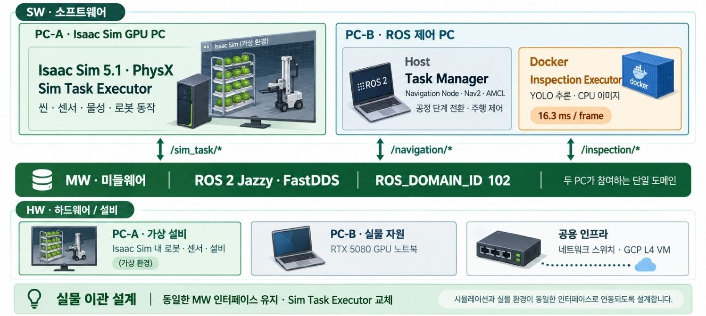
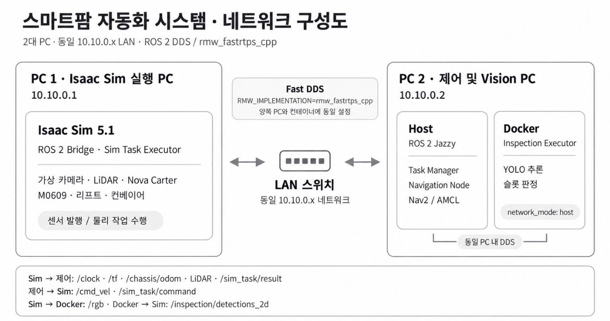
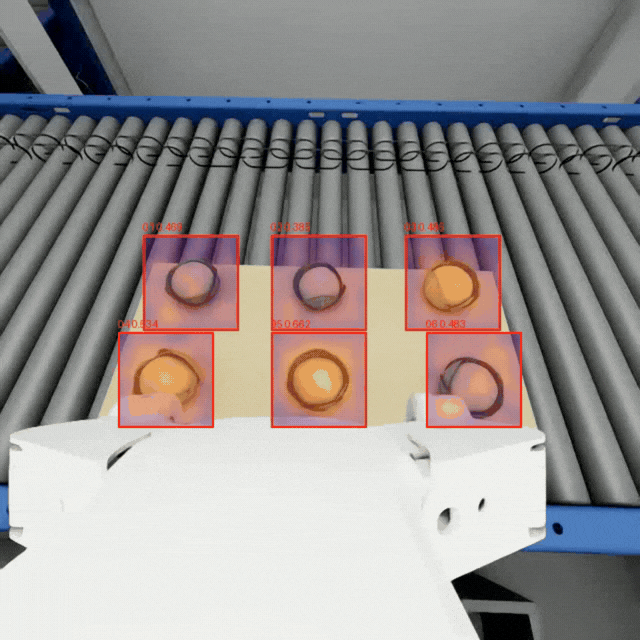

# 엽채류의 생육 주기에 따른 트레이 이동 관리 시스템

다단 수경재배형 스마트팜에서 재배 일정과 트레이 위치 정보를 기반으로 수확 이송 작업을 생성하고, AMR에 탑재한 M0609로 트레이 반출·운송·인계 공정을 수행하는 자동화 시스템의 적용 가능성을 시뮬레이션에서 검증하는 프로젝트다.


## 프로젝트 소개

공장형 엽채류 재배 시설의 수확 후 공정(post-harvest) 자동화 디지털 트윈을 Isaac Sim 환경에서 구축한다.

하나의 시뮬레이션 안에서도 이동 로봇, 로봇 팔, 검사 모델, 컨베이어는 서로 다른 시간과 실패 조건으로 움직인다. 이 프로젝트는 각 작업을 독립적인 Executor에 맡기고, Task Manager가 명령과 결과를 확인한 뒤 다음 단계로 넘어가도록 구성했다. 목표는 배추 팔레트의 랙 재배치부터 불량 제거와 출하까지 하나의 사이클로 연결하고, 실패 지점을 추적 가능하게 만드는 것이다.

현재 통합 시연의 기준은 **Isaac Sim 5.1·v015 장면·ROS 2 Jazzy·Nav2·YOLO 검사**다. 별도의 [PatchCore 실험](ml/cabbage_anomaly/README.md)은 합성 데이터의 이미지 단위 이상 탐지와 녹화 영상 시연을 다루며, 실시간 Task Manager 공정에는 연결되지 않는다.

| 구분 | 현재 구현 |
| --- | --- |
| 공정 제어 | `DEMO_HARVEST_01`의 12단계 명령, 결과 검증, 제한 시간·실패 처리 |
| 물리 작업 | 랙 팔레트 재배치, 수확 팔레트 운반, 검사·불량 제거·배출 |
| 이동·검사 | Nav2 접근 주행과 라이다 기반 정밀 도킹, YOLO 여섯 슬롯 판정 |
| 별도 ML 평가 | PatchCore 정상 ROI 학습, 검증 임계값 선정, 최종 테스트와 히트맵 영상 |

## 전체 공정 시나리오

`/start_cycle`에 `DEMO_HARVEST_01`을 요청하면 Task Manager가 세 Executor의 준비 상태를 확인하고 아래 작업을 순서대로 발행한다. 각 단계는 현재 명령과 식별자가 일치하는 `SUCCEEDED` 결과를 받아야 진행된다.

| 순서 | 작업 | 내용 |
| ---: | --- | --- |
| 1 | `TRANSFER` | PALLET_002를 L3→L2, PALLET_003을 L4→L3으로 재배치 |
| 2 | `PICK_HARVEST` | PALLET_001을 랙에서 인출해 운송 자세로 준비 |
| 3 | `NAVIGATION` | 검사대 접근점으로 주행하고 `FEEDER_DOCK`에 정밀 도킹 |
| 4 | `PLACE_INSPECT` | PALLET_001을 검사 컨베이어에 배치 |
| 5 | `CONVEY_TO_INSPECT` | 팔레트를 검사 정지점까지 반송 |
| 6 | `PREPARE_INSPECT` | 지그가 팔레트를 검사 작업 위치에 배치 |
| 7 | `MOVE_TO_INSPECT` | 검사 로봇을 카메라 자세로 이동 |
| 8 | `INSPECT` | 새 영상에서 배추 여섯 슬롯을 판정 |
| 9 | `CULL` | 불량 슬롯이 있을 때만 해당 배추를 분류함으로 제거 |
| 10 | `RECHECK` | 새 영상으로 제거 슬롯과 남은 배추를 재판정 |
| 11 | `RELEASE_INSPECT` | 지그를 복귀시키고 팔레트를 컨베이어로 되돌림 |
| 12 | `CONVEYOR_OUT` | 팔레트를 출하 구역으로 배출하고 사이클 종료 |

정상 팔레트는 `CULL`만 건너뛰고 `RECHECK → RELEASE_INSPECT → CONVEYOR_OUT`을 수행한다. 불량 팔레트는 최초 검사 데이터가 Sim에 저장된 것을 확인한 뒤 CULL로 진행한다. Task Manager의 상태는 `IDLE → PREFLIGHT → 단계별 작업 → COMPLETE`로 흐르며, 준비 실패·작업 실패·제한 시간 초과 시 `ERROR`에서 멈춘다. 상세 전이와 성공 조건은 [아키텍처](docs/01-architecture.md)와 [인터페이스 계약](docs/02-interfaces.md)에 있다.

## 시스템 구성



| 실행 위치 | 프로세스 | 역할 |
| --- | --- | --- |
| Isaac Sim PC | Standalone 앱·Sim Task Node | v015 장면, 물리·센서, 이송·CULL·컨베이어 명령 실행 |
| ROS 2 PC | Task Manager | 시나리오 순서, Executor 준비 상태, 명령 ID·결과·제한 시간 관리 |
| ROS 2 PC | Nav2·Navigation Executor | 목적지 이동과 라이다 기반 정밀 도킹 |
| GPU Docker 컨테이너 | Inspection Executor | `/rgb` 수신, YOLO 판정, 검사 결과와 2D 검출 발행 |

Isaac Sim PC와 ROS 2 PC는 같은 PC일 수도 있다. 분리 실행할 때는 같은 `ROS_DOMAIN_ID`에서 DDS 토픽이 전달되어야 한다.




주요 경계는 `/start_cycle` 서비스, `/cycle/status`, `/sim_task/*`, `/navigation/*`, `/inspection/*` 토픽이다. Task Manager는 실행 순서와 결과를 관리하고, 실제 동작의 성공 여부는 각 Executor가 판단한다. 메시지 타입과 필드, 검사 데이터의 CULL 연동은 [ROS 2 인터페이스 문서](docs/02-interfaces.md)를 참조한다.

## 주요 기능

### Task Manager 기반 공정 제어

전역 상태 머신이 활성 명령의 `task_id`·`command_id`·`operation`을 결과와 대조한다. 중복·오래된 결과는 다음 공정의 성공으로 사용하지 않는다. 단계별 제한 시간, Executor의 `READY` heartbeat, 물리 실패 후 재시작 조건을 관리한다.

### 랙 팔레트 이송

Nova Carter의 리프트와 M0609 포크 로봇이 두 팔레트를 순서대로 재배치한 뒤 수확 팔레트를 인출한다. 이송 완료는 화면상 이동만이 아니라 `TRANSFER` 결과의 두 `completed_units`로 확인한다.

### 자율주행과 정밀 도킹

Navigation Executor가 Nav2 `NavigateToPose`로 접근하고, 도킹 노드가 라이다 점군에서 RANSAC으로 검사대 면을 찾아 후진 정렬한다. 정렬 오차가 허용 범위를 벗어나면 물러나 다시 맞추며, 도킹 결과가 명령과 일치해야 공정이 이어진다. Nav2의 장애물 계층과 충돌 감시 설정은 [주행 설정](cobot3_ws/src/smart_farm_navigation/config/nav2_params.yaml)에 있다.

### YOLO 기반 배추 검사

별도 GPU 컨테이너가 명령 이후의 새 `/rgb` 프레임으로 여섯 슬롯을 검사한다. `lettuce_dark_green`은 정상, `lettuce_yellow`와 `lettuce_brown`은 불량으로 판정한다. 슬롯별 결과와 원본 영상의 2D 검출 정보를 Sim에 보내 CULL 대상과 연결한다. 누락·중복 등 미판정 슬롯은 검사 실패로 처리한다.

### RMPflow 기반 불량 배추 제거

Sim은 검사 슬롯을 장면의 배추 Prim에 연결하고 트레이 자세·슬롯 오프셋으로 파지 목표를 만든다. 검사 픽셀 좌표는 파지 목표로 직접 사용하지 않는다. 검사 로봇은 RMPflow로 불량 배추를 집어 yellow는 `SortBin_1`, brown은 `SortBin_2`로 배출한다. 실제 배출이 확인된 슬롯만 완료 결과에 포함한다.

### PatchCore 이미지 단위 이상 탐지

Isaac Sim 합성 장면에서 배추별 96×96 ROI를 만들고 정상 ROI 1,020장으로 PatchCore 특징 인덱스를 구성했다. 검증 데이터에서 이미지 단위 임계값을 정해 최종 테스트에 적용하고, 예측 히트맵을 녹화 영상에 표시한다. 이 실험은 위 YOLO 실시간 공정과 독립적으로 실행한다.



## 디지털 트윈과 프로젝트 구조

v015 USD 장면은 Nova Carter, 리프트, M0609 포크, 랙·팔레트, 검사 로봇·지그, 컨베이어와 센서를 포함한다. 통합 주행 지도는 [`Collected_smartfarm_v015.yaml`](cobot3_ws/src/smart_farm_navigation/maps/Collected_smartfarm_v015.yaml)이다. **v015 USD와 참조 자산은 Git 외부에서 준비해야 한다.** 다운로드·설치 구조·체크섬은 [v015 장면 자산 문서](docs/04-assets.md)에 정리했다.

```text
ROKEY_P3_A1/
├── cobot3_ws/src/
│   ├── smart_farm_interfaces/   # 공통 ROS 2 메시지·서비스
│   ├── smart_farm_manager/      # 시나리오와 Task Manager
│   ├── smart_farm_navigation/   # Nav2 설정·Navigation Executor·도킹
│   └── smart_farm_vision/       # YOLO Inspection Executor
│
├── cobot3_ws/isaacpjt/smart_farm/runtime/
│   └── standalone_app.py        # Isaac Sim 통합 실행 진입점
│
├── ml/cabbage_anomaly/         # PatchCore 학습·평가·영상 시연
├── docs/                       # 아키텍처·인터페이스·운영 가이드
└── compose.vision.yaml         # Vision GPU 컨테이너
```

## 설치와 실행

ROS 2 Jazzy·Nav2·Isaac Sim 5.1·Docker Compose와 NVIDIA GPU 환경이 필요하다. v015 장면을 `cobot3_ws/isaacpjt/smart_farm/scenes/Collected_smartfarm_v015/Collected_smartfarm_v015.usd`에 준비하고, YOLO 모델 파일이 `cobot3_ws/src/smart_farm_vision/resource/best.pt`에 있는지 확인한다. 모든 프로세스에 같은 `ROS_DOMAIN_ID`를 적용한다.

1. `cobot3_ws`에서 `smart_farm_manager`, `smart_farm_navigation`과 의존 패키지를 빌드한다.
2. v015 장면을 지정해 Isaac Sim Standalone을 실행한다.
3. Nav2, Navigation Executor, Vision 컨테이너의 Inspection Executor, Task Manager를 각각 실행한다.
4. 세 Executor의 `READY`와 Nav2 lifecycle의 `active`를 확인하고 `/start_cycle`을 호출한다.

```bash
ros2 service call /start_cycle smart_farm_interfaces/srv/StartCycle \
  "{scenario_id: DEMO_HARVEST_01}"
```

실행 명령, 시작 전 점검, rosbag 기록과 실패 후 재시작은 [통합 시연 운영 가이드](docs/03-operations.md)를 따른다. PatchCore 환경 설정·데이터셋 준비·영상 시연은 [ML README](ml/cabbage_anomaly/README.md)와 [데이터셋 문서](ml/cabbage_anomaly/data/DATASET.md)에 있다. 원본 데이터셋은 [공유 파일](https://drive.google.com/file/d/1jBT982kUO4JxZLznz7GNfq3eD3qmRSFM/view?usp=drive_link)에서 받는다.

## 검증 결과와 제한사항


통합 공정의 성공 판정은 각 단계의 terminal 결과, 불량 슬롯과 CULL 대상·완료 슬롯의 일치, `RECHECK` 결과, 최종 `/cycle/status`의 `COMPLETE/SUCCEEDED`를 기준으로 한다. 단계별 성공 필드는 [인터페이스 계약](docs/02-interfaces.md#공정별-성공-계약)에 정리했다. 전체 사이클의 실행별 통과 횟수와 Cycle Time은 검증 기록을 연결한 뒤 기재한다.

PatchCore의 저장된 [이미지 단위 평가 보고서](ml/cabbage_anomaly/results/image-level-full/report.md)에서는 검증 AUROC **0.9929**, 최종 테스트 AUROC **0.9999**를 기록했다. 최종 테스트 345장 중 TP/FP/TN/FN은 **74/1/269/1**이다. 임계값은 검증 데이터로만 정했다. 이 수치는 현재 합성 장면의 이미지 단위 평가이며, 이상 배추의 슬롯 위치가 고정돼 있어 다른 배치나 실제 카메라에 대한 성능을 뜻하지 않는다.

현재 PatchCore는 실시간 제어와 분리되어 있고, 영상 시연은 녹화 파일 기반이다. 물리 명령 제한 시간 초과는 진행 중인 Isaac 동작을 자동 취소하지 않으므로, 실패 후에는 장면과 Task Manager 상태를 새 실행 기준으로 초기화해야 한다.

## 기술적 도전과 향후 개선

| 해결한 문제 | 적용한 방식 |
| --- | --- |
| 서로 다른 Executor의 작업 순서와 결과 연결 | Task Manager FSM, 명령 ID와 terminal 결과 검증 |
| Nav2 도착 뒤 검사대에 정확히 맞추기 | 라이다 면 검출, 후진 정렬과 재시도 |
| 2D 검사 결과를 실제 배추 제거에 연결 | 검사 ID·슬롯·Prim 매핑, 트레이 상대좌표와 RMPflow |
| 실시간 검사와 데이터셋 실험의 요구 차이 | YOLO 공정과 PatchCore 오프라인 평가 분리 |

향후 개선 과제는 관제 웹·DB 연계, Cycle Time과 병목 측정, 설비 점유 기반 스케줄링, 실제 카메라 데이터 평가, PatchCore 실시간 연동, 자동 회귀시험 구축이다. 이 항목은 현재 통합 시연의 완료 기능에 포함되지 않는다.

## 참고 문서·Release

| 문서 | 내용 |
| --- | --- |
| [시스템 아키텍처](docs/01-architecture.md) | 구성 요소, 책임, 전체 공정 |
| [ROS 2 인터페이스](docs/02-interfaces.md) | 메시지·JSON 계약, 단계별 성공 조건 |
| [통합 시연 운영 가이드](docs/03-operations.md) | v015 준비, 실행, 결과 확인, 재시작 |
| [v015 장면 자산](docs/04-assets.md) | 다운로드, 압축 해제 구조, 지도 대응, 체크섬 |
| [PatchCore README](ml/cabbage_anomaly/README.md) · [데이터셋](ml/cabbage_anomaly/data/DATASET.md) | 학습·평가·영상 시연과 데이터 구성 |

| 버전 | 내용 |
| --- | --- |
| `v0.1.0` | Task Manager 기반 스마트팜 전체 공정 통합 태그 |
| `v0.2.0` | v015 장면·지도 기준 문서화와 PatchCore 이상 탐지 결과 정리 |
