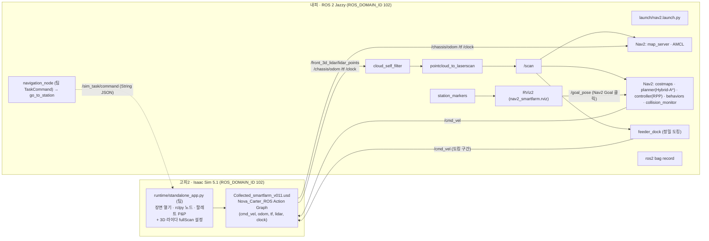
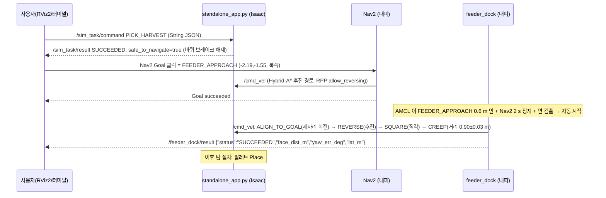
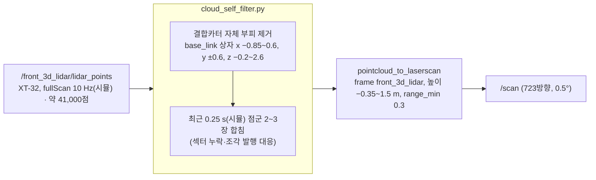
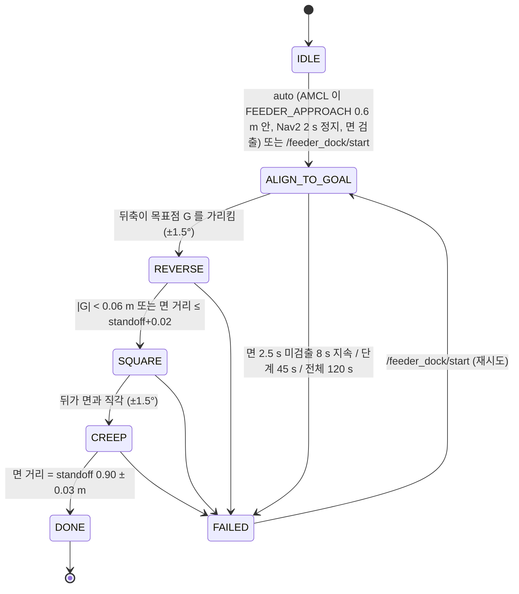

# smart_farm_navigation 아키텍처 (Nav2 + 정밀 도킹 판)

- 기준: `feature/navigation2`, 2026-09-23. 장면 `Collected_smartfarm_v011.usd`, 지도 `maps/Collected_smartfarm_v011.yaml`, ROS 2 Jazzy, `ROS_DOMAIN_ID` **102**(고피2 기준. 이전 고피는 101).
- 확정 동작(2026-09-22 실측): 팀 `standalone_app.py` 로 Isaac 실행 → 내피 Nav2 → `PICK_HARVEST` 로 Pallet_01 파지 → RViz2 에서 `FEEDER_APPROACH` 한 번 클릭 → 도착 약 2 s 뒤 `feeder_dock` 이 자동으로 `FEEDER_DOCK` 앞(면에서 0.90 m)에 뒤(팔 쪽)를 면과 직각으로 맞춰 정지.
- 그림은 GitHub 또는 VS Code(Markdown Preview Mermaid Support)에서 렌더링됨.

## 1. 배치: 고피(Isaac) ↔ 내피(Nav2)

- `/cmd_vel` 은 두 발행자가 있음: Nav2 (collision_monitor 출력) 와 `feeder_dock`. 동시에 내지 않도록 `feeder_dock` 은 Nav2 가 2 s 이상 조용할 때만 시작함.
- 두 PC 는 `ROS_DOMAIN_ID` 와 FastDDS 화이트리스트(`~/.ros/fastdds_whitelist.xml`, 상대 PC IP 포함)가 맞아야 토픽이 보임.

## 2. 한 번의 운반 시퀀스

## 3. `/scan` 생성 파이프라인 (라이다 처리)

- 라이다 위치: base_link (−0.232, 0, 0.526). 앞(+x)은 구동륜 쪽, 뒤(−x)는 리프트·M0609 쪽.
- 왜 필요한가: 리프트 기둥·팔·팔레트가 라이다 옆에 있어 그대로 두면 costmap 에 "발밑 장애물" 이 찍히고, 고피 렌더링이 느리면 스캔 일부 섹터가 통째로 비어 옴.

## 4. feeder_dock 상태 기계

- 면 검출: `/scan` 을 base_link 로 바꾼 뒤 뒤쪽 창(x −3.4~−0.5, |y|<1.3)에서 가장 가까운 점 주변 1.5 m 의 점에 RANSAC 직선(3 cm 내점)을 맞춤. 길이 0.6~1.6 m, 법선이 뒤쪽 ±60° 안이어야 TurnTable 앞면으로 인정. 목표점 G = 면 가운데 법선 위 `standoff_m`.
- 시간 기준은 전부 시뮬레이션 시계(`use_sim_time`). 실시간 배율 0.3 에서 벽시계로 판단하면 스캔이 늘 "오래된 값" 이 됨.

## 5. 파일 목록과 역할

### 실행 시작점
| 파일 | 어디서 | 역할 |
|---|---|---|
| `isaacpjt/smart_farm/runtime/standalone_app.py` (팀) | 고피 | Isaac 장면 실행, `/sim_task/command` 로 P&P. 내가 넣은 것: `open_scene()` 의 3D 라이다 `fullScan=True` 6줄 |
| `scripts/launch_scene.py` | 고피 | 팀 앱 없이 장면만 띄우는 단위 시험용. `/clock` 그래프 보강, M0609 관절 고정, fullScan, `--pose carry` 자세, 실행 로그 `results/launch_scene_*.log` |
| `launch/nav2.launch.py` | 내피 | Nav2 bringup + RViz2 + `/scan` 파이프라인 + `feeder_dock` + `station_markers` + rosbag. 인자: `scan_mode`, `dock_auto`, `record`, `record_cloud`, `map`, `initial_*` |
| `launch/navigation_node.launch.py` | 내피 | 팀 통합용 `navigation_node` (`mode:=nav2` → `go_to_station`) |

### 노드 (`smart_farm_navigation/`)
| 파일 | 역할 |
|---|---|
| `cloud_self_filter.py` | 3D 점군에서 결합카터 부피 제거 + 최근 0.25 s 점군 합침 → `/front_3d_lidar/lidar_points/filtered` |
| `scan_sanitizer.py` | 2D 라이다(`/front_2d_lidar/scan`)용 자기 반사 제거. 고피에서 2D 는 발행되지 않아 현재 미사용 |
| `feeder_dock.py` | 라이다 면 검출 정밀 후진 도킹(4절). `detect_face()` 는 bag 재생으로 단독 시험 가능 |
| `nav2_link_check.py` | Isaac → 내피 토픽 도달률, 점군 점수(조각 발행 경고), 리그 상자 안 자기 반사 개수 |
| `station_markers.py` | `config/stations.yaml` 작업점을 `/stations_markers` (MarkerArray) 로 발행 → RViz2 클릭 위치 표시 |
| `go_to_station.py` | 작업점 이름으로 NavigateToPose 순차 실행(`pure_nav2`). 팀 통합(`navigation_node`)용. 실측은 RViz2 클릭 |
| `navigation_node.py` (팀) | `/navigation/command` TaskCommand → `go_to_station` 실행 → `/navigation/result` |
| `path_runner.py`, `path_runner_smooth.py`, `geometry.py`, `scene_check.py` | 1차 시연(/cmd_vel 경로 주행) 판. Nav2 트랙에서는 미사용, 팀 `destinations.yaml` 경로로만 남음 |

### 설정 (`config/`)
| 파일 | 내용 |
|---|---|
| `nav2_params.yaml` | AMCL(odom 신뢰↑), Smac Hybrid-A*(Reeds-Shepp, 후진 허용), RPP(0.6 m/s, `allow_reversing`, `max_angular_accel` 20), PoseProgressChecker, goal 허용 0.25 m/0.5 rad, local costmap 4 m/inflation 0.45, collision_monitor, BT 응답 대기 200 ms, velocity_smoother 가감속 0.8 |
| `stations.yaml` | 초기 위치, `FEEDER_APPROACH`(−2.19,−1.55,90°), `FEEDER_DOCK`(참고값), `RACK_DOCK`, 후진 탈출 구역(`pure_nav2:=false` 때만) |
| `destinations_nav2.yaml`, `destinations.yaml` | `navigation_node` 목적지 → station / launch 매핑 |
| `arm_poses.yaml` | `launch_scene.py --pose` 프리셋(home, carry) |
| `carter2_dock.yaml`, `path_runner*.yaml` | 1차 시연 판(미사용) |

### 기타
| 파일 | 내용 |
|---|---|
| `rviz/nav2_smartfarm.rviz` | 지도·/scan·경로·발자국·local costmap·작업점 마커만 표시(점군·카메라 제외) |
| `scripts/make_map_from_usd.py` | USD prim bbox → 지도 png/yaml (`maps/Collected_smartfarm_v011.*` 생성) |
| `scripts/env_check.sh` | 터미널 환경 점검(ROS 배포판, 화이트리스트, 브리지 라이브러리 충돌) |
| `maps/Collected_smartfarm_v011.{png,yaml}` (isaacpjt) | Nav2 정적 지도. origin (−4.525, −10.025), 0.05 m/px |
| `results/` | 실측 로그(`link_*`, `nav2_*`, `goto_*`, `launch_scene_*`), `bags/`(git 제외), `robot_spawn.yaml` |
| `errored/` | 사용자 실측 피드백. `guidance/` 는 차수별 절차, `guidance/past/` 이전 판 |

## 6. 좌표계 요약
| 좌표계 | 정의 |
|---|---|
| map = Isaac world | 지도 origin 이 world 기준이라 동일. +x 는 컨베이어 진행 방향, −y 는 랙 → 컨베이어 방향 |
| base_link | 카터 섀시. +x 구동륜(앞), −x 캐스터·리프트·M0609(뒤). 초기 배치 yaw 90°(앞이 북쪽, 뒤가 통로 출구) |
| odom | Isaac 시작 시 base_link 위치가 원점. AMCL 이 map→odom 을 보정 |
| 도킹(feeder_dock) | 지도를 쓰지 않음. TurnTable 앞면 직선을 기준으로 base_link 상대량(거리·각·좌우)만 사용 |
