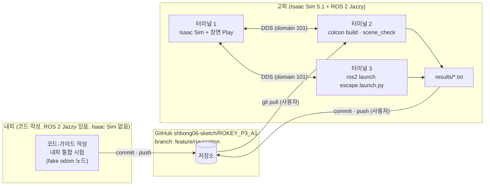
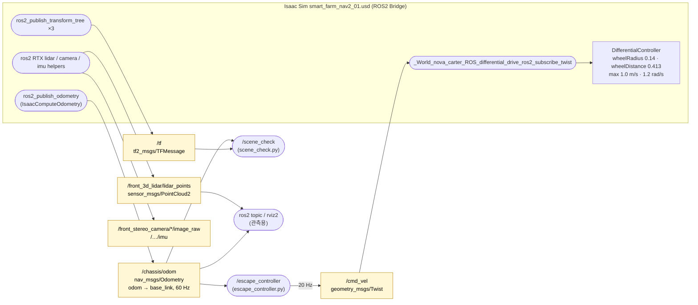
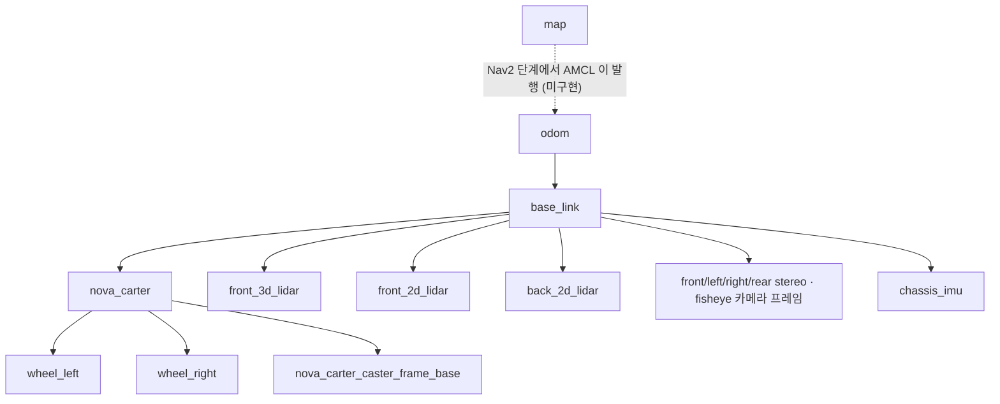
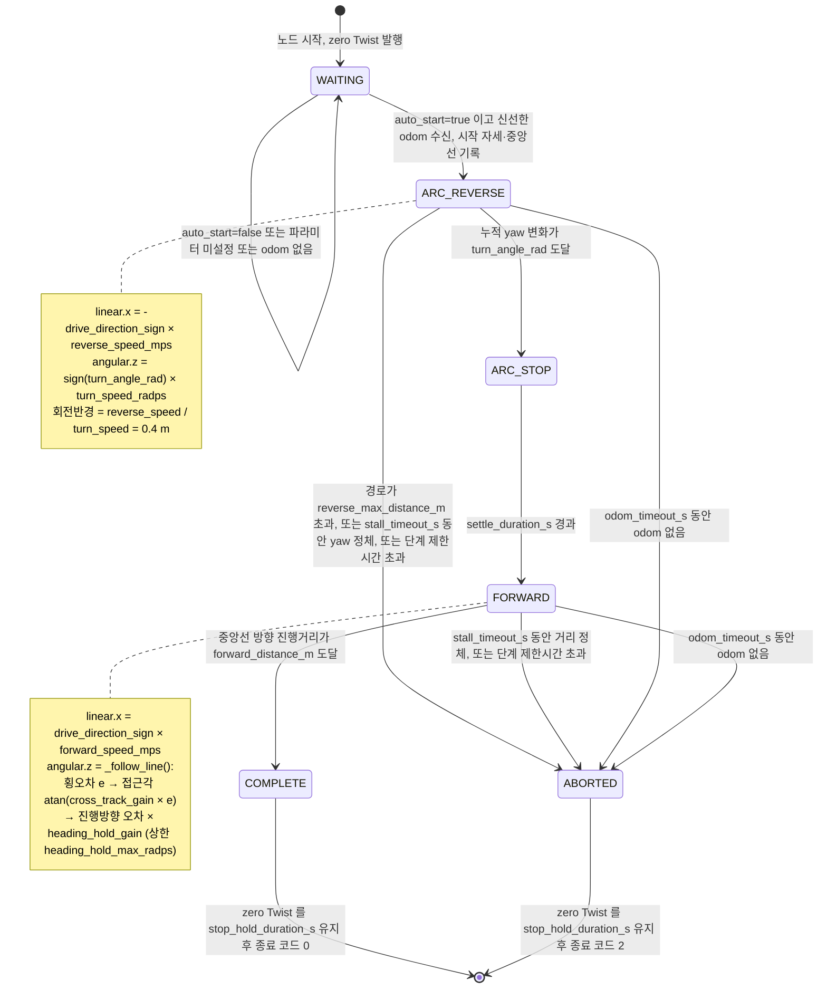
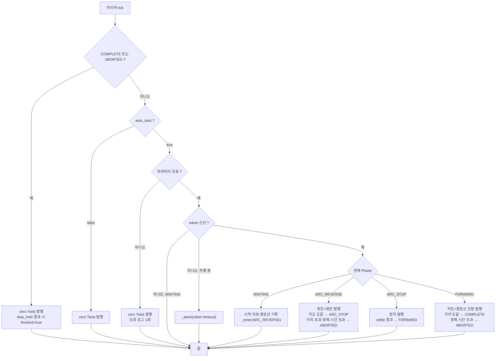
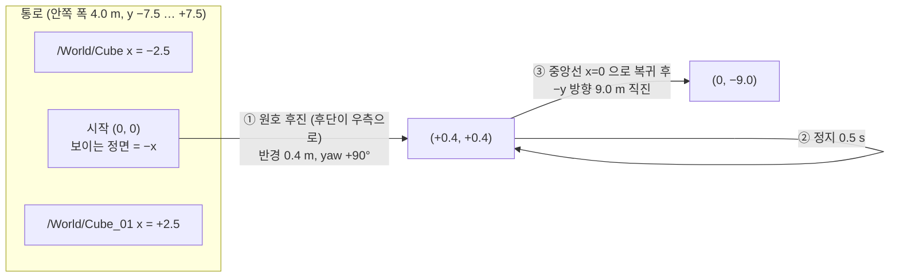
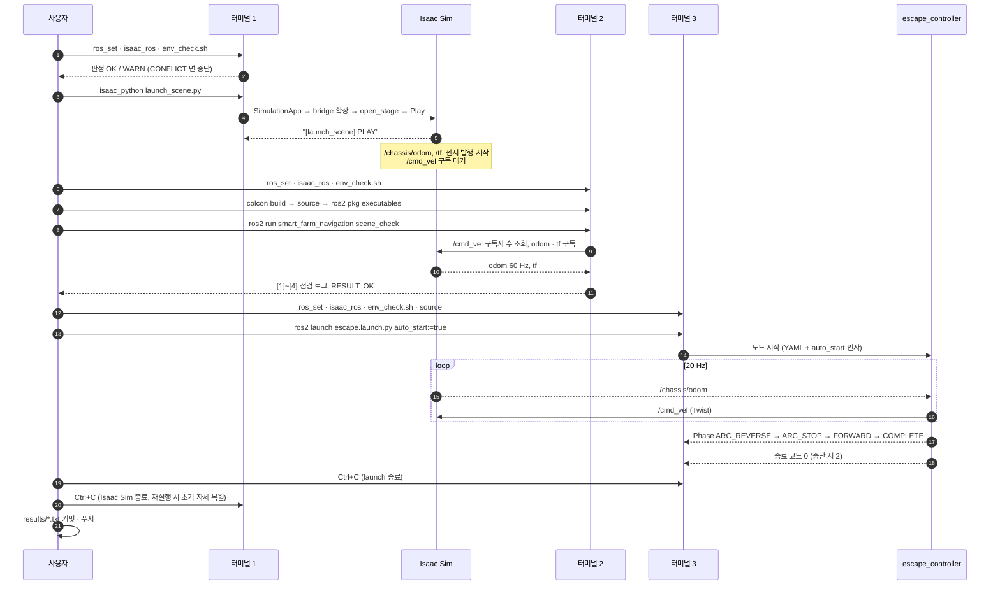
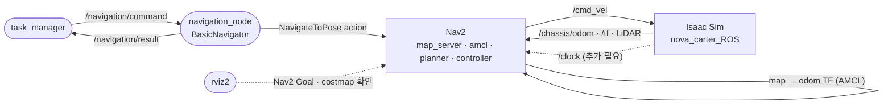

# smart_farm_navigation 노드 구성도 및 흐름도

기준: feature/navigation, 2026-09-19. 대상 장면 smart_farm_nav2_01.usd, ROS 2 Jazzy, ROS_DOMAIN_ID 101.
GitHub 또는 VS Code(Markdown Preview Mermaid Support)에서 그림으로 렌더링된다.

---

## 1. 배치도: 내피 · GitHub · 고피

---

## 2. 노드·토픽 그래프 (rqt_graph 형식)

타원 = 노드, 사각형 = 토픽. 화살표 방향이 발행(→토픽) / 구독(토픽→)이다.
Isaac Sim 안의 노드 이름은 Action Graph 경로에서 자동 생성된 것이다.

현재 장면에서 발행되지 않는 것: `/clock`, `/tf_static`, `/front_2d_lidar/scan`. 에셋의 `/ros_clock` 그래프가 defaultPrim 밖에 있어 참조에 포함되지 않기 때문이며, Nav2 단계에서 `/World/ros_clock` 참조 추가로 해결한다.

### 2.1 TF 트리 (현재)

---

## 3. escape_controller 상태 머신

### 3.1 매 tick(0.05 s) 판정 순서

### 3.2 기하 (odom 좌표계, 시작 자세 = 원점, yaw 0)

---

## 4. 실행 절차 시퀀스 (터미널 3개)

---

## 5. 향후 Nav2 단계에서의 위치 (참고, 미구현)

escape_controller 자리에 Nav2 스택이 들어가고, 상위에 task_manager · navigation_node 가 붙는다. Isaac Sim 쪽 토픽은 그대로 재사용한다.

선결 과제: `/clock` 발행 추가, `use_sim_time` 통일, 지도 YAML의 image 경로 수정, 로봇의 보이는 정면(chassis −x)과 base_link +x 불일치 해소.
