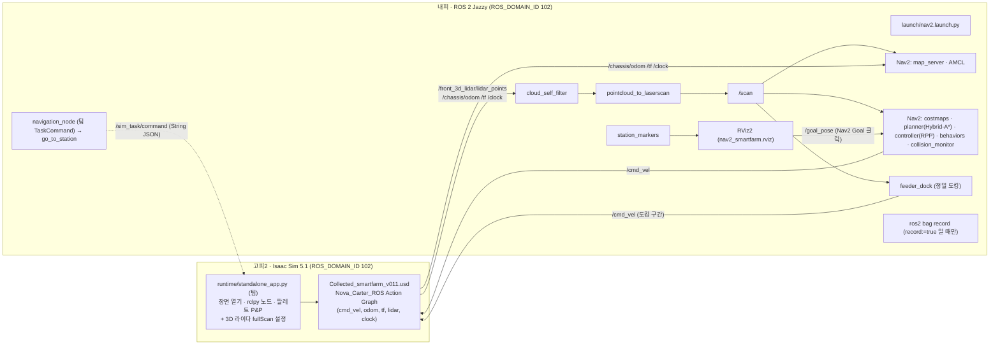
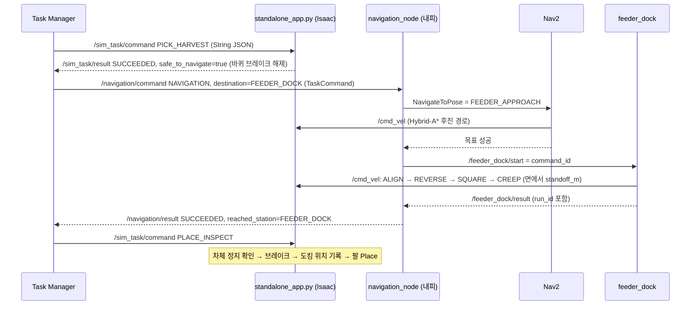
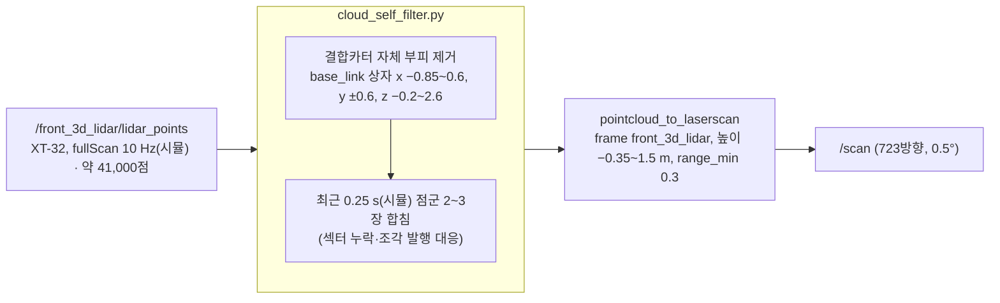
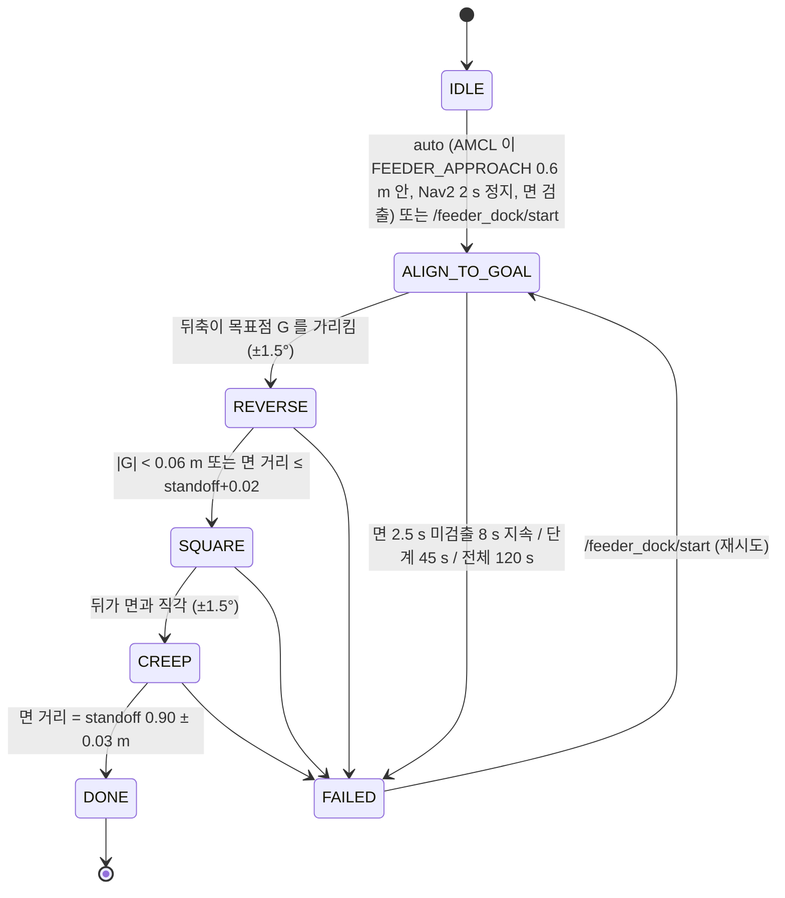

# smart_farm_navigation 아키텍처 (Nav2 + 정밀 도킹 판)

- 기준: `feature/Inspection-Place-nav2`(통합 브랜치), 2026-09-23. 장면 `Collected_smartfarm_v011.usd`, 지도 `maps/Collected_smartfarm_v011.yaml`, ROS 2 Jazzy. `ROS_DOMAIN_ID` 는 그때 쓰는 고피에 맞춘다(현재 고피1, 101).
- `navigation_node` 의 실행 중 상태값은 `BUSY` 임(통합 브랜치 기준, 이전 `EXECUTING`).
- 이름 주의: `Conveyor/TurnTable` 이 카터 쪽으로 뻗은 긴 벨트이고, `Conveyor/Feeder` 는 메인 컨베이어와 만나는 남쪽 합류 장치다. 이름과 실제 역할이 뒤바뀌어 있으나 장면을 고치지 않고 이대로 쓴다. 도킹과 Place 대상은 모두 TurnTable 북단이다.
- 확정 동작(2026-09-22 실측): 팀 `standalone_app.py` 로 Isaac 실행 → 내피 Nav2 → `PICK_HARVEST` 로 Pallet_01 파지 → RViz2 에서 `FEEDER_APPROACH` 한 번 클릭 → 도착 약 2 s 뒤 `feeder_dock` 이 `FEEDER_DOCK` 앞에 뒤(팔 쪽)를 면과 직각으로 맞춰 정지.
- 통합 동작(2026-09-23): Task Manager 가 `/navigation/command` 로 `NAVIGATION`/`FEEDER_DOCK` 을 보내면 `navigation_node` 가 `FEEDER_APPROACH` 까지 NavigateToPose 로 가고, 도착하면 실행 식별자를 담아 `feeder_dock` 을 시작시킨 뒤 같은 식별자로 돌아온 결과만 인정해 `/navigation/result` 를 낸다. RViz2 클릭 절차는 `dock_auto:=true` 로 살려 둔다.
- 그림은 GitHub 또는 VS Code(Markdown Preview Mermaid Support)에서 렌더링됨.

## 1. 배치: 고피(Isaac) ↔ 내피(Nav2)

- `/cmd_vel` 은 두 발행자가 있음: Nav2 (collision_monitor 출력) 와 `feeder_dock`. 동시에 내지 않도록 `feeder_dock` 은 Nav2 가 2 s 이상 조용할 때만 시작함.
- 두 PC 는 `ROS_DOMAIN_ID` 와 FastDDS 화이트리스트(`~/.ros/fastdds_whitelist.xml`, 상대 PC IP 포함)가 맞아야 토픽이 보임.

## 2. 한 번의 운반 시퀀스

## 3. `/scan` 생성 파이프라인 (라이다 처리)

- 라이다 위치: base_link (−0.232, 0, 0.526). 앞(+x)은 구동륜 쪽, 뒤(−x)는 리프트·M0609 쪽.
- 왜 필요한가: 리프트 기둥·팔·팔레트가 라이다 옆에 있어 그대로 두면 costmap 에 "발밑 장애물" 이 찍히고, 고피 렌더링이 느리면 스캔 일부 섹터가 통째로 비어 옴.

## 4. feeder_dock 상태 기계

- 면 검출: `/scan` 을 base_link 로 바꾼 뒤 뒤쪽 창(x −3.4~−0.5, |y|<1.3)에서 가장 가까운 점 주변 1.5 m 의 점에 RANSAC 직선(3 cm 내점)을 맞춤. 길이 0.6~1.6 m, 법선이 뒤쪽 ±60° 안이어야 TurnTable 앞면으로 인정. 목표점 G = 면 가운데 법선 위 `standoff_m`.
- 시간 기준은 전부 시뮬레이션 시계(`use_sim_time`). 실시간 배율 0.3 에서 벽시계로 판단하면 스캔이 늘 "오래된 값" 이 됨.

## 5. 파일 목록과 역할

### 실행 시작점
| 파일 | 어디서 | 역할 |
|---|---|---|
| `isaacpjt/smart_farm/runtime/standalone_app.py` (팀) | 고피 | Isaac 장면 실행, `/sim_task/command` 로 P&P. 내가 넣은 것: `open_scene()` 의 3D 라이다 `fullScan=True` 6줄 |
| `scripts/launch_scene.py` | 고피 | 팀 앱 없이 장면만 띄우는 단위 시험용. `/clock` 그래프 보강, M0609 관절 고정, fullScan, `--pose carry` 자세, 실행 로그 `results/launch_scene_*.log` |
| `launch/nav2.launch.py` | 내피 | Nav2 bringup + RViz2 + `/scan` 파이프라인 + `feeder_dock` + `station_markers` + rosbag. 인자: `scan_mode`, `dock_auto`, `record`, `record_cloud`, `map`, `initial_*` |
| `launch/navigation_node.launch.py` | 내피 | 팀 통합용 `navigation_node` (`mode:=nav2` → `go_to_station`) |

### 노드 (`smart_farm_navigation/`)
| 파일 | 역할 |
|---|---|
| `cloud_self_filter.py` | 3D 점군에서 결합카터 부피 제거 + 최근 0.25 s 점군 합침 → `/front_3d_lidar/lidar_points/filtered` |
| `scan_sanitizer.py` | 2D 라이다(`/front_2d_lidar/scan`)용 자기 반사 제거. 고피에서 2D 는 발행되지 않아 현재 미사용 |
| `feeder_dock.py` | 라이다 면 검출 정밀 후진 도킹(4절). `detect_face()` 는 bag 재생으로 단독 시험 가능 |
| `nav2_link_check.py` | Isaac → 내피 토픽 도달률, 점군 점수(조각 발행 경고), 리그 상자 안 자기 반사 개수 |
| `station_markers.py` | `config/stations.yaml` 작업점을 `/stations_markers` (MarkerArray) 로 발행 → RViz2 클릭 위치 표시 |
| `go_to_station.py` | 작업점 이름으로 손 시험하는 명령줄 도구. 통합 경로에서는 쓰지 않는다 |
| `stations.py` | 작업점 파일 읽기와 map 기준 목표 자세 생성(stamp 0). `navigation_node` 와 `go_to_station` 이 공용 |
| `navigation_node.py` (팀) | `/navigation/command` TaskCommand → NavigateToPose 액션과 `feeder_dock` 을 직접 구동 → `/navigation/result`. 자식 프로세스를 쓰지 않는다 |
| `path_runner.py`, `path_runner_smooth.py`, `geometry.py`, `scene_check.py` | 1차 시연(/cmd_vel 경로 주행) 판. 설정과 launch 는 `config/past/`, `launch/past/` 로 내렸다 |

### 설정 (`config/`)
| 파일 | 내용 |
|---|---|
| `nav2_params.yaml` | AMCL(odom 신뢰↑), Smac Hybrid-A*(Reeds-Shepp, 후진 허용), RPP(0.6 m/s, `allow_reversing`, `max_angular_accel` 20), PoseProgressChecker, goal 허용 0.25 m/0.5 rad, local costmap 4 m/inflation 0.45, collision_monitor, BT 응답 대기 200 ms, velocity_smoother 가감속 0.8 |
| `stations.yaml` | 초기 위치, `FEEDER_APPROACH`(−2.19,−1.55,90°), `FEEDER_DOCK`(참고값), `RACK_DOCK`, 후진 탈출 구역(`pure_nav2:=false` 때만) |
| `destinations_nav2.yaml` | `navigation_node` 목적지 → 작업점 매핑. `approach` 가 있으면 그 작업점까지 간 뒤 정밀 도킹 |
| `arm_poses.yaml` | `launch_scene.py --pose` 프리셋(home, carry) |

### 기타
| 파일 | 내용 |
|---|---|
| `rviz/nav2_smartfarm.rviz` | 지도·/scan·경로·발자국·local costmap·작업점 마커만 표시(점군·카메라 제외) |
| `scripts/make_map_from_usd.py` | USD prim bbox → 지도 png/yaml (`maps/Collected_smartfarm_v011.*` 생성) |
| `scripts/env_check.sh` | 터미널 환경 점검(ROS 배포판, 화이트리스트, 브리지 라이브러리 충돌) |
| `maps/Collected_smartfarm_v011.{png,yaml}` (isaacpjt) | Nav2 정적 지도. origin (−4.525, −10.025), 0.05 m/px |
| `results/` | 실측 로그(`link_*`, `nav2_*`, `goto_*`, `launch_scene_*`), `bags/`(git 제외), `robot_spawn.yaml` |
| `errored/` | 사용자 실측 피드백. `guidance/` 는 차수별 절차, `guidance/past/` 이전 판 |

## 6. 핵심 변수 (값을 바꿀 때 무엇이 달라지는지)

### 6-1. `feeder_dock` (정밀 도킹) — `ros2 run … feeder_dock --ros-args -p <이름>:=<값>` 또는 launch 인자
| 변수 | 기본값 | 뜻 · 바꾸면 |
|---|---|---|
| `standoff_m` | 0.75 | 도킹 완료 시 base_link ↔ TurnTable 앞면 거리. 팔 밑동은 여기서 0.20 m 뒤이고, 그 지점에서 place 대상까지 직선 0.90 m 로 M0609 도달 한계와 같다. 역기구학이 실패하면 0.70 으로 내리고 `self_box_x[0]` 도 −0.55 로 함께 옮긴다 |
| `arm_x`, `arm_y`, `arm_radius_m` | −2.19, −1.55, 0.6 | 자동 시작 조건: AMCL 위치가 이 점(=FEEDER_APPROACH) 반경 안. `stations.yaml` 을 바꾸면 같이 바꿔야 함 |
| `auto_start` | **false** | 통합은 `navigation_node` 가 `/feeder_dock/start`(String, 실행 식별자) 로 시작. RViz2 수동 절차는 `dock_auto:=true` |
| `search_x`, `search_y` | [−3.4, −0.5], [−1.3, 1.3] | base_link 기준 면을 찾는 창(뒤쪽). 접근 지점이 면에서 3 m 넘게 멀어지면 `search_x[0]` 을 늘림 |
| `face_min_len_m`, `face_max_len_m` | 0.6, 1.6 | 인정하는 직선 길이. TurnTable 앞면 1.15 m 기준. 다른 도킹 대상이면 그 폭에 맞춤 |
| `reverse_speed_mps`, `creep_speed_mps` | 0.15, 0.05 | 후진 속도, 마지막 거리 맞춤 속도 |
| `turn_speed_radps`, `turn_min_radps` | 0.35, 0.08 | 제자리 회전 최대·최소 각속도. Isaac 배율이 낮을수록 화면상 더 느려 보임 |
| `yaw_tol_deg`, `dist_tol_m` | 1.5, 0.03 | 직각·거리 허용 오차 = 완료 판정 |
| `k_yaw`, `k_lat` | 1.5, 1.2 | 회전·후진 조향 비례 이득. 흔들리면 낮춤 |
| `timeout_s` | 120 (시뮬 초) | 전체 제한. 단계별 45 s, 면 미검출 8 s 는 코드 상수 |
| (코드 상수) 면 신선도 2.5 s, RANSAC 내점 3 cm·120회, 법선 허용 ±60°, 최근접점 반경 1.5 m | | 검출 민감도. 옆면에 붙는 오검출이 보이면 법선 허용을 ±40° 로 줄이는 것이 첫 후보 |

### 6-2. `cloud_self_filter` (라이다 자기 반사·합침)
| 변수 | 기본값 | 뜻 · 바꾸면 |
|---|---|---|
| `self_box_x`, `self_box_y`, `self_box_z` | [−0.60, 0.60], [−0.60, 0.60], [−0.20, 2.60] | base_link 기준 결합카터 부피. **`self_box_x[0]` 을 `standoff_m` 보다 뒤에 두면 도킹 면이 지워짐.** 실측 자기 반사는 x −0.6~−0.2, z ≤ 0.53 에 분포 |
| `accumulate_s` | 0.5 (시뮬 초) | 합치는 시간창. 늘리면 섹터 누락에 강하지만 이동 중 점이 번짐(0.6 m/s 에서 0.25 s = 15 cm) |
| `partial_max_points` | 20000 | 이보다 적으면 "조각 발행" 경고만 냄 |

### 6-3. `nav2.launch.py` 인자와 `/scan` 변환
| 변수 | 기본값 | 뜻 |
|---|---|---|
| `scan_mode` | auto | `scan2d`(2D 라이다) / `cloud`(3D 점군). 고피는 2D 가 안 나와 항상 cloud |
| `dock_auto` | **false** | `feeder_dock` 자동 시작. 통합은 false, RViz2 수동 절차는 true |
| `record`, `record_cloud` | false, false | rosbag 기록 여부(통합 이후 기본 꺼짐), 점군 포함 여부. 분석이 필요한 실측은 `record:=true` 로 실행 |
| `map`, `initial_x/y/yaw_deg` | v011 지도, stations.yaml 초기 위치 | 지도·AMCL 초기 위치 |
| pointcloud_to_laserscan `min_height`/`max_height` | −0.35 / 1.5 (라이다 기준 m) | 바닥 제외, TurnTable(1.17 m)·랙 포함 |
| pointcloud_to_laserscan `range_min` | 0.3 | 라이다 0.3 m 안은 버림 |

### 6-4. `nav2_params.yaml` 에서 실제로 손댄 값
| 노드.변수 | 값 | 이유 |
|---|---|---|
| planner `GridBased.plugin` | SmacPlannerHybrid, `motion_model_for_search: REEDS_SHEPP`, `allow_reverse_expansion: true`, `reverse_penalty: 1.0`, `minimum_turning_radius: 0.35` | 통로 후진 탈출을 경로 자체에 넣기 위해. `reverse_penalty` 를 올리면 전진을 선호해 방향 전환(cusp)이 생김 |
| controller `FollowPath` (RPP) `desired_linear_vel` / `allow_reversing` / `use_rotate_to_heading` / `max_angular_accel` | 0.3 / true / false / 20 | 후진 추종. `max_angular_accel` 2.0 이면 Isaac odom 기준 회전이 기어감 |
| `progress_checker.plugin` | PoseProgressChecker (`required_movement_angle` 0.3, 20 s) | 회전을 진행으로 인정 |
| `general_goal_checker.xy_goal_tolerance` / `yaw_goal_tolerance` | 0.25 m / 0.5 rad | 도착 판정. 방향은 `feeder_dock` 이 맞추므로 느슨히 |
| amcl `alpha1~4` / `z_hit` / `z_rand` / `sigma_hit` | 0.1 / 0.8 / 0.2 / 0.1 | Isaac odom 이 정확하므로 주행 잡음↓, 레이저 신뢰↑ |
| local_costmap `width`/`height` / `inflation_radius` | 4 m / 0.45 | 부하와 통로 폭. global inflation 0.70 으로 올리면 통로 복귀 99 s |
| collision_monitor `time_before_collision` | 0.8 s | 장애물 접근 감속 시점 |
| velocity_smoother `max_velocity` / `max_accel` | [0.3, 0, 0.4] / [0.3, 0, 0.6] | 팔레트 미끄러짐 방지로 가감속은 낮춤 |
| bt_navigator `default_server_timeout` | 200 ms | 부하 시 goal 즉시 실패 방지 |
| 모든 노드 `use_sim_time` | true | Isaac `/clock` 기준. Isaac 재실행 시 Nav2 재실행 필요 |

### 6-5. `stations.yaml`
| 항목 | 값 | 뜻 |
|---|---|---|
| `initial_pose` | (−0.421, 1.006, 90°) | AMCL 초기 위치 = 장면의 카터 배치. 장면이 바뀌면 `launch_scene.py` 출력값으로 갱신 |
| `FEEDER_APPROACH` | (−2.19, −1.55, 90°) | Nav2 Goal 클릭 지점, `feeder_dock` 자동 시작 기준점 |
| `FEEDER_DOCK` | (−2.19, −2.85, 90°) | 참고값(마커 표시). 실제 정지 위치는 `feeder_dock` 의 `standoff_m` 가 정함 |
| `reverse_out_zones` | 통로 구역, 출구 방향 −90°, 2.2 m | `go_to_station -p pure_nav2:=false` 때만 사용 |

### 6-6. `launch_scene.py` (단위 시험용 Isaac 실행)
| 항목 | 값 | 뜻 |
|---|---|---|
| `--pose`, `--arm-joints`, `--lift` | `config/arm_poses.yaml` 의 `carry` = joint_1 270°, lift 0.243 m | 팔레트 없이 운반 자세. 480 프레임(약 8 s) 램프 |
| M0609 드라이브 강성/감쇠/최대힘 | 1e8 / 1e4 / 1e8 | 팀 `setup_arm_drives` 와 동일. 없으면 팔이 처져 라이다에 잡힘 |
| `--cloud-full-scan` | true | 3D 라이다 한 바퀴 단위 발행(10 Hz). 팀 앱에는 `open_scene()` 에 같은 설정이 들어감 |
| `LIDAR_X`(공통 상수) | −0.232 (z 0.526) | XT-32 의 base_link 위치. `feeder_dock`·`cloud_self_filter`·`nav2_link_check` 가 같은 값을 씀 |

## 7. 좌표계 요약
| 좌표계 | 정의 |
|---|---|
| map = Isaac world | 지도 origin 이 world 기준이라 동일. +x 는 컨베이어 진행 방향, −y 는 랙 → 컨베이어 방향 |
| base_link | 카터 섀시. +x 구동륜(앞), −x 캐스터·리프트·M0609(뒤). 초기 배치 yaw 90°(앞이 북쪽, 뒤가 통로 출구) |
| odom | Isaac 시작 시 base_link 위치가 원점. AMCL 이 map→odom 을 보정 |
| 도킹(feeder_dock) | 지도를 쓰지 않음. TurnTable 앞면 직선을 기준으로 base_link 상대량(거리·각·좌우)만 사용 |
