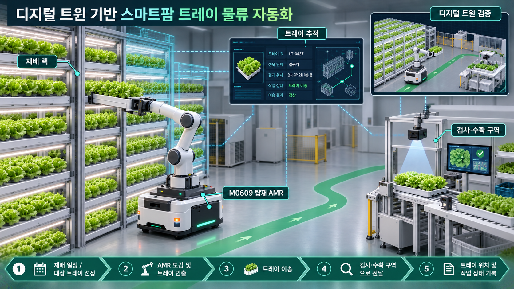

# 비즈니스 정의

관련 이슈·To-do: BRD(비즈니스 요구서) 작성 (https://app.notion.com/p/BRD-3db0f4c1b9cc8064bcabf6670a3ce4b7?pvs=21)
기록일: 2026년 9월 14일
날짜: 2026년 9월 14일
담당자: 봉승현
마지막 수정: 2026년 9월 26일 오전 1:10
분야: Docs
분류: 설계 결정
요약: 공장형 스마트팜의 생육 단계별 트레이 관리와 고단 랙 이송을 자동화하고, 도입 전 디지털 트윈에서 적용 가능성을 검증하기 위한 비즈니스 요구서
생성일: 2026년 9월 14일 오후 8:12
자료 링크: https://app.notion.com/p/3db0f4c1b9cc80aabe33e295c0e60265
작성 상태: 정리 완료

# 디지털 트윈 기반 공장형 스마트팜 생육·물류 자동화 시스템

> 다단 수경재배 방식으로 엽채류를 생산하는 공장형 스마트팜을 대상으로, 트레이별 재배 일정과 위치 데이터를 기반으로 검사·수확 이송 작업을 생성하고, 재배 랙에서 검사·수확 구역까지 이어지는 트레이 물류 자동화 공정의 적용 가능성을 디지털 트윈에서 검증하는 프로젝트
> 

.jpg)

## 1. 프로젝트 대상 정의

### 1.1 대상 도메인

본 프로젝트의 대상은 **다단 수경재배 랙에서 상추류와 같은 엽채류를 생산하는 공장형 스마트팜 또는 식물공장**이다.

수직농장은 제한된 공간에서 재배 면적을 확보하기 위해 다단 재배 구조를 사용하며, 생육 환경을 일정하게 유지하기 위해 조명, 양액, 온도, 습도 등의 환경을 제어한다. 엽채류는 수경재배와 표준화된 재배 단위를 적용하기 상대적으로 용이하므로 자동화형 수직농장의 주요 대상 작물로 활용되고 있다.

본 프로젝트에서는 작물 개체가 아니라 여러 작물이 적재된 재배 트레이를 물류 및 작업 관리의 기본 단위로 사용한다.

### 1.2 대상 작물 및 재배 방식

- 대상 작물: 상추류 등 엽채류 1종
- 재배 방식: 다단 수경재배
- 관리 단위: 재배 트레이
- 대상 공간:
    - 다단 재배 랙 구역
    - 트레이 인계 구역
    - 수확·후속 공정 구역
- 대상 물류:
    - 수확 대상 트레이의 반출 및 수확 구역 운송
- 제외 범위:
    - 파종 자동화
    - 양액 및 환경 제어
    - 작물 생육 모델 자체 개발
    - 실제 절단·세척·포장 공정 전체
    - 농장 전체 생산계획 최적화

### 1.3 프로젝트 적용 범위에 대한 전제

실제 스마트팜마다 랙 구조, 트레이 크기, 재배 방식 및 작업 순서가 다르다. 따라서 본 문서에 정의한 공정은 모든 스마트팜에 공통으로 적용되는 표준 공정이 아니라, 다단 수경재배형 엽채류 식물공장을 가정한 프로젝트 기준 공정이다.

향후 실제 공정 자료를 확보한 뒤 다음 항목을 검증하고 보정할 예정이다.

- 실제 트레이 크기와 중량
- 랙의 높이와 단수
- 생육 단계별 검사 주기
- 수확 대상 선정 방법
- 랙에서 트레이를 반출하는 방법
- 트레이 운반 장비
- 검사·수확 구역의 설비 구성
- 작업자 개입 지점과 평균 작업시간

---

## 2. 조사 배경 및 사례

### 2.1 엽채류 생산 자동화 사례

해외 엽채류 자동화 시스템에서는 파종부터 재배, 수확까지의 생산 흐름을 연결하고, 재배 단위의 이동과 위치를 추적하는 방식이 실제로 사용되고 있다.

Green Automation의 엽채류 수경재배 시스템은 작물을 재배 거터 안에서 이동시키고, 재배 과정부터 수확까지의 물류를 자동화한다. 캐나다 Haven Greens 적용 사례에서는 RFID를 사용해 각 거터의 위치와 이동 과정, 품종별 수확 및 생산 데이터를 추적한다. 이는 스마트팜 자동화에서 단순한 환경 제어뿐만 아니라 재배 단위의 위치와 작업 이력을 연결하는 물류 관리가 중요함을 보여준다.

[Green Automation 자동화 재배 시스템](https://greenautomation.com/fully-automated-system/?utm_source=chatgpt.com), [Haven Greens 적용 사례](https://greenautomation.com/canadian-cea-lettuce-this-is-just-the-beginning/?utm_source=chatgpt.com)

- 참고 자료
    
    
    

오픈소스 수직농장 자동화 시스템인 MACARONS 연구에서는 식물 트레이를 재배 구역과 모니터링·작업 스테이션 사이에서 이동시키는 모듈형 이송 시스템을 제안했다. 해당 연구는 트레이의 수평 이동과 승강 이동을 분리하여 식물 물류를 자동화할 수 있음을 실험적으로 보였다.

[MACARONS 연구](https://arxiv.org/abs/2210.04975?utm_source=chatgpt.com)

이러한 사례를 바탕으로 본 프로젝트에서는 근거가 불충분한 `성장 단계에 따른 상·하단 랙 재배치`보다, 실제 자동화 사례와 연결되는 다음 공정을 핵심 대상으로 선정한다.

> 재배 일정이나 검사 결과에 따라 작업 대상 트레이를 선택하고, 재배 랙에서 검사 또는 수확 구역으로 이송하며, 트레이의 위치와 작업 상태를 기록하는 공정
> 

### 2.2 자동화 필요성

2026년 한국농촌경제연구원은 농업 부문이 고령화와 인구감소에 따른 노동력 부족에 직면하고 있다고 분석했다. 이는 반복 작업과 물류 작업을 자동화해야 하는 배경으로 활용할 수 있다. 다만 농업 전체의 노동력 부족이 곧바로 특정 수직농장의 트레이 이송 비효율을 입증하는 것은 아니므로, 실제 대상 공정의 작업시간과 인력 투입량은 추가 현장 조사가 필요하다.

[한국농촌경제연구원 농업 인력수급 전망](https://www.krei.re.kr/krei/page/53?biblioId=544055&cmd=view&pageIndex=1&utm_source=chatgpt.com)

수직농장 기술 도입 연구에서는 인건비가 운영비의 중요한 부분이며, 파종·이식·수확·포장뿐 아니라 랙, 트레이 및 운반 장비 이동도 주요 자동화 대상으로 분류한다. 다만 자동화 설비의 높은 초기비용이 효율 향상보다 커질 수 있으므로, 도입 전에 적용 가능성과 운영 효과를 검증할 필요가 있다.

[Frontiers: 수직농장 기술 도입 연구](https://www.frontiersin.org/journals/sustainable-food-systems/articles/10.3389/fsufs.2026.1848227/full?utm_source=chatgpt.com)

### 2.3 디지털 트윈 적용 근거

실제 스마트팜에 다단 랙, 이동 로봇, 인계 장치 및 후속 공정 설비를 설치하려면 비용과 공간이 필요하다. 설비 간 인터페이스가 확정되지 않은 상태에서 실물 시스템을 구축하면 다음 문제가 발생할 수 있다.

- AMR이 랙이나 작업 스테이션에 접근하지 못함
- 랙과 AMR의 인계 높이 및 위치가 맞지 않음
- 트레이 상·하차 중 설비 간 간섭이 발생함
- 작업 신호 순서가 맞지 않아 설비가 대기하거나 정지함
- 오류 발생 후 트레이의 실제 위치와 관리 데이터가 불일치함

수직농장의 디지털 트윈 연구에서는 농장 운영 데이터와 생산계획을 연결해 작업 일정과 자원 활용을 분석할 수 있음을 제시한다. 다만 관련 연구에서도 실제 현장 데이터 통합과 실증 사례는 아직 제한적이라고 지적하므로, 본 프로젝트는 실제 농장의 완전한 디지털 트윈을 구현하는 것이 아니라 가정한 자동화 공정의 동작과 인터페이스를 검증하는 시뮬레이션 기반 PoC로 범위를 제한한다.

[Scientific Reports: 수직농장 디지털 트윈 생산계획 연구](https://www.nature.com/articles/s41598-025-97123-y?utm_source=chatgpt.com)

---

## 3. 문제 정의(Problem Definition)

### 3.1 현장의 문제

공장형 스마트팜은 제한된 면적에서 생산량을 높이기 위해 다단 재배 랙을 사용한다. 그러나 재배 공간이 수직으로 확장된 것에 비해 트레이의 검사, 위치 변경 및 수확 구역 이송은 여전히 작업자의 수작업과 경험에 의존하는 경우가 많다.

특히 수확 적기에 도달한 작물을 관리하기 위해 작업자는 다음 작업을 반복적으로 수행해야 한다.

- 각 트레이의 생육 상태와 재배 기간 확인
- 생육 단계에 따른 작업 대상 판단
- 고단 랙에 있는 트레이의 적재 및 하역
- 트레이의 랙 간 재배치
    - **랙 간 재배치의 필요성**
        
        김동억·이공인·허정욱·김현환·강동현·이시영, 「다단식 이동재배시스템 이용효과」, 『한국농업기계학회 학술발표논문집』, 제21권 제2호, 2016, p.162.
        
        - 작물은 1단에서 시작해 생육단계가 진행될수록 위층으로 순차 이동을 통해 재배단계로 이동시켜 간격을 점진적으로 넓히는 방식
        - 성숙한 작물과 트레이의 무게가 커지므로 낮은 위치에 보관해 구조적 안정성을 높임
        - M0609가 무거운 트레이를 낮은 자세에서 취급하도록 해 작업 안정성과 가반하중 여유를 확보
        - 수확 작업장과 가까운 하단에 성숙 작물을 배치해 출고 이동거리를 단축
        - 키가 큰 작물에 더 넓은 수직 공간을 제공
- 수확 대상 트레이의 수확·포장 구역 운송
- 작업 완료 여부와 트레이 위치 기록

이러한 운영 방식에는 다음과 같은 문제가 있다.

1. **높은 인력 의존성**
    - 트레이 검사와 이송이 작업자의 판단과 반복 작업에 의존함
    - 농업 인력 부족과 인건비 상승에 따라 안정적인 인력 확보가 어려움
    
    ](image%202.png)
    
    한국농촌경제연구원의 농업전망 2026 [https://saenongsa.net/mobile/article.html?no=23254](https://saenongsa.net/mobile/article.html?no=23254)
    
2. **고소 작업과 중량물 취급 위험**
    - 작업자가 젖고 무거운 트레이를 고단 랙에서 직접 취급해야 함
    - 반복적인 상·하차 과정에서 낙상 및 근골격계 부담이 발생할 수 있음
    
    ![경기도 평택시 진위면 소재 농업회사 법인 팜에이트(주) 본사에서 작업 현장 모습 [출처:중앙일보] [https://www.joongang.co.kr/article/23996954](https://www.joongang.co.kr/article/23996954)](image%203.png)
    
    경기도 평택시 진위면 소재 농업회사 법인 팜에이트(주) 본사에서 작업 현장 모습 [출처:중앙일보] [https://www.joongang.co.kr/article/23996954](https://www.joongang.co.kr/article/23996954)
    
3. **생육 단계별 작업 누락 가능성**
    - 트레이별 생육 단계, 현재 위치와 작업 이력이 체계적으로 연결되지 않으면 검사나 재배치가 누락될 수 있음
    - 작업 지연은 수확 적기를 놓치거나 작물 품질을 저하시키는 원인이 될 수 있음
4. **설비 간 단절된 작업 흐름**
    - 생육 검사, 트레이 이동, 랙 재배치 및 수확·포장 공정이 개별 작업으로 운영되면 전체 공정의 진행 상태를 일관되게 관리하기 어려움
5. **자동화 도입 효과의 불확실성**
    - 실제 현장에 로봇과 자동화 설비를 설치하기 전에는 작업 가능 범위, 설비 간 간섭, 트레이 이동 흐름과 예상 운영 효과를 판단하기 어려움
    
    
    
    수직농장은 공간 활용을 위해 재배 랙을 밀집 배치하므로, AMR의 접근·회전·교행 가능 여부를 레이아웃 설계 단계에서 검토할 필요가 있다. 본 프로젝트에서는 제한된 통로 폭을 실험 조건으로 설정하여 이동 가능성을 검증한다.
    

결과적으로 스마트팜 운영사는 반복 이송 작업의 인건비와 안전 부담을 감수하면서도, 생육 단계별 작업의 일관성과 트레이 단위의 추적성을 확보하기 어려운 상황에 놓인다.

### 3.2 시뮬레이션에서 먼저 검증해야 하는 이유

실제 스마트팜에 다단 랙, 이동 로봇, 검사 장비와 후속 공정 설비를 설치하려면 많은 비용과 공간이 필요하다. 자동화 공정이 충분히 검증되지 않은 상태에서 바로 구축하면 다음과 같은 위험이 발생할 수 있다.

- 랙 높이와 통로 폭으로 인해 로봇이 작업 위치에 접근하지 못하는 문제
- 트레이 상·하차 위치와 설비 규격이 맞지 않아 공정 연결이 실패하는 문제
- 이동 경로 중 충돌, 대기 또는 교착이 발생하는 문제
- 생육 단계와 실제 작업 순서가 맞지 않아 불필요한 이송이나 작업 누락이 발생하는 문제
- 설비 재배치와 제어 정책 수정 과정에서 추가 비용 및 운영 중단이 발생하는 문제

또한 작물의 생육은 수일에서 수주에 걸쳐 진행되므로, 실제 환경에서 여러 작업 조건과 예외 상황을 반복 검증하기 어렵다. 가상환경에서는 동일한 조건을 반복 재현하고 생육 단계, 트레이 위치, 작업 순서와 설비 조건을 변경하여 비교할 수 있다.

따라서 본 프로젝트에서는 실물 설비를 구축하기 전에 자동화 공정의 연결 가능성, 작업 흐름, 안전성과 운영 결과를 디지털 트윈에서 우선 검증한다. 이를 통해 현장 적용 과정의 시행착오와 투자 위험을 줄이고, 실제 도입 여부를 판단할 수 있는 근거를 제공한다.

## 4. 목표 고객 및 요구

### 4.1 목표 고객

- 다단 재배 랙을 사용하는 공장형 스마트팜 운영 기업
- 식물공장 및 수직농장 구축 SI 기업
- 스마트팜용 물류 자동화 설비 공급사
- AMR 및 로봇 기반 스마트팜 솔루션 개발사
- 신규 농장 구축 또는 기존 농장의 자동화 전환을 검토하는 사업자

### 4.2 주요 사용자

- 스마트팜 운영 관리자
- 생산 및 수확 일정 관리자
- 자동화 설비 운영자
- 설비 구축 및 통합 담당자

### 4.3 고객의 핵심 요구

- 트레이별 재배 일정과 현재 위치를 확인할 수 있어야 함
- 검사 또는 수확 시점에 맞춰 필요한 작업이 누락 없이 생성되어야 함
- 대상 트레이가 올바른 검사·수확 구역으로 이송되어야 함
- 작업자는 정상 공정에서 고단 랙의 트레이를 직접 운반하지 않아도 되어야 함
- 랙, AMR 및 후속 공정 설비의 작업 상태가 하나의 흐름으로 연결되어야 함
- 오류 발생 시 해당 트레이의 위치와 작업 상태를 추적할 수 있어야 함
- 실제 설비 구축 전에 레이아웃과 공정 동작을 시뮬레이션에서 검증할 수 있어야 함

## 5. 프로젝트 목표(Project Goal)

본 프로젝트의 목표는 공장형 스마트팜에서 작물의 생육 단계에 따라 필요한 작업이 생성되고, 대상 트레이가 적절한 위치로 재배치되거나 수확·포장 구역으로 운송되는 전체 자동화 공정의 적용 가능성을 검증하는 것이다.

프로젝트 완료 후에는 다음 상태가 가능해야 한다.

1. **반복적인 트레이 관리 작업의 자동화 가능성 확인**
    - 작업자가 직접 수행하던 생육 상태 확인, 작업 대상 판단, 랙 간 재배치 및 수확 이송 과정을 하나의 연속된 작업 흐름으로 관리할 수 있어야 함
2. **생육 단계에 따른 일관된 작업 수행**
    - 트레이마다 정의된 생육 단계와 작업 조건에 따라 검사, 재배치 또는 수확 이송이 누락 없이 수행되어야 함
3. **고단 재배 환경의 작업 안전성 향상**
    - 정상 자동화 시나리오에서는 작업자가 고단 랙의 트레이를 직접 상·하차하지 않고도 목표 공정을 완료할 수 있어야 함
4. **트레이 단위의 추적성 확보**
    - 각 트레이의 식별 정보, 생육 단계, 현재 위치, 작업 상태와 이송 결과를 작업 전 과정에서 확인할 수 있어야 함
5. **도입 전 의사결정 근거 확보**
    - 실제 구축 전에 정상 작업과 주요 예외 상황을 검증하고, 자동화 적용 가능 여부와 보완이 필요한 구간을 식별할 수 있어야 함
6. **향후 운영 고도화를 위한 기반 마련**
    - 복수 이동 로봇을 운용할 경우 발생하는 충돌, 대기 및 작업 할당 문제를 비교·평가할 수 있는 확장 기반을 확보해야 함

### 5.1 MVP 성공 기준

M0609가 랙과 AMR 사이의 트레이 상·하차를 담당하고, AMR은 랙과 검사·수확 구역 사이의 수평 운송을 담당한다.

| 평가 항목 | 목표 기준 |
| --- | --- |
| 전체 자동화 공정 완료율 | 정상 시나리오 반복 시험의 90% 이상 |
| 트레이 위치·상태 기록 일치율 | 작업 종료 시 실제 상태와 기록 상태 100% 일치 |
| 정상 시나리오 오이송 | 목표 위치가 아닌 구역으로의 이송 0건 |
| 고단 트레이 직접 취급 작업의 대체 가능성 확인 | 정상 시나리오에서 작업자의 고단 트레이 직접 취급이 요구되지 않는 공정 흐름을 검증 |
| 예외 상황 식별 | 사전에 정의한 주요 예외 상황을 모두 감지하고 작업 상태로 기록 |
- **전체 자동화 공정 완료율:** 사전에 정의한 정상 시나리오를 20회 반복하고, 작업 생성부터 목표 위치 도착 및 상태 기록 완료까지 모든 단계가 정상 종료된 비율 90% 이상

충북농기원, 차세대 농업 수직재배 시스템 특허 출원」
부제: 회전형 다단식 식물재배 장치로 생산량은 4배 높이고 노동력은 획기적으로 절감
기관: 충청북도농업기술원
등록일: 2020년 4월 20일
원문: 충청북도농업기술원 보도자료

- **트레이 위치·상태 기록 일치율**: 작업 완류 후 시뮬레이션상의 실제 트레이 구역과 관리 시스템에 기록된 논리적 위치가 모든 정상 시험에서 일치해야 함.
- 예외 상황 시나리오
    
    
    | 예외 | 기대 결과 |
    | --- | --- |
    | 이동 경로 차단 | 작업 중지 또는 우회 후 상태 기록 |
    | 목표 트레이 정보 없음 | 작업 미생성 또는 오류 처리 |
    | 잘못된 트레이 도착 | 오이송 방지 및 오류 기록 |
    | AMR 도킹 실패 | 제한 횟수 재시도 후 실패 처리 |
    | 작업 중 로봇 사용 불가 | 작업 대기 전환 및 중복 작업 방지 |

### 5.2 Edge Goal

복수 이동 로봇의 동시 운용은 MVP 완료 후 적용하는 고도화 목표로 구분한다. 적용할 경우 기본 운영 조건과 개선된 운영 조건을 비교하여 다음 지표의 개선 여부를 확인한다.

- 평균 작업 대기시간
- 전체 트레이 이송시간
- 로봇 간 경로 충돌 횟수
- 교착 발생 횟수
- 단위 시간당 완료 작업 수

구체적인 개선 목표값은 기준 시나리오의 최초 측정 결과를 확보한 뒤 확정한다.

---

참고 자료

- **Adaptive production strategy 논문**
    - 수요가 계속 바뀌는 수직농장에서 고정된 생산계획보다 디지털 트윈과 Q-learning을 이용한 적응형 생산계획이 더 효과적인가?
        
        [s41598-025-97123-y.pdf](s41598-025-97123-y.pdf)
        

---

## 6. 프로젝트의 가치

### 1. 생육 정보와 물류 자동화의 연결

### 2. 생육 단계에 적합한 재배 공간 배치

### 3. 고단 랙 작업의 자동화 가능성 검증

### 4. 트레이 단위 추적성 확보

### 5. 작업 계획과 설비 제어의 표준화

### 6. 실제 구축 전 기술적·경제적 위험 확인

---