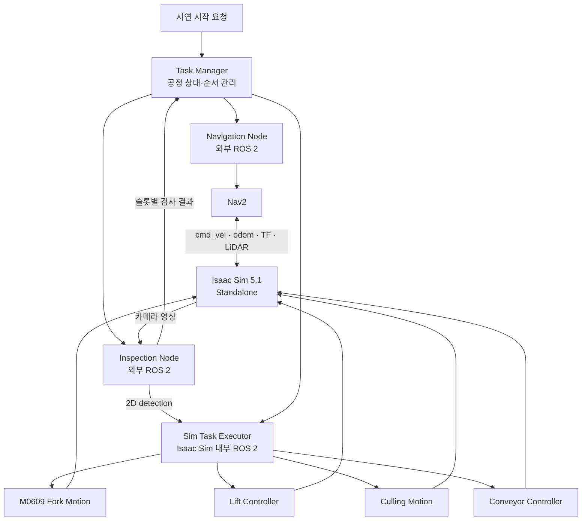

# 시스템 아키텍처

관련 이슈·To-do: 시스템 아키텍처 설계 (https://app.notion.com/p/3dd0f4c1b9cc8034930cd8efbb82dad7?pvs=21), SRD(시스템 요구서) 작성 (https://app.notion.com/p/SRD-3dc0f4c1b9cc80a38a4afab70d873348?pvs=21)
기록일: 2026년 9월 16일
날짜: 2026년 9월 16일
담당자: 봉승현
마지막 수정: 2026년 9월 19일 오후 11:32
분야: IsaacSim, ROS2
분류: 설계 결정
생성일: 2026년 9월 16일 오후 7:30
요약: Task Manager가 PREFLIGHT와 7개 공정 단계를 관리하고, 외부 Nav2·Inspection Node와 Isaac Sim 내부 Sim Task Executor를 연결하는 통합 시연 아키텍처
작성 상태: 정리 완료

# 시스템 아키텍처 — 통합 시연 기준

> **현재 기준:** Isaac Sim 5.1 Standalone 환경에서 Nova Carter, 리프트, M0609 포크 로봇, 검사 카메라 및 컨베이어를 구성한다. 외부 ROS 2의 Task Manager가 전체 공정 순서와 결과를 관리하고, Nav2는 이동을 담당하며, Isaac Sim 내부 Sim Task Executor가 리프트·로봇팔·솎아내기·컨베이어의 물리 동작을 수행한다. 통신 상세는 [인터페이스 설계](https://app.notion.com/p/3dd0f4c1b9cc801ba5eac9e5c6623d8d?pvs=21)를 기준으로 한다.
> 

## 1. 목적과 설계 원칙

- 시스템은 식물 팔레트의 랙 간 재배치, 수확 팔레트 운송, 검사, 불량 개체 솎아내기, 컨베이어 반출을 하나의 시연 사이클로 수행한다.
- Task Manager는 전체 공정 단계만 관리하며 관절값, 리프트 높이, TCP 경로 같은 세부 모션은 지시하지 않는다.
- Sim Task Executor는 고수준 작업 명령을 받아 리프트와 로봇팔의 복합 동작을 프레임 단위로 실행한다.
- Navigation Node는 작업점 이름을 map 좌표로 변환하고 Nav2 결과를 Task Manager가 사용하는 작업 결과로 변환한다.
- Inspection Node는 YOLO 검출 결과를 슬롯별 검사 결과와 원본 RGB pixel 기준 2D detection으로 변환한다. Depth와 로봇 좌표 계산은 Isaac Sim 내부 Executor가 담당한다.
- 현재 시연은 한 번에 하나의 공정 명령만 수행한다. 중간 실패 시 자동 재시도하지 않고 정지 후 장면과 논리 상태를 함께 초기화한다.

## 2. 시스템 범위와 용어

### 로봇 및 설비

- **이동 플랫폼:** Nova Carter
- **승강 장치:** Nova Carter 상부 리프트
- **운반 로봇:** 리프트 위 M0609 + 팔레트 포크
- **검사 장치:** 검사 카메라와 외부 Inspection Node
- **후공정:** 불량 개체 솎아내기 장치 및 컨베이어
- **시뮬레이터:** Isaac Sim 5.1 Standalone

### ID와 작업점

- 팔레트 ID: PALLET_001, PALLET_002, …
- 랙 슬롯: RACK_L1 ~ RACK_L4
- 식물 슬롯: SLOT_01 ~ SLOT_06
- AMR 도킹점: RACK_DOCK, INSPECTION_DOCK
- 팔레트 배치점: INSPECT_STATION, PACK_OUT
- 작업 실행 ID: TASK-YYYYMMDD-NNN
- 개별 명령 ID: TASK-YYYYMMDD-NNN-CMD-NNN

팔레트 ID는 개체 식별자이며 위치 의미를 포함하지 않는다. USD prim 이름을 논리 ID로 직접 사용하지 않고 설정 파일에서 팔레트 ID와 prim 경로를 매핑한다.

### 리프트 위치 명명

랙 층 번호와 리프트 높이 번호를 혼동하지 않도록 작업 목적 기반 프로파일을 사용한다.

- TRANSFER_L3_TO_L2
- TRANSFER_L4_TO_L3
- PICK_RACK_L1
- PLACE_INSPECTION
- TRAVEL

## 3. 전체 시스템 구조



## 4. 구성 요소별 책임

| 구성 요소 | 실행 위치 | 책임 | 책임에서 제외되는 항목 |
| --- | --- | --- | --- |
| Task Manager | 외부 ROS 2 | PREFLIGHT와 7개 실행 단계 진행, ID 생성·대조, 타임아웃, 논리 상태, 최종 결과 | 관절 제어, 리프트 높이 계산, Nav2 경로 계산, 영상 추론 |
| Navigation Node | 외부 ROS 2 | 작업점 좌표 변환, BasicNavigator 호출, Nav2 결과 변환 | 직접 cmd_vel 계산·발행 |
| Nav2 | 외부 ROS 2 | 지도 기반 경로 계획, 위치 추정 연계, 주행 제어 | 팔·리프트·컨베이어 제어 |
| Inspection Node | 외부 ROS 2 | 검사 요청 단위 영상 수집, 슬롯별 정상·불량·미판정 결과와 2D bbox·중심점 생성 | Depth·로봇 좌표 계산, 솎아내기 물리 동작 |
| Sim Task Executor | Isaac Sim 프로세스 내부 | 고수준 명령 수신, 2D detection과 Depth로 동적 Pick 좌표 계산, 내부 Routine 선택, 프레임별 동작, 물리 성공 판정 | 전체 시나리오 순서와 검사 결과 관리 |
| Motion/Controller 모듈 | Isaac Sim 프로세스 내부 | M0609, 리프트, 솎아내기, 컨베이어 제어 | ROS 전체 공정 상태 관리 |
| Isaac Sim 장면 | Isaac Sim 5.1 | 물리, 센서, 로봇 상태, 카메라 영상, 팔레트 상태 | 비즈니스 시나리오 결정 |

## 5. 실행 경계와 Standalone 구조

Isaac Sim 프로세스에서는 하나의 실행 진입점만 SimulationApp, World, world.step(), 장면 열기와 종료를 소유한다.

ROS 수신 콜백은 명령을 검증하고 대기열에 저장하는 역할만 수행한다. 긴 PICK, PLACE, 리프트 이동을 콜백에서 블로킹 실행하지 않는다. 실제 동작은 Standalone 프레임 루프에서 Sim Task Executor의 update(dt)를 호출해 진행한다.

```python
while [app.is](http://app.is)_running():
    rclpy.spin_once(sim_task_executor, timeout_sec=0.0)
    sim_task_executor.update(physics_dt)
    world.step(render=True)
```

각 Motion 모듈은 SimulationApp 생성, 장면 로드, World.reset(), world.step(), app.close()를 직접 수행하지 않는다.

## 6. 시나리오 상태 머신

PREFLIGHT를 포함한 총 8개 상태이며, 실제 공정은 7개 실행 단계다.

| 번호 | 상태 | 실행 주체 | 주요 동작 | 완료 조건 |
| --- | --- | --- | --- | --- |
| 0 | PREFLIGHT | Task Manager | Sim·Navigation·Inspection 준비, 초기 랙 점유와 장면 확인 | 모든 Executor READY, RACK_L2 공석 |
| 1 | TRANSFER | Sim Task Executor | PALLET_002 L3→L2 이동 후 PALLET_003 L4→L3 이동 | 두 단위 이동 모두 성공 |
| 2 | PICK_HARVEST | Sim Task Executor | PALLET_001을 L1에서 PICK, 인출, 운송 자세·높이 | safe_to_navigate=true |
| 3 | NAVIGATION | Navigation Node | Nav2로 INSPECTION_DOCK 이동 | Nav2 성공 및 목적지 일치 |
| 4 | PLACE_INSPECT | Sim Task Executor | 베이스 정지 확인 후 검사대 위 PLACE | 팔레트 안착 확인 |
| 5 | INSPECT | Inspection Node | 카메라 인식과 SLOT_01~SLOT_06 검사 | 슬롯별 결과 생성, 미판정 없음 |
| 6 | CULL | Sim Task Executor | 불량 슬롯 순차 솎아내기 | 대상 슬롯 제거 확인 |
| 7 | CONVEYOR_OUT | Sim Task Executor | 컨베이어 가동, 출구 이동, 작업 기록 | 출구 감지 또는 목표 위치 도달 |

검사 결과 불량 슬롯이 없으면 CULL을 건너뛰고 CONVEYOR_OUT으로 이동한다.

## 7. Sim Task Executor 내부 동작

### TRANSFER

TRANSFER는 Task Manager 관점에서 하나의 단계지만 내부에서는 두 단위 작업을 연속 실행한다.

1. CHECK_BASE_STOPPED
2. TRANSFER_UNIT_01: PALLET_002, LIFT_TO_PROFILE(TRANSFER_L3_TO_L2) → ARM_PICK(RACK_L3) → VERIFY_PICK → ARM_RETRACT → ARM_PLACE(RACK_L2) → VERIFY_PLACE → ARM_SAFE
3. TRANSFER_UNIT_02: PALLET_003, LIFT_TO_PROFILE(TRANSFER_L4_TO_L3) → ARM_PICK(RACK_L4) → VERIFY_PICK → ARM_RETRACT → ARM_PLACE(RACK_L3) → VERIFY_PLACE → ARM_SAFE
4. RESULT

각 단위 작업에서 PICK과 PLACE는 같은 리프트 높이에서 수행한다. PICK과 PLACE 사이에는 리프트 이동이 없다.

### PICK_HARVEST

CHECK_BASE_STOPPED → LIFT_TO_PROFILE(PICK_RACK_L1) → ARM_PICK(PALLET_001, RACK_L1) → VERIFY_PICK → ARM_RETRACT → ARM_TRANSPORT_POSE → LIFT_TO_PROFILE(TRAVEL) → VERIFY_TRANSPORT_READY → RESULT

VERIFY_TRANSPORT_READY는 팔레트 상승·인출, 미끄러짐, 팔 운송 자세, 리프트 운송 높이와 랙 이탈을 확인한다. 모든 조건이 충족되어야 safe_to_navigate=true를 반환한다.

### PLACE_INSPECT

CHECK_BASE_STOPPED → CHECK_INSPECTION_DOCK → LIFT_TO_PROFILE(PLACE_INSPECTION) → ARM_PLACE(INSPECT_STATION) → VERIFY_PLACE → ARM_SAFE → RESULT

### CULL

VALIDATE_TARGET_SLOTS → 각 슬롯에 대해 MOVE_TO_SLOT → REMOVE_DEFECT → VERIFY_REMOVAL → ARM_SAFE → RESULT

### CONVEYOR_OUT

CHECK_PALLET_ON_CONVEYOR → START_CONVEYOR → MONITOR_EXIT → STOP_CONVEYOR → RECORD_CYCLE → RESULT

컨베이어 완료는 명령 발행이 아니라 출구 trigger, 팔레트 prim의 출구 좌표 통과 또는 목표 위치 도달로 판정한다.

## 8. 상태 소유권

| 상태 | 원본 소유자 | Task Manager가 보관하는 정보 |
| --- | --- | --- |
| 현재 공정 단계 | Task Manager | current_state, active_command_id, deadline |
| 팔레트 기대 위치 | Task Manager | 명령 성공에 따라 갱신한 논리 위치 |
| 팔레트 실제 위치·물리 상태 | Isaac Sim | Executor 결과와 검증 상태 |
| AMR 위치 | Nav2·AMCL·Isaac Sim | 도착한 작업점 이름과 결과 |
| 리프트·관절 상태 | Sim Task Executor | 단계 완료 여부만 수신 |
| 검사 결과 | Inspection Node | defect_slots, unknown_slots |
| 검사 2D 위치 | Inspection Node | Task Manager는 보관하지 않음 |
| Depth·로봇 좌표와 컨베이어 출구 도달 | Sim Task Executor | 최종 성공 여부만 수신 |

Task Manager의 팔레트 위치는 명령 결과에 기반한 기대 상태다. 실제 장면 상태와 동일하다고 자동 가정하지 않는다.

## 9. 성공·실패 및 복구 원칙

- 관절 목표 도달과 물리적 PICK·PLACE 성공을 구분한다.
- PICK 성공은 팔레트 상승, 인출, 미끄러짐 허용 범위를 함께 확인한다.
- PLACE 성공은 하강, 안착, 포크 인출 후 팔레트 유지 여부를 확인한다.
- Nav2 성공 후 PLACE 전에 Sim Task Executor가 베이스 정지와 검사대 도킹 조건을 다시 확인한다.
- TRANSFER 중간 실패 시 이미 첫 번째 팔레트가 이동했을 수 있으므로 전체 TRANSFER를 자동 재실행하지 않는다.
- 실행 실패, TIMEOUT 또는 결과 불일치 시 다음 단계로 진행하지 않는다.
- 중간 자동 복구는 초기 범위에서 제외한다. 모든 동작을 정지한 뒤 장면과 Task Manager 논리 상태를 함께 초기화한다.
- 시험용 도킹·관절·시간 허용값은 단독 시험 결과로 확정하며 설계 문서의 임시값을 최종 성능 기준으로 사용하지 않는다.

## 10. 실행 순서

1. Isaac Sim Standalone을 실행하고 장면, ROS 2 Bridge, 센서, Sim Task Executor를 준비한다.
2. 지도, AMCL, Nav2를 실행하고 map→odom→base_link, 오도메트리, LiDAR, cmd_vel 연결을 확인한다.
3. Navigation Node와 Inspection Node를 실행한다.
4. Task Manager를 실행한다.
5. /start_cycle 요청을 보낸다.
6. Task Manager의 /cycle/status와 각 Executor status를 관찰한다.
7. 실패 시 로봇·리프트·컨베이어 정지 후 장면과 Task Manager를 함께 초기화한다.

## 11. 디렉터리 기준안

```
ROKEY_P3_A1/
├── docs/
│   ├── 01-architecture.md
│   ├── 02-interfaces.md
│   └── 03-integration_test.md
└── cobot3_ws/
    ├── src/
    │   ├── smart_farm_interfaces/
    │   ├── smart_farm_task_manager/
    │   │   ├── smart_farm_task_manager/
    │   │   │   ├── task_manager_node.py
    │   │   │   ├── state_machine.py
    │   │   │   └── scenario_loader.py
    │   │   └── config/demo_harvest.yaml
    │   ├── smart_farm_navigation/
    │   │   ├── smart_farm_navigation/navigation_[node.py](http://node.py)
    │   │   └── config/stations.yaml
    │   └── color_vision/
    │       └── color_vision/inspection_[node.py](http://node.py)
    └── isaacpjt/smart_farm/
        ├── runtime/
        │   ├── standalone_app.py
        │   ├── sim_task_executor.py
        │   └── command_dispatcher.py
        ├── motion/
        │   ├── fork_motion.py
        │   ├── lift_controller.py
        │   ├── culling_motion.py
        │   └── conveyor_controller.py
        └── config/
            ├── prim_paths.yaml
            ├── rack_slots.yaml
            └── lift_profiles.yaml
```

## 12. 확정 전 실측·구현 항목

- 작업점 map 좌표와 INSPECTION_DOCK 도킹 허용 오차
- 각 리프트 프로파일의 실제 높이
- M0609 TCP, 포크 삽입·인출 거리와 충돌 여유
- 수확 팔레트 운송 자세와 이동 중 안정성
- 검사 카메라 시야 및 슬롯별 좌표 매핑
- 솎아내기 장치의 로봇·툴·대상 제거 방식
- 컨베이어 출구 감지 방식
- 단계별 timeout과 물리 성공 허용값
- 작업 기록의 저장 위치와 형식