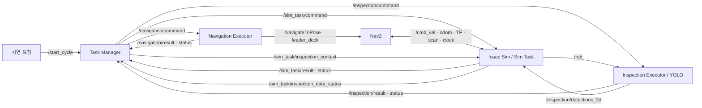

# 시스템 아키텍처 — v0.2.0

이 문서는 현재 `DEMO_HARVEST_01` 구현의 구성과 책임 경계를 설명한다. 공정 순서의 기준은 [시나리오](../cobot3_ws/src/smart_farm_manager/smart_farm_manager/scenario.py)와 [상태 머신](../cobot3_ws/src/smart_farm_manager/smart_farm_manager/state_machine.py)이다. 메시지 필드와 오류 코드는 [인터페이스 문서](02-interfaces.md)에서 다룬다.

## 실행 기준

- Isaac Sim 5.1 Standalone이 Nova Carter, 리프트, M0609 포크 로봇, 검사 스테이션, 컨베이어의 물리·센서를 실행한다.
- 기본 장면은 Git 외부 자산 `cobot3_ws/isaacpjt/smart_farm/scenes/Collected_smartfarm_v015/Collected_smartfarm_v015.usd`다. [Standalone 진입점](../cobot3_ws/isaacpjt/smart_farm/runtime/standalone_app.py)은 이 파일이 있으면 기본 장면으로 선택한다. 파일이 없을 때 v011로 대체되는 동작은 v0.2.0 통합 시연의 기준이 아니다.
- [Nav2 launch](../cobot3_ws/src/smart_farm_navigation/launch/nav2.launch.py)의 기본 지도는 `Collected_smartfarm_v015.yaml`이다. 장면과 지도의 버전을 함께 맞춘다.
- Task Manager, Nav2, Navigation Executor는 ROS 2 Jazzy 호스트에서 실행한다. Inspection Executor는 `compose.vision.yaml`의 GPU 컨테이너에서 실행한다. 이 프로세스들이 같은 `ROS_DOMAIN_ID`로 DDS 통신해야 한다.
- v0.2.0에서 통합 검사는 `smart_farm_vision`의 YOLO 모델을 사용한다. [`ml/cabbage_anomaly`](../ml/cabbage_anomaly/README.md)의 PatchCore는 데이터셋·녹화 영상 평가용이며 Task Manager 공정에 연결되지 않는다.

## 구성 요소와 책임

| 구성 요소 | 실행 위치 | 책임 |
| --- | --- | --- |
| [Task Manager](../cobot3_ws/src/smart_farm_manager/smart_farm_manager/task_manager_node.py) | ROS 2 호스트 | `/start_cycle` 수락, executor 준비·명령 순서·ID·제한 시간 관리, terminal 결과 검증, `/cycle/status` 발행 |
| [Navigation Executor](../cobot3_ws/src/smart_farm_navigation/smart_farm_navigation/navigation_node.py)·Nav2 | ROS 2 호스트 | `NavigateToPose`와 `feeder_dock`을 사용해 `FEEDER_DOCK`까지 이동·정밀 도킹 |
| [Inspection Executor](../cobot3_ws/src/smart_farm_vision/smart_farm_vision/inspection_executor_node.py) | Vision GPU 컨테이너 | `/rgb`의 새 프레임에서 YOLO 검출, 여섯 슬롯 판정, `INSPECT`·`RECHECK` 결과와 2D 검출 발행 |
| [Sim Task Node](../cobot3_ws/isaacpjt/smart_farm/runtime/sim_task_node.py) | Isaac Sim 프로세스 | Sim 명령·검출 데이터 수신·검증, 상태·terminal 결과 발행 |
| [Standalone 런타임](../cobot3_ws/isaacpjt/smart_farm/runtime/standalone_app.py) | Isaac Sim 프로세스 | 장면·World 소유, 프레임 루프에서 포크·리프트·지그·솎아내기·컨베이어 실행 |
| v015 USD 장면 | Git 외부 자산 | 로봇·팔레트·스테이션·센서·물리 상태 제공 |

Task Manager는 공정 순서와 팔레트의 기대 위치를 관리한다. 실제 위치와 동작 성공은 각 executor가 판정한다. Isaac의 ROS 콜백은 명령을 대기열에 넣고, 긴 물리 동작은 Standalone 프레임 루프에서 진행한다.

```mermaid
flowchart LR
    USER["시연 요청"] -->|"/start_cycle"| TM["Task Manager"]
    TM -->|"/sim_task/command"| SIM["Isaac Sim / Sim Task"]
    SIM -->|"/sim_task/result · status"| TM
    TM -->|"/navigation/command"| NAV["Navigation Executor"]
    NAV -->|"NavigateToPose · feeder_dock"| NAV2["Nav2"]
    NAV -->|"/navigation/result · status"| TM
    NAV2 <-->|"/cmd_vel · odom · TF · scan · clock"| SIM
    TM -->|"/inspection/command"| VISION["Inspection Executor / YOLO"]
    SIM -->|"/rgb"| VISION
    VISION -->|"/inspection/result · status"| TM
    VISION -->|"/inspection/detections_2d"| SIM
    TM -->|"/sim_task/inspection_context"| SIM
    SIM -->|"/sim_task/inspection_data_status"| TM
```

## 공정 순서

`IDLE`에서 `DEMO_HARVEST_01`을 수락하면 `PREFLIGHT`로 들어간다. 세 executor의 최신 `READY` 상태를 확인한 뒤 아래 공정을 순서대로 발행한다. 활성 명령의 `task_id`·`command_id`·`operation`과 일치하는 `SUCCEEDED` terminal 결과를 검증해야 다음 단계로 넘어간다.

| 순서 | 공정 | 실행 주체 | 성공 시 다음 상태 |
| ---: | --- | --- | --- |
| 1 | `TRANSFER` — PALLET_002 L3→L2, PALLET_003 L4→L3 | Sim Task | `PICK_HARVEST` |
| 2 | `PICK_HARVEST` — PALLET_001 인출·운송 자세 | Sim Task | `NAVIGATION` |
| 3 | `NAVIGATION` — `FEEDER_DOCK` 이동·도킹 | Navigation | `PLACE_INSPECT` |
| 4 | `PLACE_INSPECT` — 검사 컨베이어에 PALLET_001 배치 | Sim Task | `CONVEY_TO_INSPECT` |
| 5 | `CONVEY_TO_INSPECT` — `INSPECT_STOP`으로 이동 | Sim Task | `PREPARE_INSPECT` |
| 6 | `PREPARE_INSPECT` — 지그가 `INSPECT_WORK_POS`로 밀어 넣음 | Sim Task | `MOVE_TO_INSPECT` |
| 7 | `MOVE_TO_INSPECT` — 검사 카메라 자세 준비 | Sim Task | `INSPECT` |
| 8 | `INSPECT` — 여섯 슬롯 판정과 최초 2D 검출 | Inspection | 불량이 있으면 `CULL`, 없으면 `RECHECK` |
| 9 | `CULL` — 불량 슬롯 배출; 정상 경로에서는 생략 | Sim Task | `RECHECK` |
| 10 | `RECHECK` — 새 영상으로 제거 슬롯·나머지 슬롯 재판정 | Inspection | `RELEASE_INSPECT` |
| 11 | `RELEASE_INSPECT` — 지그를 빼고 `INSPECT_STOP`으로 복귀 | Sim Task | `CONVEYOR_OUT` |
| 12 | `CONVEYOR_OUT` — `PACK_OUT`까지 배출 확인 | Sim Task | `COMPLETE/SUCCEEDED` |

정상 판정에서도 `RECHECK`와 `RELEASE_INSPECT`를 수행한다. `CONVEYOR_OUT`은 `RELEASE_INSPECT` 성공 후에만 시작한다. `COMPLETE`와 `ERROR`는 terminal 상태다. 다른 ID의 결과나 중복 결과는 전이에 사용하지 않는다.

## 검사와 솎아내기 데이터 경계

Inspection Executor는 명령을 받은 **뒤**의 새 `/rgb` 프레임으로 `INSPECT`와 `RECHECK`를 수행한다. `INSPECT` 결과에는 불량·미판정 슬롯을 담고, 2D 검출에는 슬롯·클래스·영상 좌표와 검사 명령 식별자를 담는다. `RECHECK`는 제거 대상 슬롯을 `target_slots`로 받고, 해당 칸에 검출이 없으면 `REMOVED`로 판정한다. 이때의 검출은 최초 CULL 데이터로 다시 저장하지 않는다.

CULL이 필요하면 Task Manager는 Sim에 최초 검사 식별자를 알리고, 일치하는 검출 데이터가 저장된 뒤 CULL 명령을 발행한다. Sim은 대상 슬롯 집합과 검사 결과의 불량 슬롯 집합을 대조한다. 관리형 CULL의 파지 목표는 픽셀에서 Depth를 복원해 계산하지 않는다. 현재 트레이 월드 자세와 각 배추 자리의 로컬 오프셋을 사용하며, 영상 좌표는 진단용 기하 비교에 사용한다. 실제 제거가 확인된 슬롯만 `completed_units`로 보고한다.

## 실패와 재시작

- `PREFLIGHT`는 Sim·Navigation·Inspection의 최신 `READY` heartbeat를 요구한다. 준비 실패, 제한 시간 초과, terminal `FAILED`, 성공 결과의 계약 불일치는 `ERROR`로 끝나며 다음 공정을 발행하지 않는다.
- Task Manager의 팔레트 위치는 성공 결과에서 갱신한 **논리적 기대 위치**다. 물리 명령 실패는 `RESET_REQUIRED`로 끝날 수 있으며 같은 명령을 자동 재시도하지 않는다.
- Isaac Sim에서 Stop→Play하면 Standalone 런타임이 원본 장면을 다시 열고 이전 대기 명령·검출 데이터를 버린다. 새 사이클 전에는 Task Manager도 새 `IDLE` 상태로 시작해야 한다.
- 전체 사이클에는 v015 USD 장면, 대응 지도, YOLO 모델, GPU 컨테이너와 ROS 2 네트워크가 필요하다.
