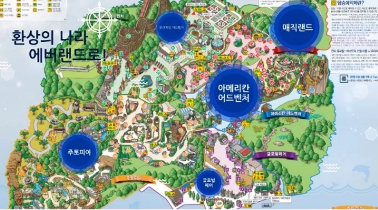
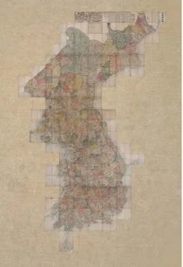
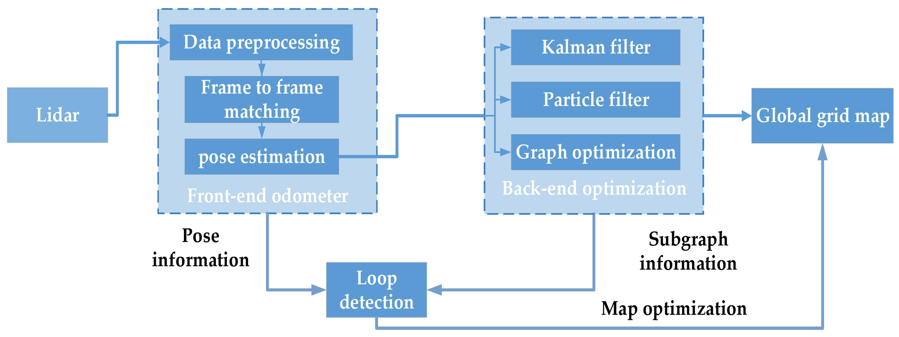
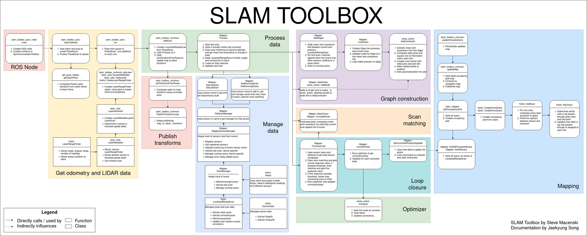

# SLAM 개요

- 출처: https://sonmiran9.oopy.io/1d2450ef-7c59-83e1-be15-81ec5a73dcb0 (Isaac Sim_협동3_9기 > Nova-Carter로 SLAM & Navigation)
- 정리 기준: 제목 구조와 명령·설정값은 원문 그대로, 설명문은 요약. 이미지는 같은 폴더에 저장.

## SLAM(Simultaneous Localization and Mapping) 이란?

- Simultaneous(동시적) + Localization(위치 추정) + Mapping(지도 작성).

### Localization
- 지도가 주어진 상태에서 그 안에서 내 위치를 찾는 문제.

### Mapping
- 이동 정보가 주어진 상태에서 지도를 만드는 문제.

### SLAM
- 위 두 문제를 동시에 푸는 알고리즘. 위치를 알아야 지도를 그리고, 지도가 있어야 위치를 아는 순환 관계라 "chicken and egg problem"이라 부름.
- 센서 데이터로 주변을 인식해 지도를 만들면서 로봇 위치를 실시간 추적함. 처음 보는 환경에서도 동작함.

## 2D Lidar SLAM framework

| 단계 | 역할 요약 |
| --- | --- |
| 1. Lidar | 2D LiDAR 스캔으로 거리 데이터 입력 (예: TurtleBot4) |
| 2. Front-end Odometer | 노이즈 제거·스캔 정렬 등 전처리, 연속 스캔 간 상대 이동 계산(예: ICP), 현재 pose 추정. "지금 어디 있는지"를 대략 추정 |
| 3. Back-end Optimization | Kalman Filter, Particle Filter, Graph Optimization 등으로 pose 열을 경로 그래프로 묶어 오차 최소화. 전체 경로를 다시 정렬 |
| 4. Loop Detection | 과거 방문 위치 재인식(루프 클로저)으로 누적 오차 보정. 예: 복도 한 바퀴 후 출발점 인식 |
| 5. Global Grid Map | 최적화된 위치를 바탕으로 Occupancy Grid Map 생성 |

- 흐름 요약: Front-end가 현재 위치 추정 → Back-end가 누적 오차 보정 → 정교한 2D 지도 완성.

## ROS2 Package로 제공

- SLAM Toolbox: 2D 라이다로 실시간 지도 작성과 위치 추정을 수행하는 ROS 2 SLAM 패키지.

