# Nova Carter 로드 및 Map 제작

- 출처: https://sonmiran9.oopy.io/856450ef-7c59-82a9-b480-8125698c3f98
- 정리 기준: 제목 구조와 명령·설정값은 원문 그대로, 설명문은 요약. 이미지는 같은 폴더에 저장.

## 학습 목표

- Robotics Examples에서 Nova Carter 창고 시나리오 로드
- Occupancy Map 도구로 2D 점유 격자 지도 생성
- Nav2 형식(PNG + YAML)으로 저장

## 핵심 개념

- Occupancy Map: 공간을 격자로 나눠 셀별 장애물 점유 여부를 기록한 2D 지도. Nav2 경로 계획의 기본 입력.
- 흰색 = 자유 공간, 검정 = 점유(벽·진열대·지게차), 회색 = 미탐색.

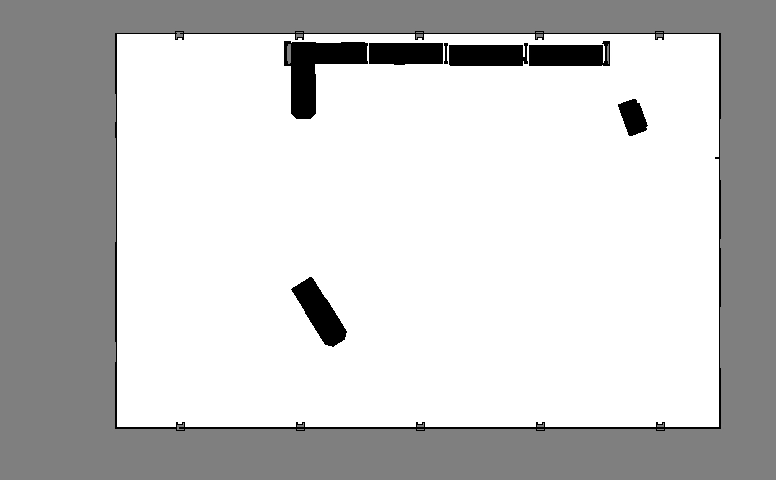

## 사전 준비

- Isaac Sim 5.1.0 실행 가능 상태.
- ROS 2 패키지 설치와 빌드는 Isaac Sim을 띄운 터미널과 **다른 터미널**에서 한다. 같은 터미널이면 ROS 라이브러리 충돌로 통신이 깨진다.

```shell
# Nav2 패키지 설치
sudo apt install ros-jazzy-navigation2 -y
sudo apt install ros-jazzy-nav2-bringup -y
sudo apt install ros-jazzy-pointcloud-to-laserscan -y
sudo apt install ros-jazzy-nav2-simple-commander -y
```

- navigation2: planner·controller 등 본체 / nav2-bringup: launch·설정 / pointcloud-to-laserscan: 3D 점군을 2D 스캔으로 변환.

```shell
#IsaacSim-ros_workspaces 다운로드 명령어
cd ~
git clone -b IsaacSim-5.1.0 https://github.com/isaac-sim/IsaacSim-ros_workspaces.git

#clone 후에는 저장소 루트에서 아래 명령으로 서브모듈을 초기화
cd ~/IsaacSim-ros_workspaces
git submodule update --init --recursive

#빌드 초기화
source /opt/ros/jazzy/setup.bash
cd ~/IsaacSim-ros_workspaces/jazzy_ws
colcon build
```

- 빌드 중 `tl_expected deprecated`, `on_init deprecated` 경고(stderr)는 무시 가능. 컴파일은 완료됨.

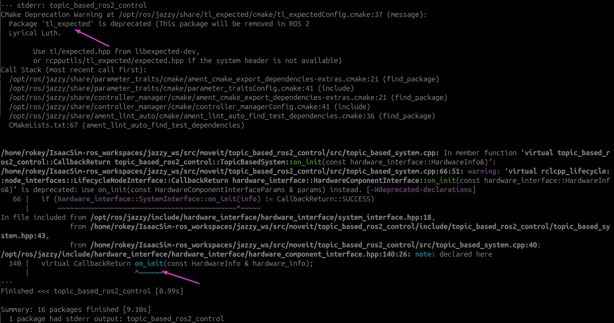

```
ls ~/IsaacSim-ros_workspaces/jazzy_ws/src/navigation/carter_navigation/maps/
```


## 학습 내용 (절차)

1. Isaac Sim 시작

```
isaac_ros

isaac
```

2. 시나리오 로드: Window → Examples → Robotics Examples → 좌측 트리 ROS2 → NAVIGATION → Nova Carter 카드 → Information 패널의 Load Sample Scene. 창고와 Nova Carter가 로드됨(시간이 오래 걸림). 씬에는 OmniGraph ROS2 그래프(ROS_Clock, Nova_Carter_ROS)가 포함됨. Nova Carter는 NVIDIA 4륜 차동구동 로봇.

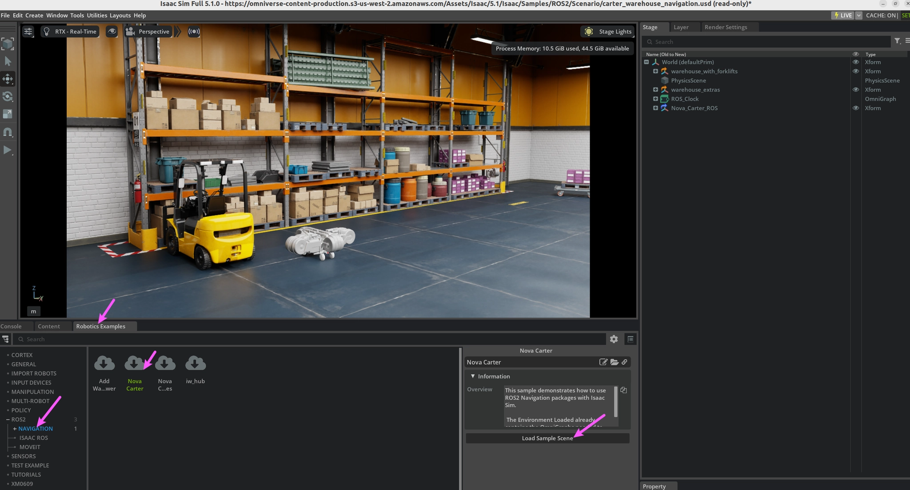

3. Viewport를 Top 뷰로 전환: 카메라 버튼(Perspective) → Top (Alt + T). 2D 지도 범위를 정확히 보기 위함.

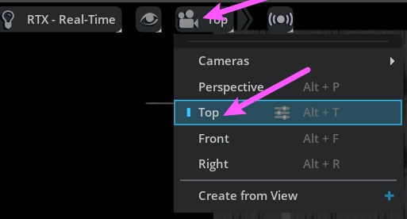

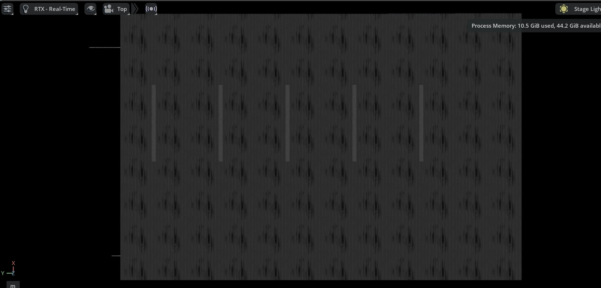

4. Occupancy Map 도구: Tools → Robotics → Occupancy Map. 하단 패널에 탭이 열림. 씬의 Collider 정보를 기반으로 격자 점유를 계산함.

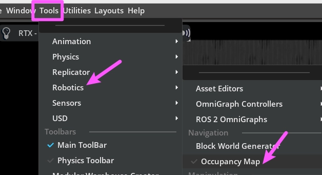

5. 파라미터 설정

```
Occupancy Map 패널
    ├── Upper Bound:    Z = 0.62
    ├── Lower Bound:    Z = 0.1
```

- Origin은 씬 원점(0,0,0), Cell Size 0.05 m(한 칸 5 cm).
- Z 범위는 장애물로 인식할 높이 구간. Upper 0.62 = 로봇 본체 높이 근방(그 위 선반 상단은 제외), Lower 0.1 = 바닥 잡음 제거.

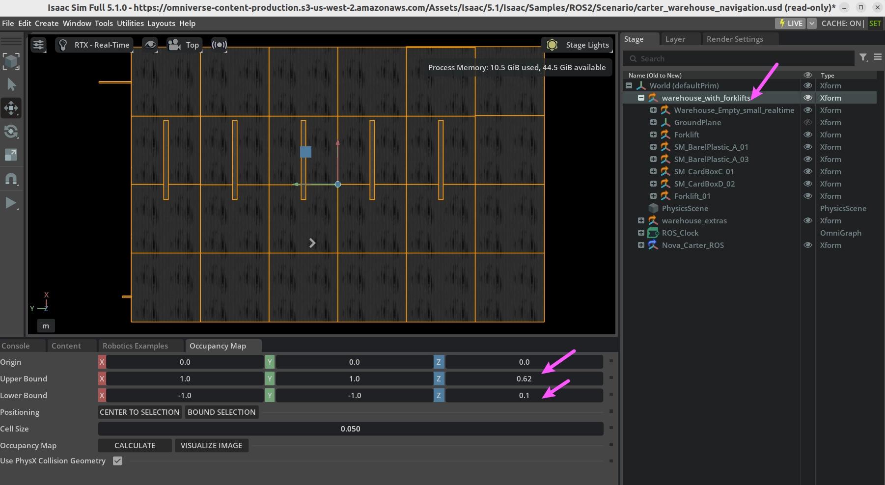

- 범위 자동 지정: Stage에서 `warehouse_with_forklifts` 선택 → BOUND SELECTION. 선택 prim의 경계가 X·Y에 적용됨(예: Upper X=12.0, Y=20.81808 / Lower X=-12.0, Y=-18.0). Z는 입력값 유지.

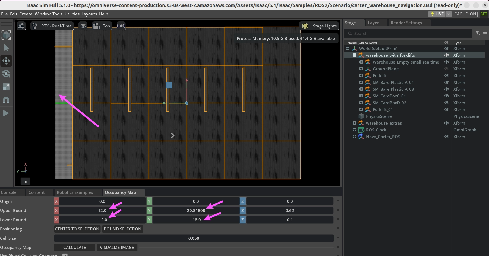

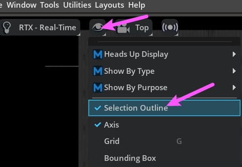

6. Nova_Carter_ROS 비활성화: Stage에서 선택 → 눈 아이콘(또는 우클릭 → Delete). 로봇이 씬에 있으면 로봇 자체가 장애물로 찍혀 지도가 잘못됨.

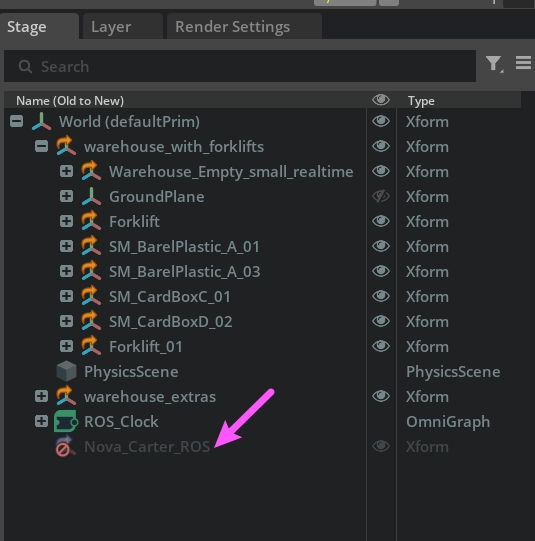

7. CALCULATE → 약 10초 대기 → VISUALIZE IMAGE. 계산 직후 바로 누르면 오류가 날 수 있음.

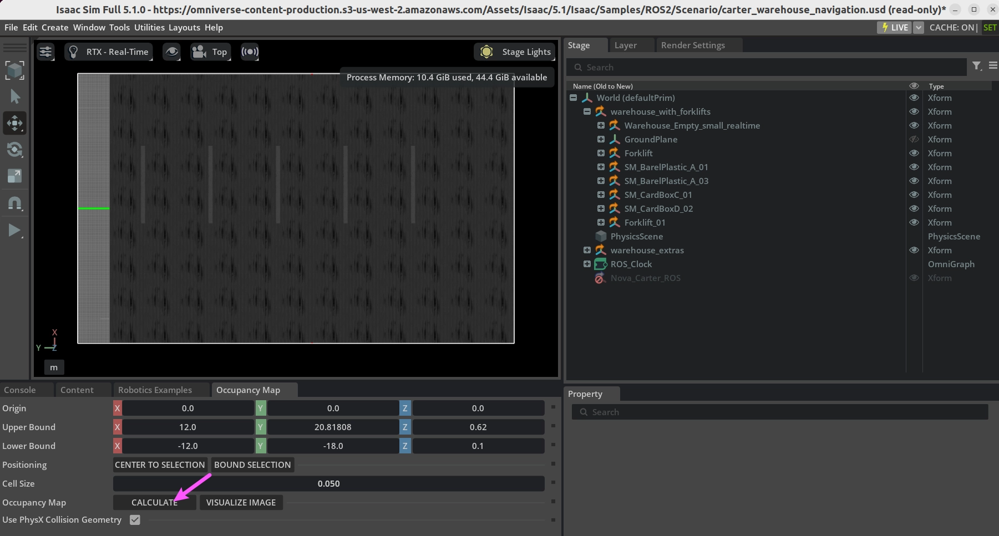

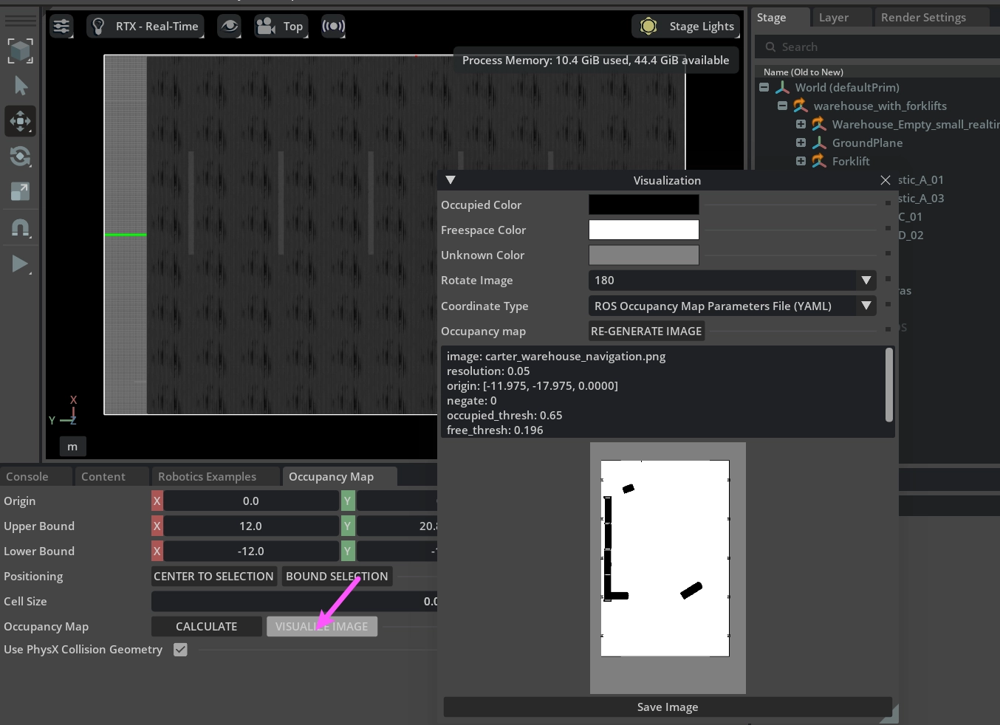

8. ROS용 재생성

```
Visualization 창
    ├── Rotate Image:    180
    ├── Coordinate Type: ROS Occupancy Map Parameters File (YAML) 선택
    └── RE-GENERATE IMAGE 클릭
```

- ROS와 Isaac Sim은 Y축 방향이 반대라 180도 회전이 필요함. Coordinate Type을 YAML로 해야 map_server가 읽는 형식이 됨.

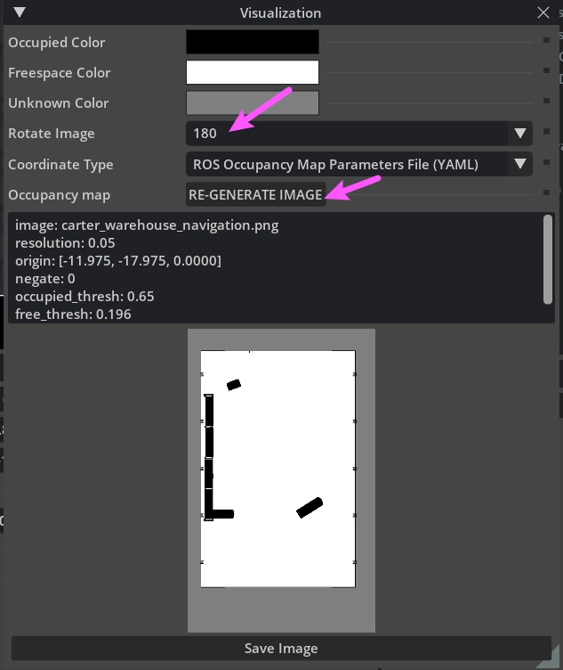

9. YAML 메타정보 복사: Visualization 창 하단 텍스트 전체 선택(Ctrl+A) 후 복사(Ctrl+C).

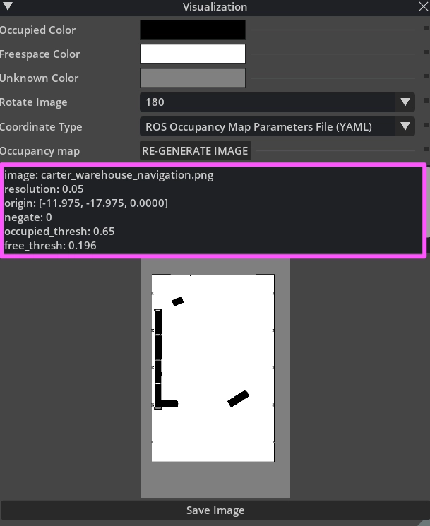

```yaml
image: carter_warehouse_navigation.png
resolution: 0.05
origin: [-11.975, -17.975, 0.0000]
negate: 0
occupied_thresh: 0.65
free_thresh: 0.196
```

10. YAML 저장

```shell
gedit ~/IsaacSim-ros_workspaces/jazzy_ws/src/navigation/carter_navigation/maps/carter_warehouse_navigation.yaml
```

- 기존 내용을 복사한 YAML로 덮어쓰기. `image:`의 파일명은 실제 PNG 이름과 대소문자까지 일치해야 함.

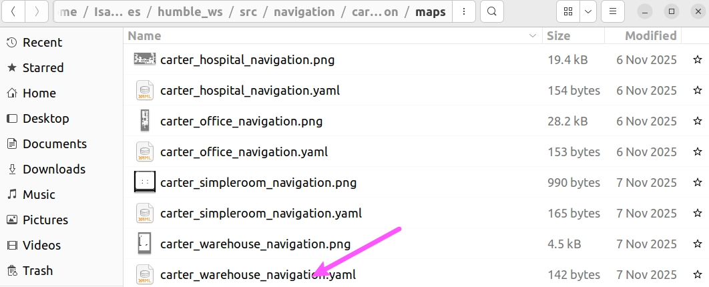

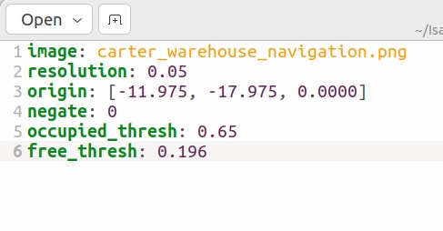

| 파라미터 | 값 | 의미 요약 |
| --- | --- | --- |
| image | carter_warehouse_navigation.png | 지도 이미지 파일 |
| resolution | 0.05 | 픽셀 1개 = 5 cm |
| origin | [-11.975, -17.975, 0.0] | 이미지 좌하단의 실제 좌표 (x, y, yaw) |
| negate | 0 | 색 반전 없음 |
| occupied_thresh | 0.65 | 이 이상이면 점유 |
| free_thresh | 0.196 | 이 이하이면 자유 공간 |

11. PNG 저장: Visualization 창 하단 Save Image → 경로 `~/IsaacSim-ros_workspaces/humble_ws/src/navigation/carter_navigation/maps/` → 파일명 `carter_warehouse_navigation.png` → Save. (원문은 humble_ws로 적혀 있으나 앞 단계는 jazzy_ws를 사용함. 실제 사용 워크스페이스에 맞출 것.)

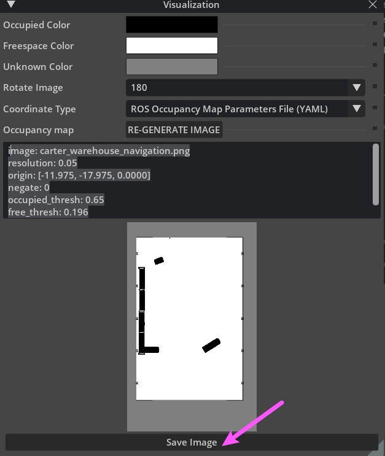

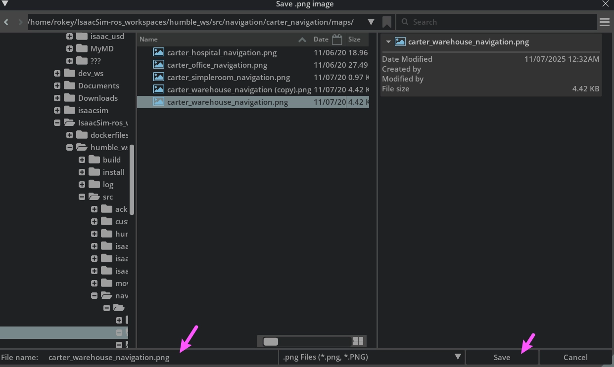

## 요약 정리

| 파일 | 경로 | 역할 |
| --- | --- | --- |
| carter_warehouse_navigation.png | .../carter_navigation/maps/ | 지도 이미지 |
| carter_warehouse_navigation.yaml | .../carter_navigation/maps/ | 지도 메타데이터 |

- 주의 3가지: CALCULATE 전 Nova_Carter_ROS 비활성화 / CALCULATE 후 잠시 대기 뒤 VISUALIZE / YAML의 image 이름과 PNG 이름 일치.
