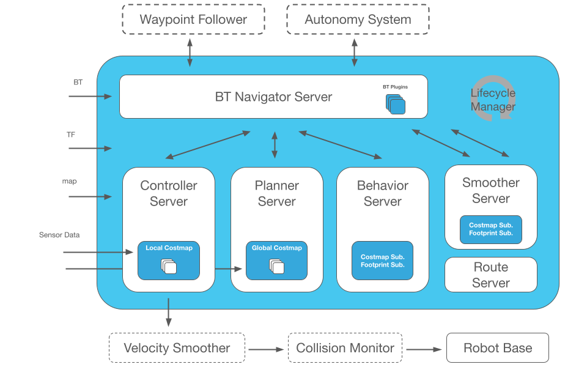
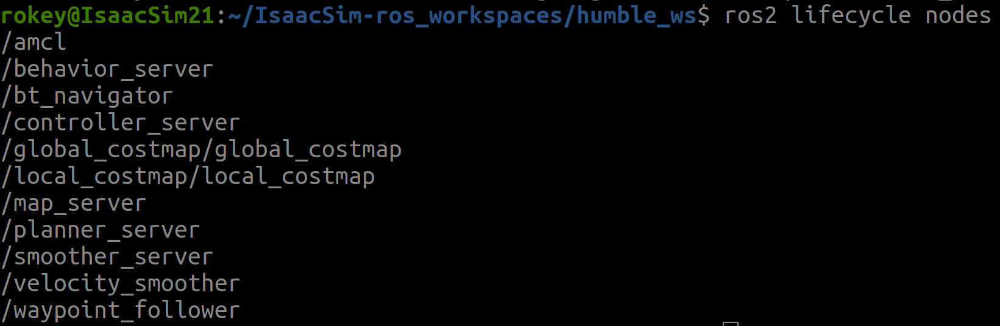
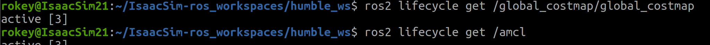
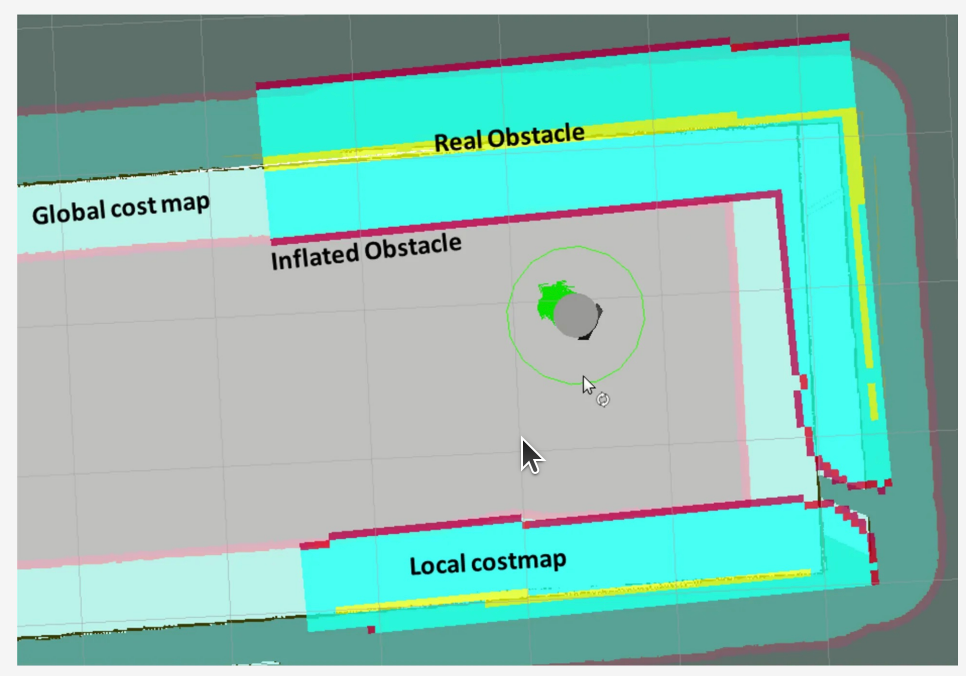
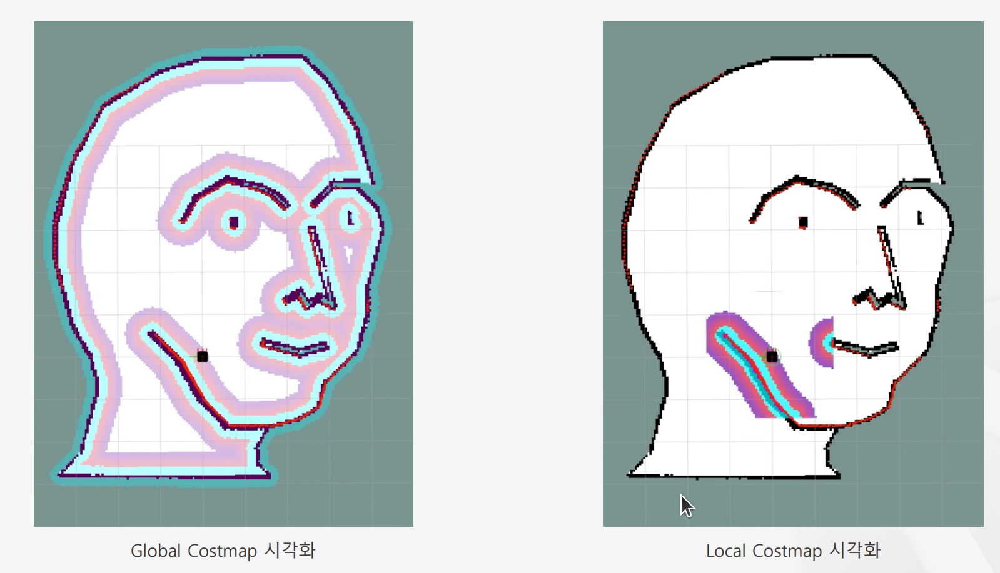

# Nav2개요

- 출처: https://sonmiran9.oopy.io/3dd450ef-7c59-80a8-b4be-edf5ff849214
- 정리 기준: 제목 구조와 명령·설정값은 원문 그대로, 설명문은 요약. 이미지는 같은 폴더에 저장.

## Nav2는 무엇인가?

- Nav2(Navigation2): ROS 2 기반 자율주행 프레임워크. 지도 위 목적지까지 경로 계획 → 장애물 회피 → 이동을 담당.



| 노드 | 역할 요약 |
| --- | --- |
| map_server | 정적 지도(.yaml/.png)를 읽어 /map 발행 |
| amcl | 위치 추정. map → base_link 사이 TF 제공 |
| planner_server | 목적지까지 전역 경로 생성 |
| controller_server | 센서 범위 안에서 반응형 국소 경로·속도 명령 생성 |
| behavior_tree_navigator / bt_navigator | Behavior Tree로 전체 내비게이션 과정과 목표 도달까지의 진행 관리 |
| lifecycle_manager | 위 노드들의 상태 전이(unconfigured → inactive → active)를 자동 수행 |

## Nav2 실행 시 주요 상태 흐름

1. launch 실행 → lifecycle_manager가 각 노드 상태 관리 시작
2. 각 노드 전이: unconfigured → configuring → inactive → activating → active
3. 모두 active가 되면 내비게이션 준비 완료
4. /amcl_pose 발행 = 위치 추정 성공
5. /cmd_vel 발행 = 실제 이동

## 비정상 상황: 셧다운이 필요한 경우

| 증상 | 조치 요약 |
| --- | --- |
| amcl TF 오류(extrapolation 등) | 지도 또는 초기 위치 문제. RViz에서 초기 포즈 재지정 |
| /amcl_pose 미발행 | amcl 미동작. 재실행 |
| 일부 노드가 inactive에서 정지 | lifecycle_manager 실패. 전체 종료 후 재실행 |
| RViz에 지도는 보이나 로봇 아이콘 고정 | 위치 추정 실패. 포즈 재설정 또는 재시작 |

- 정리: Nav2는 여러 노드가 순서대로 살아나야 하는 상태 기계임. 하나라도 활성화되지 않으면 전체가 실패함. 디버깅 4문항: 지도가 떴는가, 위치가 추정되는가, 모든 노드가 active인가, 속도 명령이 나오는가. 전체 재시작이 빠를 때도 있지만 상태를 관찰해 원인을 추론하는 습관이 중요함.

### Lifecycle 상태 확인 명령

```bash
ros2 lifecycle nodes
```



```bash
ros2 lifecycle get /노드이름
```



## Costmap 개요

- 로봇이 갈 수 있는 곳과 없는 곳을 나타내는 2D 격자 지도. 각 셀의 비용(cost)이 통과 난이도를 뜻함.



| 구분 | Global Costmap | Local Costmap |
| --- | --- | --- |
| 목적 | 전체 경로 계획 | 실시간 장애물 회피·단기 경로 |
| 반영 대상 | 정적 장애물(벽, 건물) | 로봇 주변 동적 장애물(사람, 다른 로봇) |
| 갱신 주기 | 낮음(전체 지도 기반) | 높음(작은 창 사용) |


