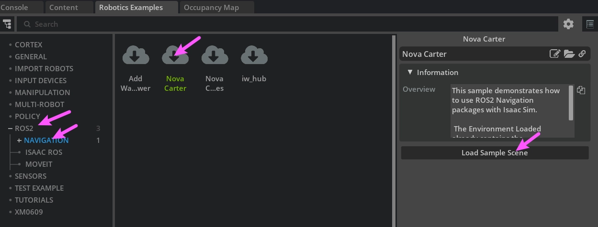
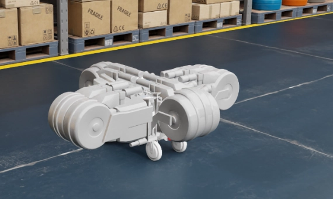
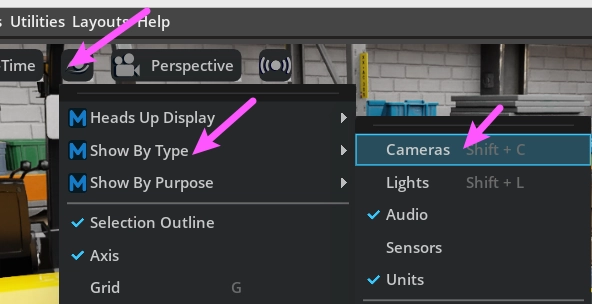
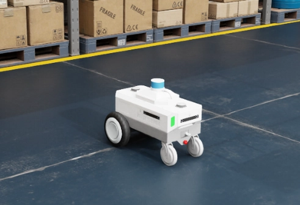
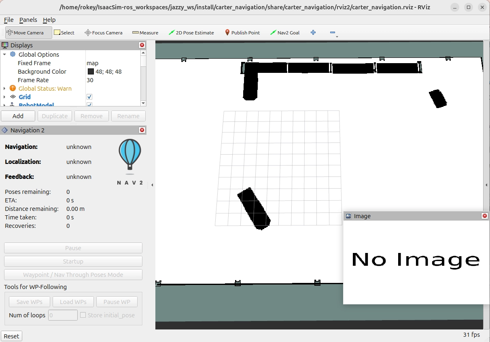
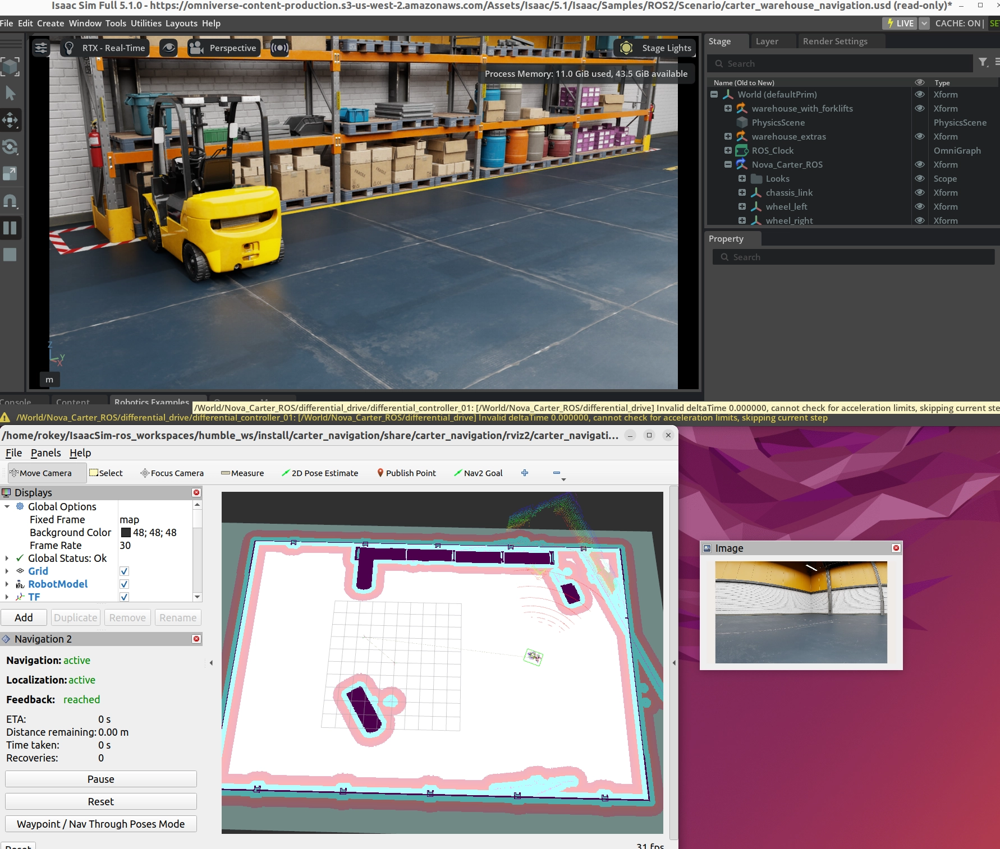

# Nav2 자율주행 + Rviz2 연동

- 출처: https://sonmiran9.oopy.io/ad5450ef-7c59-8340-99c6-0170670cf3ea
- 정리 기준: 제목 구조와 명령·설정값은 원문 그대로, 설명문은 요약. 이미지는 같은 폴더에 저장.

## 학습 목표

- carter_navigation.launch.py로 Isaac Sim과 Nav2 연동
- Rviz2에서 지도·로봇·센서 표시 확인
- Nav2 Goal로 목적지를 지정해 자율주행 확인

## 핵심 개념

| 노드 | 역할 요약 |
| --- | --- |
| map_server | PNG/YAML 지도를 /map으로 발행 |
| AMCL | 파티클 필터로 지도 위 로봇 위치 추정 |
| planner_server | 전역 경로 계획 |
| controller_server | 경로 추종 속도 명령(/cmd_vel) 생성 |
| bt_navigator | Behavior Tree로 전체 흐름 제어 |
| rviz2 | 시각화 |

## 사전 준비

- 지도 파일 2개가 저장되어 있어야 함.

```
~/IsaacSim-ros_workspaces/humble_ws/src/navigation/carter_navigation/maps/
    ├── carter_warehouse_navigation.png
    └── carter_warehouse_navigation.yaml
```

(원문은 humble_ws. 실제로는 앞 페이지에서 빌드한 jazzy_ws 경로를 확인할 것.)

## Rviz로 자율 주행

1. Nova Carter 시나리오 재로드: Window → Examples → Robotics Examples → ROS2 → NAVIGATION → Nova Carter → Load Sample Scene. 지도 제작 때 Nova_Carter_ROS를 껐으므로 다시 로드함.



2. 카메라 형상 숨기기: 실제 센서 동작과 무관한 시각화 객체이므로 끄면 로봇 형상이 잘 보임. Viewport 눈 아이콘 → Show By Type → Cameras 체크 해제 (Shift + C).







3. carter_navigation launch 실행 (새 터미널)

```shell
#ROS 네트워크 설정
export ROS_DOMAIN_ID=50
export ROS_DISTRO=jazzy
export RMW_IMPLEMENTATION=rmw_fastrtps_cpp
export FASTRTPS_DEFAULT_PROFILES_FILE=$HOME/.ros/fastdds_whitelist.xml

#ros 패키지 소싱
ros_set

#워크스페이스 소싱
cd ~/IsaacSim-ros_workspaces/jazzy_ws
source install/setup.bash

ros2 launch carter_navigation carter_navigation.launch.py
```

- Rviz2 창이 자동으로 열림. 처음에는 Navigation2 패널의 Navigation·Localization이 unknown이며 Isaac Sim Play 후 active로 바뀜.
- 우리 프로젝트는 ROS_DOMAIN_ID=101을 쓰므로 위 50은 수업 환경 값임.



4. Isaac Sim Play: Play 상태에서만 ROS2 토픽이 발행됨. Play 전에는 지도는 보이지만 LaserScan과 로봇 위치가 오지 않음.

- Rviz2 확인 항목: 중앙에 창고 지도 / 빨간 점 LaserScan / Nova Carter 3D 모델 / Navigation2 패널 Navigation·Localization 모두 active.




5. Nav2 Goal: Rviz2 도구바의 Nav2 Goal → 지도의 흰색(자유) 영역을 클릭한 채 드래그. 클릭 위치 = 목적지, 드래그 방향 = 도착 방향. 놓으면 경로 계획 후 이동 시작.

- Isaac Sim과 Rviz2에서 동시에 이동을 볼 수 있음. 초록 선 = 전역 경로. Feedback이 reached이면 도착. 지게차 옆 좁은 통로를 목적지로 주면 회피 경로 생성을 확인할 수 있음.
- 원문에는 주행 동영상 링크가 있으나 오프라인 파일로는 받지 않음.

## 요약 정리

| 터미널 | 역할 | 주의 |
| --- | --- | --- |
| 터미널 1 | Isaac Sim 실행 | colcon build 금지 |
| 터미널 2 | 패키지 설치·colcon build·launch | Isaac Sim 실행 금지 |

| 증상 | 원인 | 해결 |
| --- | --- | --- |
| Rviz2에 지도가 안 보임 | YAML·PNG 파일명 불일치 | image 항목과 PNG 이름 맞추기 |
| LaserScan이 안 보임 | Play 미실행 | Play |
| Navigation unknown 유지 | Play 전 | Play 후 대기 |
| Nav2 Goal 무반응 | Localization 미활성 | 패널 active 확인 후 재시도 |
