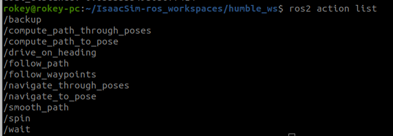
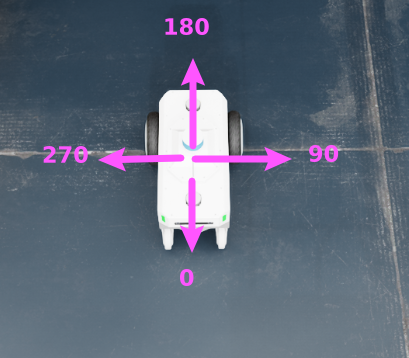
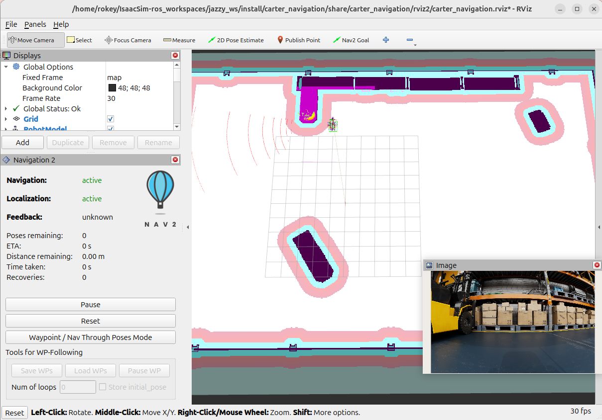
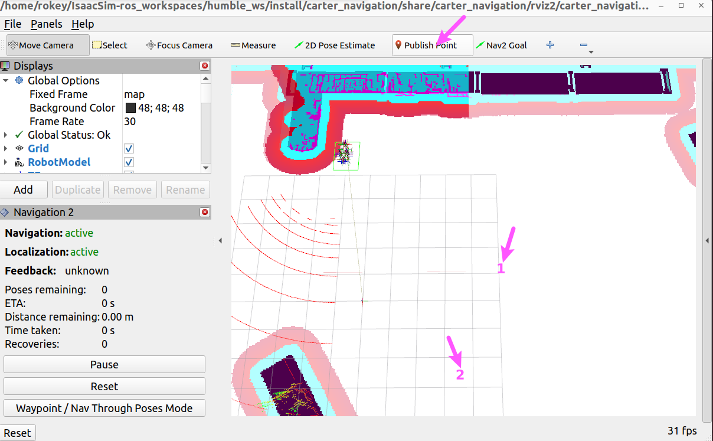
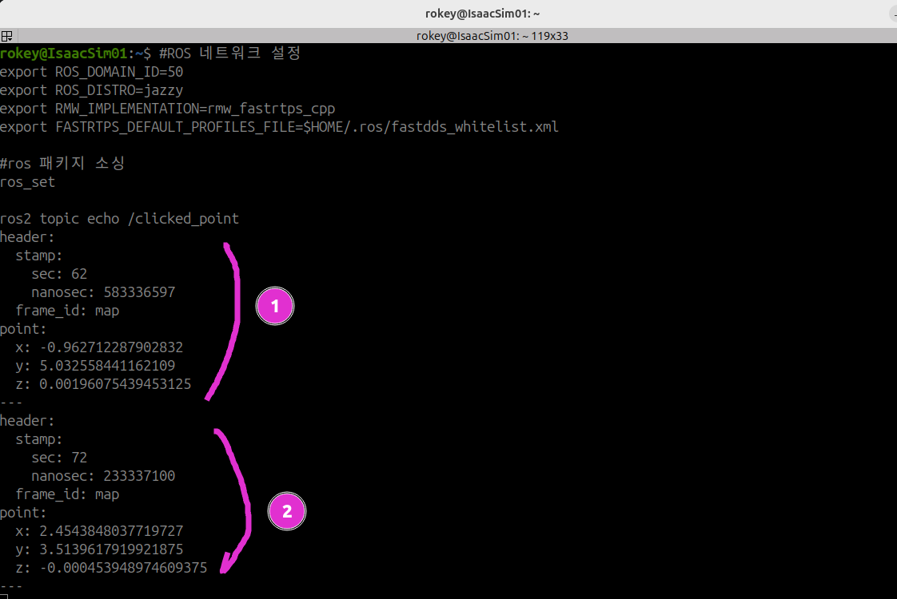
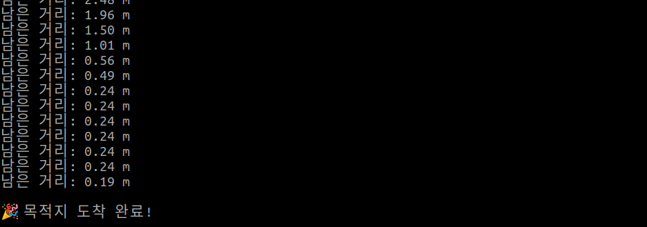

# Python Simple Commander API — nav_to_pose

- 출처: https://sonmiran9.oopy.io/5ed450ef-7c59-8255-99d6-0197c5b74ce1
- 정리 기준: 제목 구조와 명령·코드·설정값은 원문 그대로, 설명문은 요약. 이미지는 같은 폴더에 저장.

## 학습 목표

- Nav2 Simple Commander API 주요 메서드 이해
- Python으로 초기 위치와 목표를 지정해 자율주행 실행
- 이동 중 남은 거리 피드백을 출력하는 노드 작성

## 핵심 개념

### Nav2 Simple Commander
- RViz2 없이 Python 코드로 Nav2를 제어하는 고수준 API. BasicNavigator 하나로 초기 위치 설정, 목표 이동, 상태 확인을 처리함. RViz2에서 클릭하던 일을 코드로 자동화한 것.



- 액션 3종: `/navigate_to_pose`(단일 목표), `/navigate_through_poses`(경유지를 거쳐 최종 목표), `/follow_waypoints`(각 웨이포인트를 별도 목표로 순차 도착, 지점마다 동작 수행에 적합).
- 공식 문서: https://docs.nav2.org/commander_api/index.html

### 핵심 API

| 메서드 | 역할 |
| --- | --- |
| BasicNavigator() | 제어 객체 생성 |
| setInitialPose(pose) | AMCL 초기 위치(RViz2의 2D Pose Estimate에 해당) |
| waitUntilNav2Active() | Nav2가 완전히 뜰 때까지 대기 |
| goToPose(pose) | 목표 이동(RViz2의 Nav2 Goal에 해당) |
| isTaskComplete() | 도달 여부 |
| getFeedback() | 남은 거리 등 피드백 |

## 사전 준비

- Isaac Sim Play + Nav2 launch 실행 중.

## 학습 내용

1. 패키지 생성

```shell
#ROS 패키지 소싱
ros_set

cd ~/cobot3_ws/src/nova_carter
ros2 pkg create nav_to_goal --build-type ament_python --license Apache-2.0
    
cd ~/cobot3_ws
colcon build --packages-select nav_to_goal
```

```
~/cobot3_ws/src/nova_carter/
       └── nav_to_goal/
           ├── nav_to_goal/ 
           │   └── __init__.py
           ├── package.xml
           ├── setup.cfg
           └── setup.py
```

2. 로봇 방향 기준



### 목표 지점 좌표 찾기

1. Isaac Sim Play.
2. Nav2 실행 (터미널 1). Rviz2가 열리고 Navigation·Localization이 active가 되면 준비 완료.

```shell
#ROS 네트워크 설정
export ROS_DOMAIN_ID=50
export ROS_DISTRO=jazzy
export RMW_IMPLEMENTATION=rmw_fastrtps_cpp
export FASTRTPS_DEFAULT_PROFILES_FILE=$HOME/.ros/fastdds_whitelist.xml

#ros 패키지 소싱
ros_set

#워크스페이스 소싱
cd ~/IsaacSim-ros_workspaces/jazzy_ws
source install/setup.bash

#내비게이션 실행
ros2 launch carter_navigation carter_navigation.launch.py
```



3. 좌표 확인 (터미널 2): 아래를 띄운 뒤 Rviz2 상단 Publish Point로 지도 위 원하는 지점을 클릭하면 좌표가 출력됨.

```bash
#ROS 네트워크 설정
export ROS_DOMAIN_ID=50
export ROS_DISTRO=jazzy
export RMW_IMPLEMENTATION=rmw_fastrtps_cpp
export FASTRTPS_DEFAULT_PROFILES_FILE=$HOME/.ros/fastdds_whitelist.xml

#ros 패키지 소싱
ros_set

ros2 topic echo /clicked_point
```




4. 출발지·목적지 좌표 추출



### nav_to_pose.py

- 파일 위치: `~/cobot3_ws/src/nova_carter/nav_to_goal/nav_to_goal/nav_to_pose.py`
- 구조: 오일러→쿼터니언 변환, 쿼터니언→오일러 변환, 최종 자세 출력, PoseStamped 생성(create_pose), main(초기 위치 설정 → 목표 이동 → 피드백 출력 → 결과 처리).

```python
import math
import time
import rclpy
from nav2_simple_commander.robot_navigator import BasicNavigator, TaskResult
from geometry_msgs.msg import PoseStamped

# ==========================================================
# 🧮 [연산 함수 1] 오일러 각도(Rad) -> 쿼터니언 변환 함수
# ==========================================================
def get_quaternion_from_euler(roll, pitch, yaw):
    """math 모듈만 사용하여 오일러 각도를 쿼터니언으로 변환"""
    qx = math.sin(roll/2) * math.cos(pitch/2) * math.cos(yaw/2) - math.cos(roll/2) * math.sin(pitch/2) * math.sin(yaw/2)
    qy = math.cos(roll/2) * math.sin(pitch/2) * math.cos(yaw/2) + math.sin(roll/2) * math.cos(pitch/2) * math.sin(yaw/2)
    qz = math.cos(roll/2) * math.cos(pitch/2) * math.sin(yaw/2) - math.sin(roll/2) * math.sin(pitch/2) * math.cos(yaw/2)
    qw = math.cos(roll/2) * math.cos(pitch/2) * math.cos(yaw/2) + math.sin(roll/2) * math.sin(pitch/2) * math.sin(yaw/2)
    return [qx, qy, qz, qw]

# ==========================================================
# 🧮 [연산 함수 2] 쿼터니언 추출 -> 오일러 각도(Rad) 변환 함수
# ==========================================================
def get_euler_from_quaternion(x, y, z, w):
    """수신된 쿼터니언 값을 추출하여 오일러 각도(라디안)로 연산"""
    t0 = +2.0 * (w * x + y * z)
    t1 = +1.0 - 2.0 * (x * x + y * y)
    roll = math.atan2(t0, t1)

    t2 = +2.0 * (w * y - z * x)
    t2 = +1.0 if t2 > +1.0 else t2
    t2 = -1.0 if t2 < -1.0 else t2
    pitch = math.asin(t2)

    t3 = +2.0 * (w * z + x * y)
    t4 = +1.0 - 2.0 * (y * y + z * z)
    yaw = math.atan2(t3, t4)

    return roll, pitch, yaw

# ==========================================================
# 🖨️ [출력 함수] 최종 도착 위치 및 방향 출력기
# ==========================================================
def print_final_pose(pose_msg):
    """PoseStamped 메시지를 받아 위치와 오일러 각도를 예쁘게 출력"""
    if not pose_msg:
        return

    pos = pose_msg.pose.position
    ori = pose_msg.pose.orientation
    
    # 쿼터니언 -> 오일러 각도(라디안) 추출
    roll_rad, pitch_rad, yaw_rad = get_euler_from_quaternion(ori.x, ori.y, ori.z, ori.w)
    
    # 라디안 -> 디그리(도) 변환
    roll_deg = math.degrees(roll_rad)
    pitch_deg = math.degrees(pitch_rad)
    yaw_deg = math.degrees(yaw_rad)
    
    # 결과 출력
    print("-" * 50)
    print(f"📍 최종 위치: X = {pos.x:.3f} m, Y = {pos.y:.3f} m")
    print(f"🧭 최종 방향 (Radian): Roll = {roll_rad:.3f}, Pitch = {pitch_rad:.3f}, Yaw = {yaw_rad:.3f}")
    print(f"🧭 최종 방향 (Degree): {yaw_deg:.1f}°")
    print("-" * 50)

# ==========================================================
# 🚀 메인 주행 로직
# ==========================================================
def create_pose(navigator, x, y, yaw_deg):
    """x, y, yaw(도 단위) → PoseStamped 생성"""
    pose = PoseStamped()
    pose.header.frame_id = 'map'
    pose.header.stamp = navigator.get_clock().now().to_msg()
    
    pose.pose.position.x = float(x)
    pose.pose.position.y = float(y)

    yaw_rad = math.radians(yaw_deg)
    q = get_quaternion_from_euler(0, 0, yaw_rad)
    
    pose.pose.orientation.x = q[0]
    pose.pose.orientation.y = q[1]
    pose.pose.orientation.z = q[2]
    pose.pose.orientation.w = q[3]
    return pose

def main():
    rclpy.init()
    nav = BasicNavigator()
    
    # 1. 출발점 설정
    init_pose = create_pose(nav, -6.0, -1.0, 0.007)
    nav.setInitialPose(init_pose)
    nav.waitUntilNav2Active()
    
    # 2. 목표 지점 설정
    goal_pose = create_pose(nav, -2.0, 2.0, 180.0)
        
    # 3. Task 실행
    nav.goToPose(goal_pose)
    
    last_pose = None

    while not nav.isTaskComplete():
        feedback = nav.getFeedback()
        if feedback:
            last_pose = feedback.current_pose
            print(f"남은 거리: {feedback.distance_remaining:.2f} m")
            
        time.sleep(1.0)

    # 4. 결과 처리
    result = nav.getResult()
    if result == TaskResult.SUCCEEDED:
        print('\n🎉 목적지 도착 완료!')
        
        print_final_pose(last_pose)
            
    elif result == TaskResult.CANCELED:
        print('주행 취소됨')
    elif result == TaskResult.FAILED:
        print('주행 실패')

    rclpy.shutdown()

if __name__ == '__main__':
    main()
```

- setup.py 수정

```shell
# 수정할 내용
'console_scripts': [
	'nav_to_pose = nav_to_goal.nav_to_pose:main',
],
```

## 빌드 및 실행

```shell
cd ~/cobot3_ws
colcon build --packages-select nav_to_goal
source install/setup.bash
```

- Isaac Sim Play → 터미널 1에서 Nav2 launch(위와 동일 블록) → 터미널 2에서 노드 실행.

```shell
#ROS 네트워크 설정
export ROS_DOMAIN_ID=50
export ROS_DISTRO=jazzy
export RMW_IMPLEMENTATION=rmw_fastrtps_cpp
export FASTRTPS_DEFAULT_PROFILES_FILE=$HOME/.ros/fastdds_whitelist.xml

#ros 패키지 소싱
ros_set

#cobot3 워크스페이스 소싱
source ~/cobot3_ws/install/setup.bash

ros2 run nav_to_goal nav_to_pose
```

- Isaac Sim에서 원기둥을 추가하면 Nav2가 장애물로 인식해 경로를 다시 만드는 것을 볼 수 있음. 원문에 주행 동영상(mp4) 링크가 있으나 파일로 받지 않음.



- 도착 시 로봇 방향 확인: RViz2에서 Add → By topic → /amcl_pose → PoseWithCovariance.


## 참고 문서

- Nav2 Simple Commander API, geometry_msgs/PoseStamped, Nav2 Python Tutorial (원문에 제목만 나열됨).
