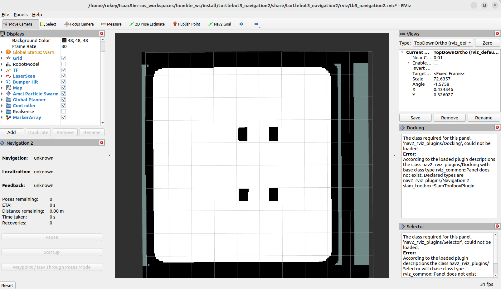
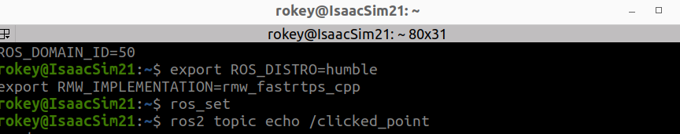
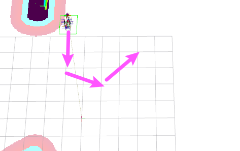
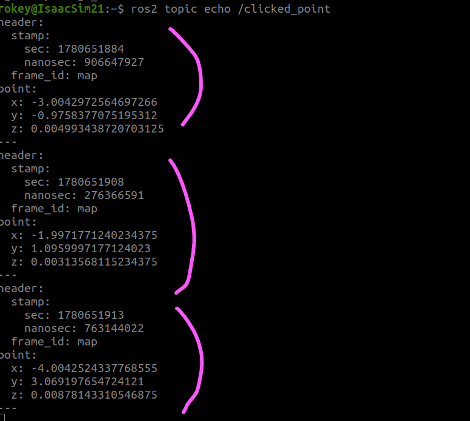
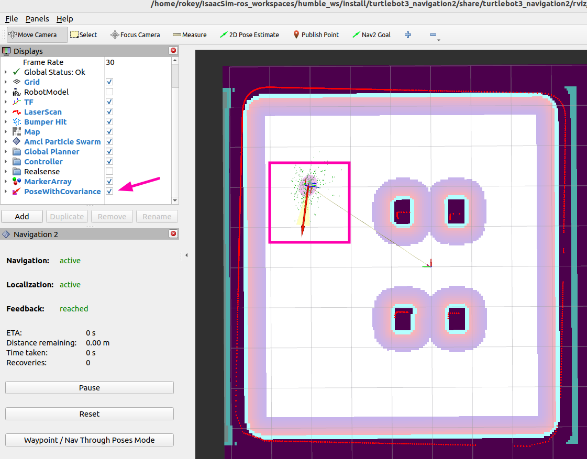
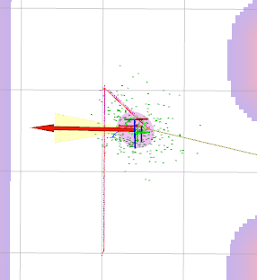

# Python Simple Commander — nav_through_pose

- 출처: https://sonmiran9.oopy.io/167450ef-7c59-8322-9792-81997254ccd6
- 정리 기준: 제목 구조와 명령·코드·설정값은 원문 그대로, 설명문은 요약. 이미지는 같은 폴더에 저장.

## 학습 목표

- goThroughPoses()와 goToPose()의 차이 이해
- 경유지(Waypoint) 리스트로 순서대로 주행

## 핵심 개념

| | goToPose() | goThroughPoses() |
| --- | --- | --- |
| 목적지 수 | 1개 | 여러 개(리스트) |
| 경유지 처리 | 없음 | 각 지점을 통과 |
| 정지 | 목적지에서 정지 | 경유지는 통과, 최종 목적지에서 정지 |
| 용도 | 단순 이동 | 순찰, 경로 지정 이동 |

- 공식 문서: https://docs.nav2.org/commander_api/index.html

## 사전 준비

- nav_to_goal 패키지 생성·빌드 완료, Isaac Sim Play와 Nav2 launch 가능 상태.

## 학습 내용

1. 로봇 방향 기준


### 목표 지점 좌표 찾기

- Isaac Sim Play → 터미널 1에서 Nav2 실행 → 터미널 2에서 `ros2 topic echo /clicked_point` → Rviz2 Publish Point로 지도 클릭 → 출발지·경유지 좌표 추출. 절차는 nav_to_pose 페이지와 같음.
- 원문의 터미널 1 블록은 humble(humble_ws)로 적혀 있음. 수업 환경은 jazzy이므로 nav_to_pose 페이지의 jazzy 블록을 기준으로 할 것.

```shell
export ROS_DISTRO=humble
export RMW_IMPLEMENTATION=rmw_fastrtps_cpp
cd ~/IsaacSim-ros_workspaces/humble_ws
source install/setup.bash

ros2 launch carter_navigation carter_navigation.launch.py
```



```bash
ros2 topic echo /clicked_point
```








### nav_through_pose.py

- 파일 위치: `~/cobot3_ws/src/nova_carter/nav_to_goal/nav_to_goal/nav_through_pose.py`
- nav_to_pose와 같은 보조 함수를 쓰고, main에서 경유지 리스트를 만들어 goThroughPoses()로 실행함. 피드백에는 남은 경유지 수(number_of_poses_remaining)와 남은 거리가 들어 있음.

```python
import math
import time
import rclpy
from nav2_simple_commander.robot_navigator import BasicNavigator, TaskResult
from geometry_msgs.msg import PoseStamped

def get_quaternion_from_euler(roll, pitch, yaw):
    qx = math.sin(roll/2) * math.cos(pitch/2) * math.cos(yaw/2) - math.cos(roll/2) * math.sin(pitch/2) * math.sin(yaw/2)
    qy = math.cos(roll/2) * math.sin(pitch/2) * math.cos(yaw/2) + math.sin(roll/2) * math.cos(pitch/2) * math.sin(yaw/2)
    qz = math.cos(roll/2) * math.cos(pitch/2) * math.sin(yaw/2) - math.sin(roll/2) * math.sin(pitch/2) * math.cos(yaw/2)
    qw = math.cos(roll/2) * math.cos(pitch/2) * math.cos(yaw/2) + math.sin(roll/2) * math.sin(pitch/2) * math.sin(yaw/2)
    return [qx, qy, qz, qw]

def get_euler_from_quaternion(x, y, z, w):
    t0 = +2.0 * (w * x + y * z)
    t1 = +1.0 - 2.0 * (x * x + y * y)
    roll = math.atan2(t0, t1)

    t2 = +2.0 * (w * y - z * x)
    t2 = +1.0 if t2 > +1.0 else t2
    t2 = -1.0 if t2 < -1.0 else t2
    pitch = math.asin(t2)

    t3 = +2.0 * (w * z + x * y)
    t4 = +1.0 - 2.0 * (y * y + z * z)
    yaw = math.atan2(t3, t4)
    return roll, pitch, yaw

def print_final_pose(pose_msg):
    if not pose_msg:
        return
    pos = pose_msg.pose.position
    ori = pose_msg.pose.orientation
    roll_rad, pitch_rad, yaw_rad = get_euler_from_quaternion(ori.x, ori.y, ori.z, ori.w)
    yaw_deg = math.degrees(yaw_rad)
    
    print("-" * 50)
    print(f"📍 최종 위치: X = {pos.x:.3f} m, Y = {pos.y:.3f} m")
    print(f"🧭 최종 바라보는 방향 (Heading): {yaw_deg:.1f}°")
    print("-" * 50)

def create_pose(navigator, x, y, yaw_deg):
    pose = PoseStamped()
    pose.header.frame_id = 'map'
    pose.header.stamp = navigator.get_clock().now().to_msg()
    pose.pose.position.x = float(x)
    pose.pose.position.y = float(y)
    q = get_quaternion_from_euler(0, 0, math.radians(yaw_deg))
    pose.pose.orientation.x = q[0]
    pose.pose.orientation.y = q[1]
    pose.pose.orientation.z = q[2]
    pose.pose.orientation.w = q[3]
    return pose

# ==========================================================
# 🚀 메인 주행 로직 (다중 경유지 주행)
# ==========================================================
def main():
    rclpy.init()
    nav = BasicNavigator()
    
    # 1. 출발점 설정
    init_pose = create_pose(nav, 0.002, -0.024, 0.0)
    nav.setInitialPose(init_pose)
    nav.waitUntilNav2Active()
    
    # 2. 경유지(Waypoints) 리스트 생성
    waypoints = []
    
    # 예시: 로봇이 'ㄷ'자 형태로 이동하도록 설정
    waypoints.append(create_pose(nav, 1.0, 0.0, 90.0))   # 경유지 1
    waypoints.append(create_pose(nav, 2.0, -1.0, 90.0))  # 경유지 2
    waypoints.append(create_pose(nav, 1.5, 1.0 , 90.0))  # 경유지 3 (최종 목적지)
        
    # 3. Task 실행 (goToPose -> goThroughPoses로 변경)
    print("🚀 다중 경유지 주행을 시작합니다...")
    nav.goThroughPoses(waypoints)
    
    last_pose = None

    while not nav.isTaskComplete():
        feedback = nav.getFeedback()
        if feedback:
            last_pose = feedback.current_pose
            
            # 피드백에서 남은 총 거리와 남은 경유지 개수를 확인할 수 있습니다.
            print(f"남은 경유지 수: {feedback.number_of_poses_remaining} 개 | "
                  f"목적지까지 남은 총 거리: {feedback.distance_remaining:.2f} m")
            
        time.sleep(1.0)

    # 4. 결과 처리
    result = nav.getResult()
    if result == TaskResult.SUCCEEDED:
        print('\n🎉 모든 경유지를 거쳐 목적지에 도착 완료!')
        print_final_pose(last_pose)
            
    elif result == TaskResult.CANCELED:
        print('\n⚠️ 주행이 취소되었습니다.')
    elif result == TaskResult.FAILED:
        print('\n❌ 주행 실패 (장애물 등으로 경로를 찾을 수 없음).')

    rclpy.shutdown()

if __name__ == '__main__':
    main()
```

- setup.py 수정

```shell
entry_points={
    'console_scripts': [
            'nav_to_pose = nav_to_goal.nav_to_pose:main',
            'nav_through_pose = nav_to_goal.nav_through_pose:main',
    ],
},
```

## 빌드 및 실행

```shell
cd ~/cobot3_ws
colcon build --packages-select nav_to_goal
source install/setup.bash
```

- Isaac Sim Play → 터미널 1: Nav2 launch(jazzy 블록) → 터미널 2: 아래 실행.

```shell
#ROS 네트워크 설정
export ROS_DOMAIN_ID=50
export ROS_DISTRO=jazzy
export RMW_IMPLEMENTATION=rmw_fastrtps_cpp
export FASTRTPS_DEFAULT_PROFILES_FILE=$HOME/.ros/fastdds_whitelist.xml

#ros 패키지 소싱
ros_set

#cobot3 워크스페이스 소싱
source ~/cobot3_ws/install/setup.bash
   
ros2 run nav_to_goal nav_through_pose
```

- 원문에 주행 동영상(mp4) 링크가 있으나 파일로 받지 않음.
- 도착 시 방향 확인: RViz2 Add → By topic → /amcl_pose → PoseWithCovariance.



## 요약 정리

- 경유지 좌표는 모두 지도의 흰색(자유) 영역이어야 함. 경유지 간격이 너무 좁으면 경로 계획이 실패할 수 있음.



| | goToPose | goThroughPoses |
| --- | --- | --- |
| 입력 | PoseStamped 1개 | PoseStamped 리스트 |
| 경로 | 출발 → 목적지 | 출발 → 경유지1 → 경유지2 → 목적지 |
| 활용 | 단순 이동 | 순찰, 다중 지점 |
