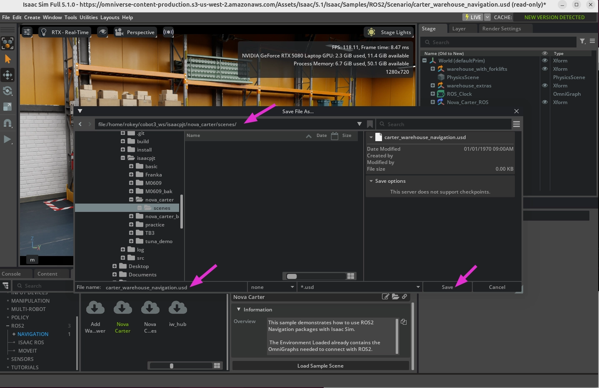
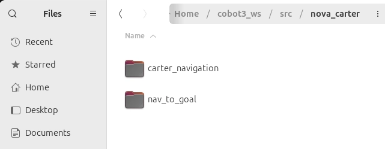
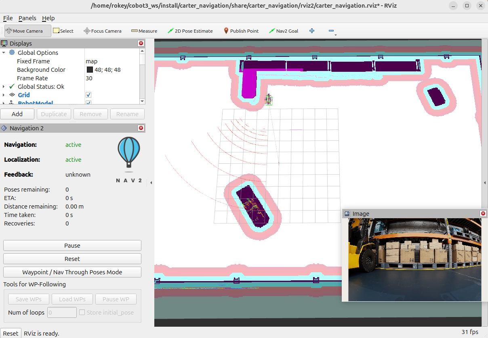
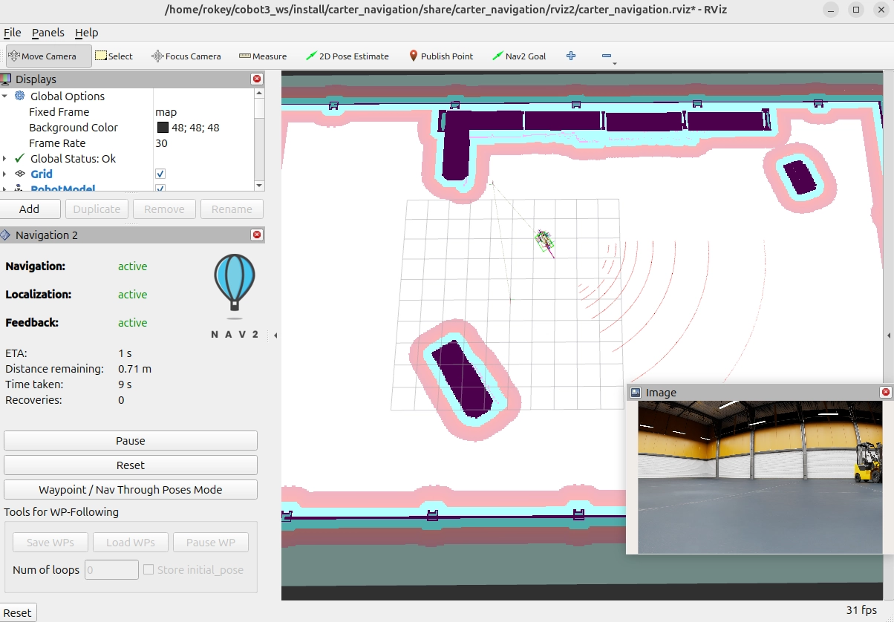

# 나만의 USD 환경 구성 + navigation 마이그레이션

- 출처: https://sonmiran9.oopy.io/84f450ef-7c59-83ef-8299-81c0b92bd7ca
- 정리 기준: 제목 구조와 명령·설정값은 원문 그대로, 설명문은 요약. 이미지는 같은 폴더에 저장.

## 학습 목표

- 예제 씬을 로컬 USD로 저장해 편집
- 창고 씬에 사람·물건 에셋 추가
- carter_navigation 패키지를 cobot3_ws로 복사해 독립 실행
- launch의 map:= 인수로 지도 파일 지정

## 핵심 개념

- Robotics Examples의 씬은 NVIDIA S3에서 직접 읽는 원격 파일이라 읽기 전용임. 에셋을 추가해도 저장되지 않음. 로드 직후 File → Save As로 로컬에 저장하면 편집 가능.

```
(read-only 경로 예시)
<https://omniverse-content-production.s3.amazonaws.com/>
    Assets/Isaac/5.1/Isaac/Samples/ROS2/Scenario/
    carter_warehouse_navigation.usd  (read-only)
```

## 사전 준비

```shell
mkdir -p ~/cobot3_ws/isaacpjt/nova_carter/scenes
```

## 학습 내용

1. 예제 씬 로드: Window → Examples → Robotics Examples → ROS2 → NAVIGATION → Nova Carter → Load Sample Scene.
2. 즉시 로컬 저장: File → Save As → `~/cobot3_ws/isaacpjt/nova_carter/scenes/carter_warehouse_navigation.usd`. 타이틀바가 로컬 경로로 바뀌고 read-only 표시가 사라짐.



3. carter_navigation 패키지 복사

```shell
cp -r ~/IsaacSim-ros_workspaces/jazzy_ws/src/navigation/carter_navigation \
      ~/cobot3_ws/src/nova_carter/
```



4. 빌드

```shell
#ros 패키지 소싱
ros_set

cd ~/cobot3_ws
colcon build --packages-select carter_navigation
```

5. 실행 테스트 (터미널 3개)

- 터미널 1 — Isaac Sim. 실행 후 File → Open으로 저장한 USD를 열고 Play.

```shell
#ROS 네트워크 설정
export ROS_DOMAIN_ID=50
export ROS_DISTRO=jazzy
export RMW_IMPLEMENTATION=rmw_fastrtps_cpp
export FASTRTPS_DEFAULT_PROFILES_FILE=$HOME/.ros/fastdds_whitelist.xml

#아이작심 ROS 브릿지 설정
isaac_ros

#아이작심 시작
isaac
```

- 터미널 2 — launch. 지도 경로를 map:= 인수로 전달.

```shell
#ROS 네트워크 설정
export ROS_DOMAIN_ID=50
export ROS_DISTRO=jazzy
export RMW_IMPLEMENTATION=rmw_fastrtps_cpp
export FASTRTPS_DEFAULT_PROFILES_FILE=$HOME/.ros/fastdds_whitelist.xml

#ros 패키지 소싱
ros_set

#cobot3 워크스페이스 소싱
source ~/cobot3_ws/install/setup.bash

#내비게이션 실행
ros2 launch carter_navigation carter_navigation.launch.py \
    map:=/home/rokey/cobot3_ws/src/nova_carter/carter_navigation/maps/carter_warehouse_navigation.yaml
```



- 터미널 3 — 동작 확인

```shell
#ROS 네트워크 설정
export ROS_DOMAIN_ID=50
export ROS_DISTRO=jazzy
export RMW_IMPLEMENTATION=rmw_fastrtps_cpp
export FASTRTPS_DEFAULT_PROFILES_FILE=$HOME/.ros/fastdds_whitelist.xml

#ros 패키지 소싱
ros_set

#cobot3 워크스페이스 소싱
source ~/cobot3_ws/install/setup.bash

ros2 run nav_to_goal nav_to_pose
```



- Rviz2에서 내 씬의 지도 위에 Nova Carter가 보이는지 확인하고, Nav2 Goal 또는 nav_to_pose로 주행 시험.

## 요약 정리

```
~/cobot3_ws/
├── src/
│   ├
│   └── nova_carter/                  ← 그룹 폴더 (package.xml 없음)
│       ├── nav_to_goal/                ← nav_to_pose, nav_through_pose
│       └── carter_navigation/        ← 패키지명 = 폴더명
│           ├── launch/
│           ├── maps/                 ← 지도 파일 (PNG + YAML)
│           ├── params/
│           └── rviz2/
└── isaacpjt/
    ├── M0609/                        ← 기존
    └── nova_carter/
        └── scenes/                   ← USD 파일만
            └── carter_warehouse_navigation.usd
```
