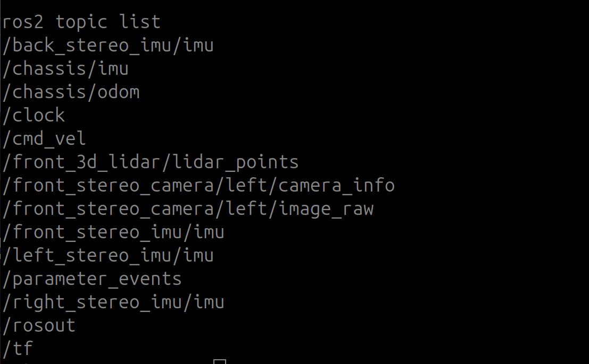

# Nova Carter USD Standalone 로드

- 출처: https://sonmiran9.oopy.io/e53450ef-7c59-824a-b0c0-018488474c93
- 정리 기준: 제목 구조와 명령·코드·설정값은 원문 그대로, 설명문은 요약. 이미지는 같은 폴더에 저장.

## 학습 목표

- Standalone 스크립트로 내 USD 씬 자동 로드
- ROS2 Bridge를 켜는 올바른 import 순서
- 실행 후 Play로 ROS2 토픽 발행 시작

## 핵심 개념

### Isaac Sim import 필수 순서
- ROS2 Bridge 확장이 rclpy 경로를 Python에 등록하므로, 확장을 켜기 전에 rclpy를 import하면 오류가 남.

```
SimulationApp 생성
    └── enable_extension("isaacsim.ros2.bridge")
         └── simulation_app.update()
              └── import rclpy  ← 여기서부터만 가능
```

### USD Reference 방식
- 현재 스테이지의 /World prim에 USD를 참조로 붙임. USD 안의 OmniGraph(ROS_Clock, Nova_Carter_ROS)가 그대로 유지됨.

```python
stage = omni.usd.get_context().get_stage()
UsdGeom.Xform.Define(stage, "/World")
world_prim = stage.GetPrimAtPath("/World")
world_prim.GetReferences().AddReference(USD_PATH)
```

### OmniGraph 자동 활성화
- USD에 든 OmniGraph는 Play를 누르는 순간 동작함. 별도 노드 코드 없이 아래 토픽이 발행됨.

| OmniGraph 노드 | 토픽 |
| --- | --- |
| ROS_Clock | /clock |
| Nova_Carter_ROS | /scan, /odom, /tf 발행 · /cmd_vel 수신 |

## 사전 준비

```shell
ls ~/cobot3_ws/isaacpjt/nova_carter/scenes/
```

## 학습 내용

1. 스크립트 파일: `~/cobot3_ws/isaacpjt/nova_carter/nova_carter_ros.py`

### nova_carter_ros.py

```python
from isaacsim import SimulationApp

simulation_app = SimulationApp({"headless": False})

from isaacsim.core.utils.extensions import enable_extension
enable_extension("isaacsim.ros2.bridge")
simulation_app.update()

from pathlib import Path
import time
import omni.usd
from pxr import Usd, UsdGeom

USD_PATH = str(Path(__file__).resolve().parent / "scenes/carter_warehouse_navigation.usd")

# /World prim 생성 후 USD Reference 연결
stage = omni.usd.get_context().get_stage()
UsdGeom.Xform.Define(stage, "/World")
world_prim = stage.GetPrimAtPath("/World")
world_prim.GetReferences().AddReference(USD_PATH)

for _ in range(15):
    simulation_app.update()

print("\n[완료] 씬 로드 — Play 버튼을 눌러 ROS2 토픽 발행을 시작하세요")

while simulation_app.is_running():
    simulation_app.update()
    time.sleep(0.016)

simulation_app.close()
```

2. 실행

```shell
#ROS 네트워크 설정
export ROS_DOMAIN_ID=50
export ROS_DISTRO=jazzy
export RMW_IMPLEMENTATION=rmw_fastrtps_cpp
export FASTRTPS_DEFAULT_PROFILES_FILE=$HOME/.ros/fastdds_whitelist.xml

#아이작심 ROS 브릿지 설정
isaac_ros

cd ~/cobot3_ws/isaacpjt/nova_carter
isaac_python nova_carter_ros.py
```

3. Isaac Sim 뷰포트의 Play를 누르면 OmniGraph가 활성화되어 토픽 발행 시작.

4. 새 터미널에서 토픽 확인

```shell
#ROS 네트워크 설정
export ROS_DOMAIN_ID=50
export ROS_DISTRO=jazzy
export RMW_IMPLEMENTATION=rmw_fastrtps_cpp
export FASTRTPS_DEFAULT_PROFILES_FILE=$HOME/.ros/fastdds_whitelist.xml

#ros 패키지 소싱
ros_set

ros2 topic list
```



## 우리 프로젝트와의 관계

- smart_farm_navigation/scripts/launch_scene.py가 같은 구조(SimulationApp → enable_extension → open_stage → Play)임. 차이는 이 수업 스크립트가 Play를 사용자에게 맡기는 반면 launch_scene.py는 자동으로 Play까지 누른다는 점.
