# Multi-Robot — Nova Carter2 추가

- 출처: https://sonmiran9.oopy.io/96f450ef-7c59-83d3-adac-811807935c44
- 정리 기준: 제목 구조와 명령·설정값은 원문 그대로, 설명문은 요약. 이미지는 같은 폴더에 저장.

## 학습 목표

- 다중 로봇에서 Namespace가 필요한 이유
- 기존 USD 씬에 두 번째 로봇을 추가하고 OmniGraph namespace 설정

## 핵심 개념

- 로봇이 2대면 /scan, /odom, /cmd_vel 같은 토픽 이름이 충돌함. Namespace로 로봇마다 이름 공간을 나눔.

| 로봇 | scan | odom | cmd_vel |
| --- | --- | --- | --- |
| 단일 | /scan | /odom | /cmd_vel |
| carter1 | /carter1/scan | /carter1/odom | /carter1/cmd_vel |
| carter2 | /carter2/scan | /carter2/odom | /carter2/cmd_vel |

- OmniGraph 안의 node_namespace 노드 값(carter1, carter2)을 바꾸면 그 그래프의 모든 토픽 앞에 namespace가 붙음.

## 사전 준비

```shell
ls ~/cobot3_ws/isaacpjt/nova_carter/scenes/
```

## 학습 내용

1. USD 열기: File → Open → `~/cobot3_ws/isaacpjt/nova_carter/scenes/carter_warehouse_navigation.usd`.
2. Stage 구조: World 아래 warehouse_with_forklifts, ROS_Clock, Nova_Carter_ROS(= carter1이 될 로봇).

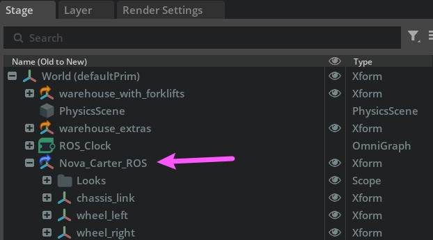

3. carter1 namespace: Nova_Carter_ROS 아래 4개 ActionGraph의 node_namespace를 선택해 Property 패널 inputs:value에 `carter1` 입력. 대상: transform_tree_odometry, ros_lidars, differential_drive, chassis_imu.

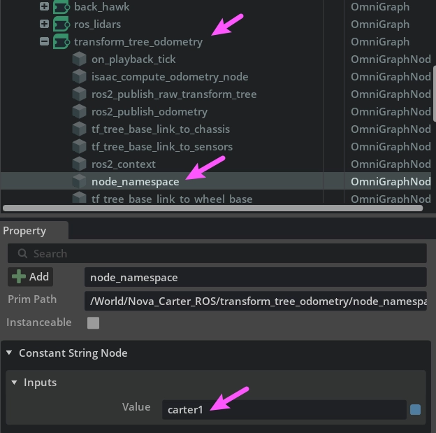

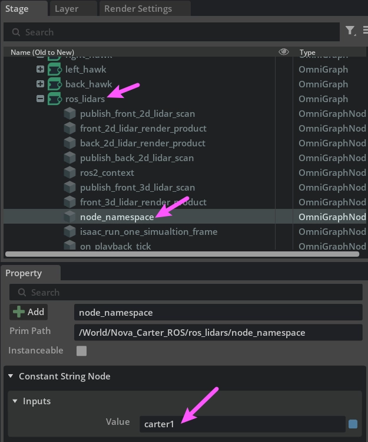

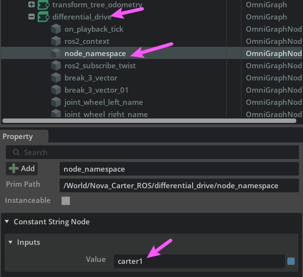

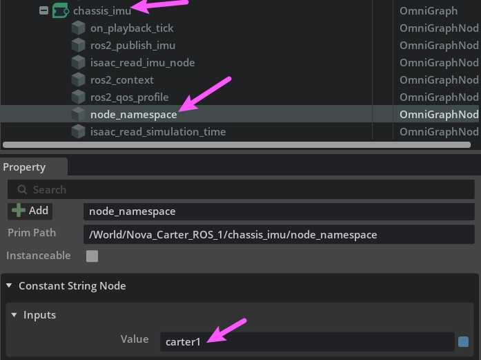

4. Nova_Carter_ROS 우클릭 → Duplicate → Nova_Carter_ROS_01 생성.

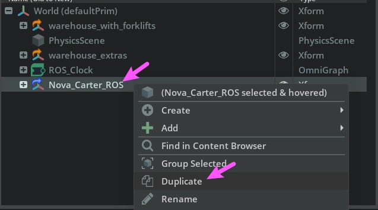

5. 복제 prim 이름 변경(예: Nova_Carter_ROS_2).

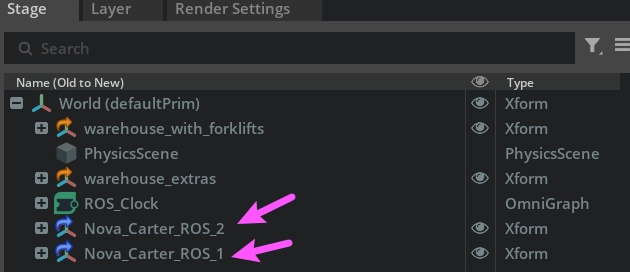

6. carter2 위치 이동: Property → Transform → Translate의 X, Y를 바꿔 빈 공간으로(예: X = -3.0, Y = 3.0). carter1과 겹치지 않게, 간격 1 m 이상. 두 로봇의 초기 위치를 메모해 둠.

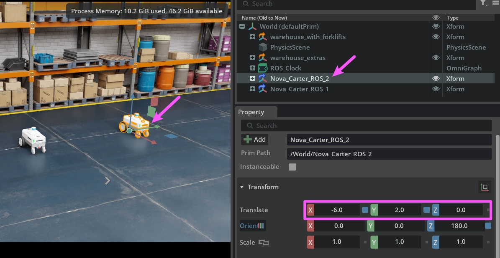

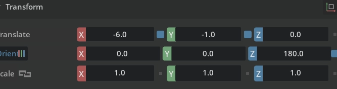

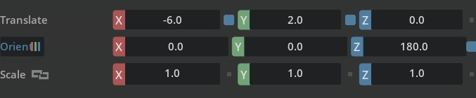

7. carter2 namespace: Nova_Carter_ROS_2 아래 transform_tree_odometry, ros_lidars, differential_drive의 node_namespace에 `carter2` 입력.
8. 저장: Ctrl + S → multi_carter_warehouse_navigation.usd.
9. Play 후 새 터미널에서 토픽 확인.

```shell
#ROS 네트워크 설정
export ROS_DOMAIN_ID=50
export ROS_DISTRO=jazzy
export RMW_IMPLEMENTATION=rmw_fastrtps_cpp
export FASTRTPS_DEFAULT_PROFILES_FILE=$HOME/.ros/fastdds_whitelist.xml

#ros 패키지 소싱
ros_set

ros2 topic list
```

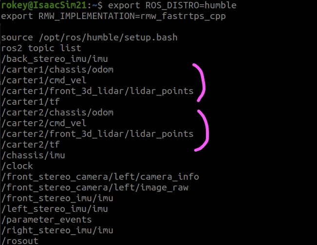

## 요약 정리

- node_namespace는 Constant String 노드 하나로 해당 ActionGraph의 모든 토픽 이름을 바꾸는 구조라 값 하나만 고치면 됨.

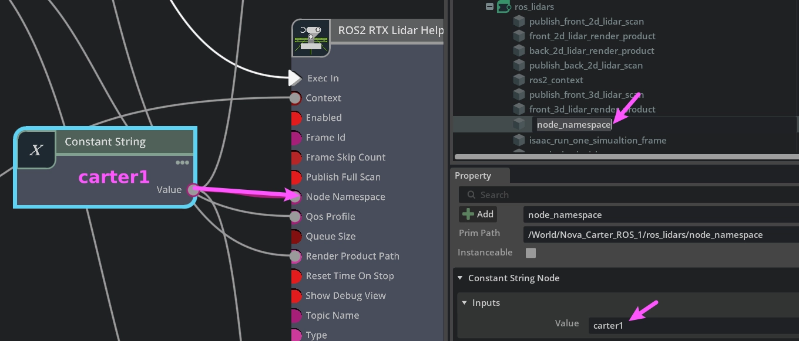

## 우리 프로젝트와의 관계

- 현재 smart_farm_nav2_01.usd의 Nova Carter는 namespace가 비어 있어 /cmd_vel, /chassis/odom을 그대로 씀. 저장소의 params/smart_farm/123.py가 /carter1/... 토픽을 참조하는 것은 이 수업의 다중 로봇 설정에서 온 것임.
