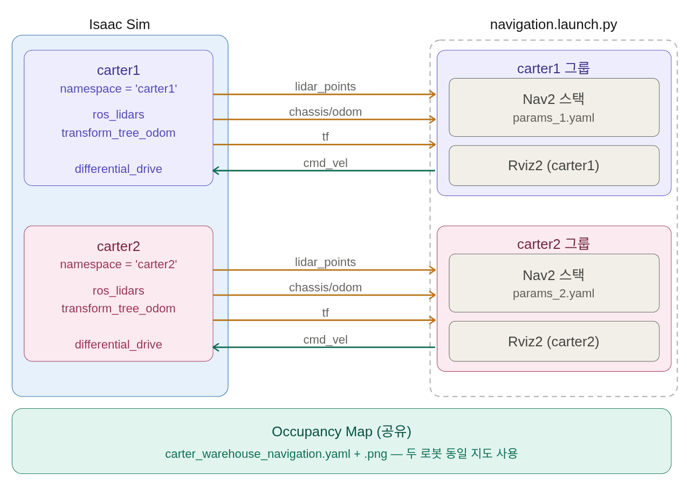
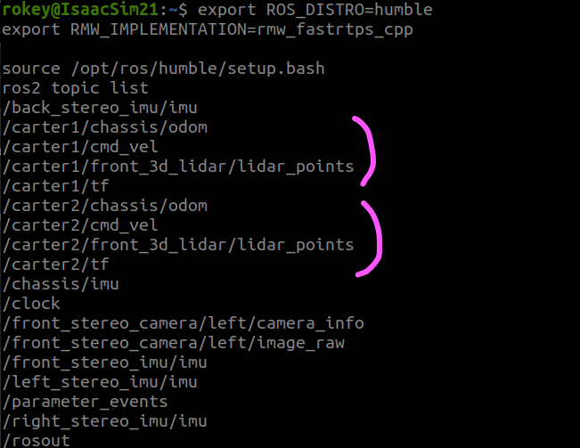
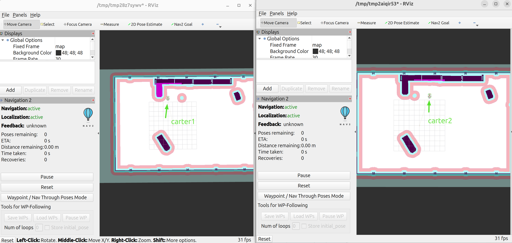

# Multi-Robot — Nav2 Launch + Rviz2

- 출처: https://sonmiran9.oopy.io/8de450ef-7c59-832d-a291-01ca5f79852b
- 정리 기준: 제목 구조와 명령·설정값은 원문 그대로, 설명문은 요약. 이미지는 같은 폴더에 저장.
- 원문에 실린 launch 파일과 params YAML 2개(NVIDIA, Apache-2.0)는 같은 폴더에 별도 파일로 저장함.
  - multiple_robot_carter_navigation_warehouse.launch.py
  - multi_robot_carter_navigation_params_1.yaml (carter1)
  - multi_robot_carter_navigation_params_2.yaml (carter2)

## 학습 목표

- warehouse용 multi-robot launch로 carter1·carter2 Nav2 동시 실행
- Rviz2에서 두 로봇 주행 확인
- params 파일의 역할과 로봇별 차이 이해

## 핵심 개념



```
launch.py
    └── params_1.yaml (carter1)  ← initial_pose, costmap 토픽, odom 토픽
    └── params_2.yaml (carter2)  ← 동일 구조, 다른 위치·토픽
    └── map: carter_warehouse_navigation.yaml

USD 씬
    └── carter1 node_namespace = "carter1"  ←→  /carter1/scan, /carter1/odom ...
    └── carter2 node_namespace = "carter2"  ←→  /carter2/scan, /carter2/odom ...
```

- initial_pose가 USD의 spawn 위치와 다르면 AMCL이 로봇을 지도에서 못 찾음.
- costmap 센서 토픽에 /carter1/, /carter2/ 접두어가 없으면 두 로봇의 센서가 뒤섞임.

## 사전 준비

- namespace가 설정된 multi_carter_warehouse_navigation.usd, 지도 PNG/YAML.

```
~/cobot3_ws/
├── src/nova_carter/carter_navigation/
│   ├── launch/                              ← launch 파일 생성 위치
│   ├── maps/
│   │   ├── carter_warehouse_navigation.png  ← 기존
│   │   └── carter_warehouse_navigation.yaml ← 기존
│   └── params/warehouse/                    ← params 파일 생성 위치
└── isaacpjt/nova_carter/scenes/
    ├── carter_warehouse_navigation.usd      ← 단일 로봇 (기존)
    └── multi_carter_warehouse_navigation.usd ← 멀티 로봇 (신규 생성)
```

## 학습 내용

1. launch 파일: 로봇 2대의 Nav2 스택과 Rviz2를 한 번에 띄우는 오케스트레이터. robots 리스트를 돌며 로봇별 GroupAction을 만듦. hospital 예제를 복사해 아래만 바꿈.

| 항목 | hospital (원본) | warehouse (수정) |
| --- | --- | --- |
| robots | carter1, carter2, carter3 | carter1, carter2 |
| ENV_MAP_FILE | carter_hospital_navigation.yaml | carter_warehouse_navigation.yaml |
| params 경로 | params/hospital/ | params/warehouse/ |
| carter3 params 선언 | 있음 | 제거 |

- 로봇별 그룹 구성: nav2_bringup의 rviz_launch.py(namespace 적용) + carter_navigation_individual.launch.py + pointcloud_to_laserscan 노드(front_3d_lidar/lidar_points → scan, target_frame front_3d_lidar, 높이 -0.1~1.5 m, ±90도, 증분 0.0087 rad).
- 전체 코드: multiple_robot_carter_navigation_warehouse.launch.py

2. params_1.yaml (carter1): Nav2 전체 파라미터. 핵심은 AMCL 초기 위치, odom 토픽, costmap 센서 토픽, 속도 제한. hospital 버전을 복사해 아래만 수정.

```shell
mkdir -p ~/cobot3_ws/src/nova_carter/carter_navigation/params/warehouse
```

| 항목 | 내용 |
| --- | --- |
| map_server.yaml_filename | carter_warehouse_navigation.yaml |
| amcl.initial_pose | x -6.0, y -1.0, yaw 3.14159. USD의 carter1 spawn 위치와 일치해야 함 |
| amcl.map_topic | /carter1/map (원본은 /carter2/map으로 잘못됨) |
| local_costmap front_3d_lidar_layer scan 토픽 | /carter1/scan (원본 /scan은 namespace 없는 전역 토픽) |

- 전체 파일: multi_robot_carter_navigation_params_1.yaml. 주요 값 요약: bt_navigator·velocity_smoother odom_topic chassis/odom, DWB max_vel_x 1.8, max_vel_theta 1.0, footprint [0.14,0.25]~[-0.607,-0.25], local costmap 6×6 m 0.05 m, inflation 0.8 m(local)/1.0 m(global), collision_monitor가 cmd_vel_smoothed → cmd_vel.

3. params_2.yaml (carter2): initial_pose x -6.0, y 2.0. 토픽 접두어 /carter1/ → /carter2/. map_topic은 원본이 이미 /carter2/map. 전체 파일: multi_robot_carter_navigation_params_2.yaml.

4. 빌드

```shell
#ROS 패키지 소싱
ros_set

cd ~/cobot3_ws
colcon build --packages-select carter_navigation
```

5. 단계별 확인
- 터미널 1: Isaac Sim에서 multi USD 열고 Play.
- 터미널 2: 토픽 확인.

```shell
#ROS 네트워크 설정
export ROS_DOMAIN_ID=50
export ROS_DISTRO=jazzy
export RMW_IMPLEMENTATION=rmw_fastrtps_cpp
export FASTRTPS_DEFAULT_PROFILES_FILE=$HOME/.ros/fastdds_whitelist.xml

#ros 패키지 소싱
ros_set

ros2 topic list
```



- 터미널 3: launch 실행. Rviz2 두 창에서 Navigation·Localization이 모두 active인지 확인.

```shell
#ROS 네트워크 설정
export ROS_DOMAIN_ID=50
export ROS_DISTRO=jazzy
export RMW_IMPLEMENTATION=rmw_fastrtps_cpp
export FASTRTPS_DEFAULT_PROFILES_FILE=$HOME/.ros/fastdds_whitelist.xml

#ros 패키지 소싱
ros_set

#cobot3 워크스페이스 소싱
source ~/cobot3_ws/install/setup.bash

ros2 launch carter_navigation multiple_robot_carter_navigation_warehouse.launch.py \
    map:=/home/rokey/cobot3_ws/src/nova_carter/carter_navigation/maps/carter_warehouse_navigation.yaml
```



- Nav2 Goal: Rviz2 창 1(carter1)과 창 2(carter2)에 각각 목적지를 주면 두 로봇이 동시에 주행. 원문에 동영상(mp4) 링크가 있으나 파일로 받지 않음.

## 요약 정리

| 파일 | 핵심 수정 |
| --- | --- |
| launch.py | robots 2대, map 파일명, params 경로 |
| params_1.yaml | initial_pose, /carter1/ 토픽, map 파일명 |
| params_2.yaml | initial_pose(다른 위치), /carter2/ 토픽, map 파일명 |
| USD | node_namespace 3곳 × 2대, spawn 위치 일치 |

## 우리 프로젝트와의 관계

- 저장소의 cobot3_ws/src/smart_farm_navigation/params/smart_farm/123.py는 이 페이지의 params_1.yaml과 같은 내용(carter1 namespace)임. 단일 로봇·namespace 없음인 smart_farm_nav2_01.usd에 쓰려면 /carter1/ 접두어 제거, initial_pose와 map 파일명 변경이 필요함.
