# Nova Carter가 보행자를 LiDAR로 감지

- 출처: https://sonmiran9.oopy.io/1f7450ef-7c59-83a5-a5b2-81ae4c98921b
- 정리 기준: 제목 구조와 명령·설정값은 원문 그대로, 설명문은 요약. 이미지는 같은 폴더에 저장.

## 학습 목표

- Warehouse 환경에 NavMesh를 깔고 보행자 추가
- 보행자가 다니는 환경에서 Nova Carter 자율주행과 사람 감지 확인

## 핵심 개념

- NavMesh: 캐릭터가 걸을 수 있는 영역을 정의하는 메시. Include Volume = 허용, Exclude Volume = 금지. Bake하면 선반·지게차 같은 장애물은 자동으로 제외되어 통로에만 생성됨.

## 사전 준비

- Extension isaacsim.replicator.agent.core / ui 활성화(걸어다니는 사람 추가 강의안 참조).
- 씬: `~/cobot3_ws/isaacpjt/nova_carter/scenes/carter_warehouse_navigation.usd`

## 학습 내용

1. File → Open으로 위 씬 열기.

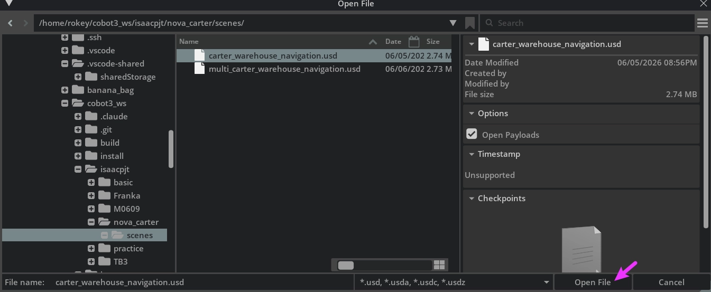

2. Create → Navigation → NavMesh Include Volume. Stage에 NavMeshVolume 추가됨.

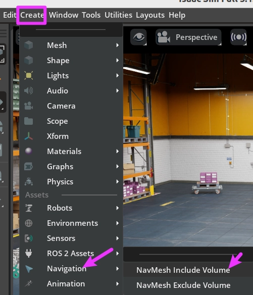

3. NavMeshVolume 선택 → Property → Transform. Translate Y ≈ 11.22(바닥 중심), Scale X=10.0, Y=10.0(바닥 전체).

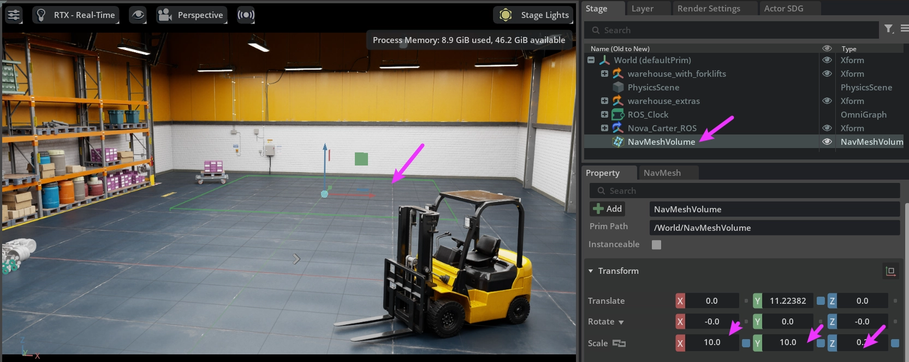

4. NavMesh 패널 → Areas 탭 → Bake. 바닥에 시안색 오버레이가 보이면 성공.

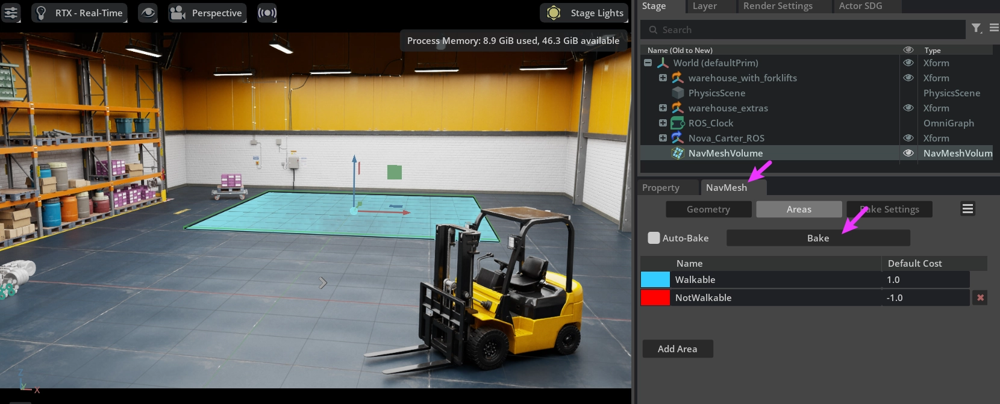

5. File → Save As → `~/cobot3_ws/isaacpjt/nova_carter/scenes/carter_warehouse_people.usd`. 원본을 덮어쓰지 않도록 별도 저장.

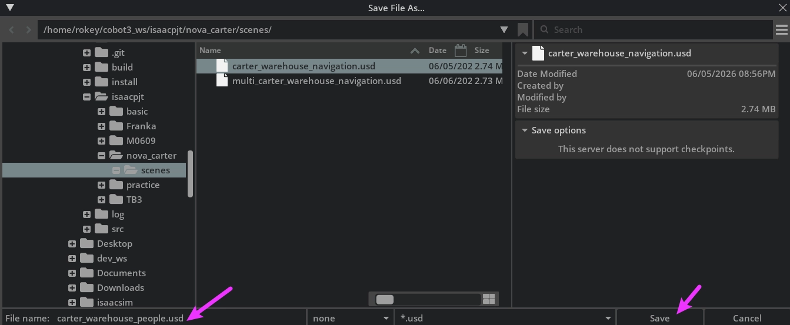

6. Tools → Action and Event Data Generation → Actor SDG.

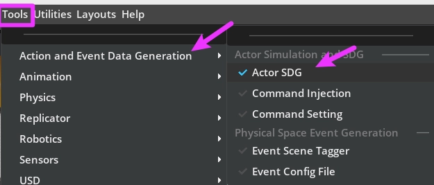

7. SDG Setup: Scene Asset Path = 방금 저장한 people usd, Seed 123456789, Simulation Length 1800 frames(60 s).

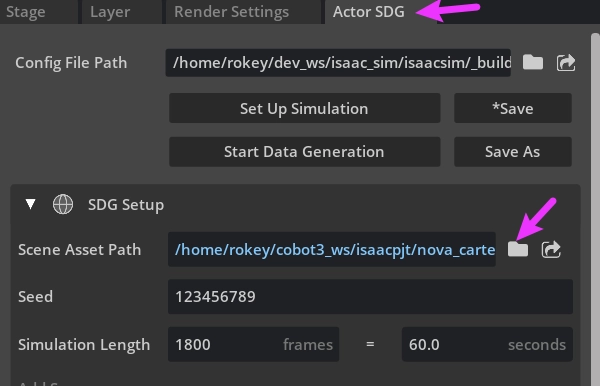

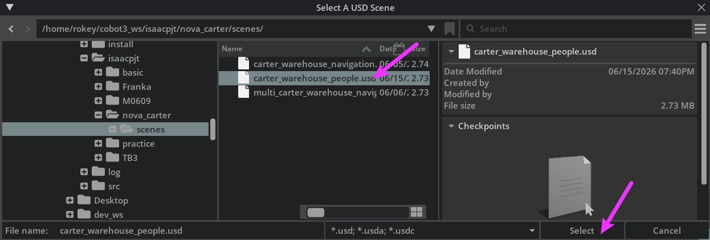

8. Character 섹션: Character Number 1, Character Filter construction(작업복 캐릭터), Spawn Area Walkable.

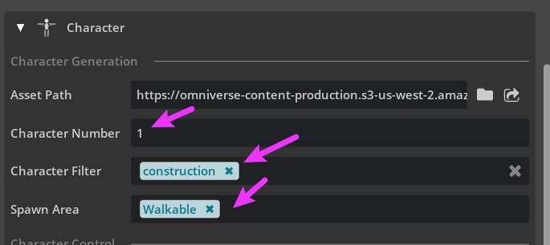

9. Actor SDG 패널 → *Save.

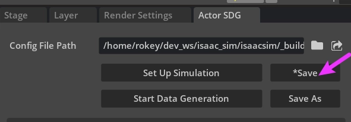

10. Set Up Simulation → 창고 안에 캐릭터 배치.

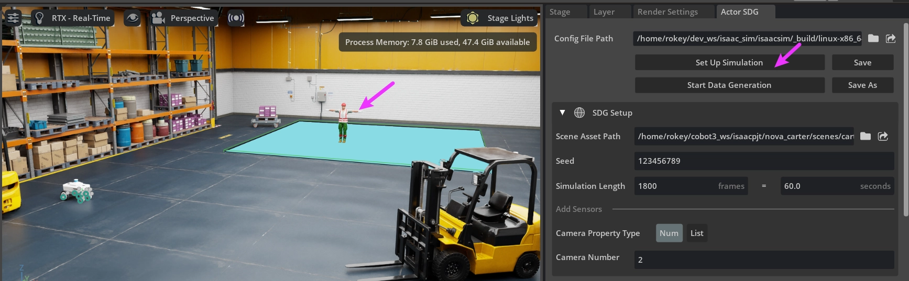

11. Character Control: Command File my_command.txt → Generate Random Commands. GoTo 좌표는 NavMesh 안에서 생성됨.

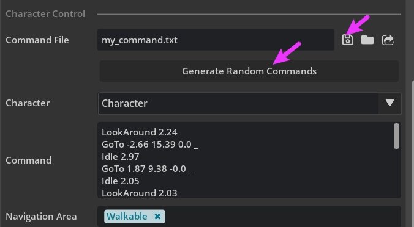

```
LookAround 2.24
GoTo -2.66 15.39 0.0 _
Idle 2.97
GoTo 1.87 9.38 -0.0 _
Idle 2.05
LookAround 2.03
```

12. Start Data Generation 또는 Play(Space). 작업자가 창고 안을 걸어다님.


## Navigation + 사람 감지

- 보행자가 걷는 상태에서 Nova Carter 자율주행을 실행하고 LiDAR가 보행자를 감지·회피하는지 확인.


## 요약 정리

| 단계 | 핵심 작업 | 확인 포인트 |
| --- | --- | --- |
| 1~4 | NavMesh 설정 + Bake | 통로에만 시안색 오버레이 |
| 5 | people usd로 별도 저장 | 원본 유지 |
| 6~9 | Actor SDG + Character(construction) | Spawn Area Walkable |
| 10~12 | Set Up + Command 생성 + 시작 | 작업자가 통로를 걸음 |
| 응용 | navigation + 사람 감지 | LiDAR로 보행자 감지 |
