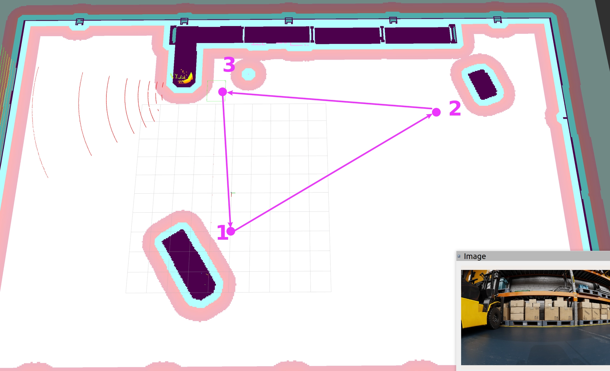

# 경비 로봇 Nova-Carter

- 출처: https://sonmiran9.oopy.io/a12450ef-7c59-8250-be2d-010d4feab381
- 이 페이지는 본문 텍스트 없이 이미지 1장으로 구성됨. 과제 성격의 페이지로 보임.

## 이미지 내용

- Rviz2의 창고 costmap 위에 순찰 경유지 3개(1 → 2 → 3 → 1)가 삼각형 경로로 표시됨. 좌상단 랙 근처에 로봇(LiDAR 스캔 호)이 있고, 우하단에 로봇 전방 카메라 Image 창이 겹쳐 있음.
- 해석: nav_through_pose 또는 follow_waypoints로 경유지를 순환하며 창고를 순찰하고, 카메라 영상을 함께 확인하는 "경비 로봇" 실습 과제.

## 교훈

 - nav_through_pose로 로봇을 함부로 움직이면 꼭지점처럼 뾰족한 경로에서는 로봇이 경로 탐지에 애로사항이 생겨 헛돌 수 있음
 - 각지게 움직이거나 특히 좁은 곳을 왕복하는 경우에는 nav_to_pose를 사용하는게 나을 수 있음
