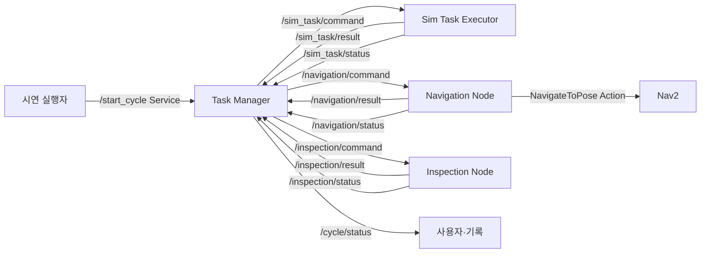

# 인터페이스 설계

관련 이슈·To-do: 인터페이스 설계 (https://app.notion.com/p/3dd0f4c1b9cc80ce93cfc9bcd586ccf6?pvs=21)
기록일: 2026년 9월 16일
날짜: 2026년 9월 16일
담당자: 봉승현
마지막 수정: 2026년 9월 19일 오후 11:49
분야: IsaacSim, ROS2
분류: 설계 결정
생성일: 2026년 9월 16일 오후 7:30
요약: Task Manager와 실행 노드 간 command/result Topic, 공통 메시지, operation별 입력·결과, 오류·QoS·초기화 정책을 정의한 통합 인터페이스 계약
작성 상태: 정리 완료

# 인터페이스 설계 — 통합 시연 기준

> 기준 아키텍처: [시스템 아키텍처](https://app.notion.com/p/3dd0f4c1b9cc80a2a1a2e624fa2f7c2c?pvs=21). 상위 통합 통신은 command/result Topic으로 단순화하고, Navigation Node 내부에서만 Nav2의 NavigateToPose Action을 사용한다. 모든 실행 노드는 한 번에 하나의 명령만 수행한다.
> 

## 1. 통신 원칙

- 시연 시작은 `/start_cycle` Service로 요청한다.
- Task Manager와 Navigation Node, Sim Task Executor, Inspection Node 사이는 `command/result` Topic을 사용한다.
- 실행 중 세부 단계와 준비 여부는 각 Executor의 status Topic으로 발행한다.
- Task Manager는 하나의 terminal result를 받기 전 다음 공정 명령을 보내지 않는다.
- Navigation Node는 내부적으로 `BasicNavigator`와 `NavigateToPose` Action을 사용한다.
- Isaac Sim 내부 ROS 콜백은 명령을 검증·저장하기만 한다. 실제 물리 동작은 Standalone 프레임 루프의 `update(dt)`에서 수행한다.
- 장시간 동작을 Service 콜백이나 Topic 수신 콜백 안에서 블로킹 실행하지 않는다.
- 최초 통합부터 std_msgs/String JSON 대신 `smart_farm_interfaces`의 사용자 정의 메시지를 사용한다.

## 2. 통신 구조



## 3. 인터페이스 목록

| 이름 | 타입 | 송신 → 수신 | 목적 |
| --- | --- | --- | --- |
| `/start_cycle` | smart_farm_interfaces/srv/StartCycle | 실행자 → Task Manager | 시나리오 시작 요청과 수락 |
| `/sim_task/command` | TaskCommand Topic | Task Manager → Sim Task Executor | TRANSFER, PICK_HARVEST, PLACE_INSPECT, CULL, CONVEYOR_OUT 요청 |
| `/sim_task/result` | TaskResult Topic | Sim Task Executor → Task Manager | Sim 작업 최종 성공·실패 결과 |
| `/sim_task/status` | ExecutorStatus Topic | Sim Task Executor → Task Manager·관찰자 | 준비 여부, 실행 중 operation과 내부 phase |
| `/navigation/command` | TaskCommand Topic | Task Manager → Navigation Node | INSPECTION_DOCK 이동 요청 |
| `/navigation/result` | TaskResult Topic | Navigation Node → Task Manager | Nav2 최종 결과와 도착 작업점 |
| `/navigation/status` | ExecutorStatus Topic | Navigation Node → Task Manager·관찰자 | Nav2 준비, 이동 중, 남은 거리 또는 내부 상태 |
| `/inspection/command` | TaskCommand Topic | Task Manager → Inspection Node | 팔레트 슬롯별 검사 요청 |
| `/inspection/result` | TaskResult Topic | Inspection Node → Task Manager | 불량 슬롯과 미판정 슬롯 결과 |
| `/inspection/status` | ExecutorStatus Topic | Inspection Node → Task Manager·관찰자 | 모델 준비, 영상 대기, 추론 중 상태 |
| `/cycle/status` | CycleStatus Topic | Task Manager → 관찰자 | 현재 공정 단계와 사이클 최종 결과 |
| `NavigateToPose` | Nav2 Action | Navigation Node → Nav2 | map 기준 PoseStamped 목표와 주행 결과 |
| `/cmd_vel` | geometry_msgs/Twist | Nav2 → Isaac Sim | Nova Carter 속도 명령 |
| `/tf`, `/tf_static` | tf2_msgs/TFMessage | Isaac Sim·AMCL → Nav2 | map→odom→base_link 및 센서 변환 |
| 오도메트리 | nav_msgs/Odometry | Isaac Sim → Nav2 | Nova Carter 위치·속도 |
| LiDAR | sensor_msgs/LaserScan 또는 PointCloud2 | Isaac Sim → Nav2 | 장애물 인식 |
| 검사 영상 | sensor_msgs/Image | Isaac Sim → Inspection Node | 슬롯별 검사 입력 |
| `/clock` | rosgraph_msgs/Clock | Isaac Sim → 외부 ROS 2 | 시뮬레이션 시간 |

실제 오도메트리, LiDAR, cmd_vel, 카메라 Topic 이름은 최종 장면과 launch 설정에서 확정한다.

## 4. StartCycle.srv

```
string scenario_id
---
bool accepted
string task_id
string reason
```

- 허용 scenario_id: DEMO_HARVEST_01
- accepted=true는 시작 요청이 수락되었음을 의미하며 전체 공정 성공을 의미하지 않는다.
- 이미 사이클이 실행 중이면 accepted=false, reason=BUSY를 반환한다.
- 최종 결과는 /cycle/status에서 확인한다.

## 5. 공통 메시지

### TaskCommand.msg

```
string task_id
string command_id
string operation
string recipe_id
string pallet_id
string source
string destination
string[] target_slots
```

- task_id: 전체 시연 사이클 식별자
- command_id: 개별 공정 명령 식별자
- operation: 실행할 고수준 작업
- recipe_id: Executor 내부 복합 동작 레시피
- pallet_id: 대상 팔레트
- source, destination: 논리 작업점
- target_slots: 솎아내기 대상 식물 슬롯

사용하지 않는 선택 필드는 빈 문자열 또는 빈 배열로 보낸다.

### TaskResult.msg

```
string task_id
string command_id
string operation
string status
string phase
string reason
bool safe_to_navigate
string reached_station
string[] completed_units
string[] defect_slots
string[] unknown_slots
```

- status는 terminal 결과만 표현한다.
- phase는 성공 또는 실패가 확정된 내부 단계다.
- safe_to_navigate는 PICK_HARVEST 결과에서 운송 준비 완료를 나타낸다.
- reached_station은 NAVIGATION 결과에서 사용한다.
- completed_units는 TRANSFER 중 완료된 단위 이동을 기록한다.
- defect_slots와 unknown_slots는 INSPECT 결과에서 사용한다.

### ExecutorStatus.msg

```
string executor
string state
string task_id
string command_id
string operation
string phase
string detail
```

state 값:

- STARTING
- READY
- BUSY
- PAUSED
- ERROR

status Topic은 진행 관찰과 PREFLIGHT에 사용한다. Task Manager의 단계 전이는 status가 아니라 terminal TaskResult를 기준으로 한다.

### CycleStatus.msg

```
string task_id
string scenario_id
string state
string active_command_id
string status
string reason
```

status 값:

- ACCEPTED
- RUNNING
- SUCCEEDED
- FAILED
- TIMEOUT
- RESET_REQUIRED

## 6. 공통 데이터 규칙

### ID

- task_id: TASK-YYYYMMDD-NNN
- command_id: TASK-YYYYMMDD-NNN-CMD-NNN
- pallet_id: PALLET_001, PALLET_002, …
- rack slot: RACK_L1 ~ RACK_L4
- plant slot: SLOT_01 ~ SLOT_08
- navigation station: RACK_DOCK, INSPECTION_DOCK
- pallet station: INSPECT_STATION, PACK_OUT

Task Manager가 task_id와 command_id를 생성한다. 모든 결과는 요청의 두 ID를 그대로 반환해야 한다.

### operation

- TRANSFER
- PICK_HARVEST
- NAVIGATION
- PLACE_INSPECT
- INSPECT
- CULL
- CONVEYOR_OUT

### TaskResult status

- SUCCEEDED
- FAILED
- CANCELED
- TIMEOUT

### 공통 reason 시작값

- NONE
- INVALID_COMMAND
- INVALID_ID
- BUSY
- NOT_READY
- SIM_NOT_READY
- NAV_NOT_READY
- INSPECTION_NOT_READY
- BASE_NOT_STOPPED
- DOCKING_ERROR
- LIFT_FAILED
- MOTION_FAILED
- PICK_VERIFY_FAILED
- PLACE_VERIFY_FAILED
- TRANSPORT_NOT_SAFE
- NAV_FAILED
- IMAGE_TIMEOUT
- INSPECTION_FAILED
- UNKNOWN_SLOT
- CULL_FAILED
- CONVEYOR_FAILED
- RESULT_TIMEOUT
- RESET_REQUIRED

## 7. operation별 계약

| operation | 수신 노드 | 필수 입력 | 성공 결과의 필수 조건 |
| --- | --- | --- | --- |
| TRANSFER | Sim Task Executor | recipe_id=RACK_REARRANGE_01 | L2→L3와 L1→L2 완료, completed_units 2개 |
| PICK_HARVEST | Sim Task Executor | pallet_id=PALLET_004, source=RACK_L4 | safe_to_navigate=true |
| NAVIGATION | Navigation Node | destination=INSPECTION_DOCK | reached_station=INSPECTION_DOCK |
| PLACE_INSPECT | Sim Task Executor | pallet_id=PALLET_004, destination=INSPECT_STATION | VERIFY_PLACE 통과 |
| INSPECT | Inspection Node | pallet_id=PALLET_004 | SLOT_01~SLOT_08 결과, unknown_slots 없음 |
| CULL | Sim Task Executor | pallet_id와 target_slots | 모든 대상 슬롯 제거 확인 |
| CONVEYOR_OUT | Sim Task Executor | pallet_id, destination=PACK_OUT | 출구 감지와 작업 기록 완료 |

INSPECT 결과 defect_slots가 비어 있으면 Task Manager는 CULL 명령을 보내지 않고 CONVEYOR_OUT으로 전이한다.

## 8. 주요 명령 예시

### TRANSFER

```
task_id: TASK-20260919-001
command_id: TASK-20260919-001-CMD-001
operation: TRANSFER
recipe_id: RACK_REARRANGE_01
pallet_id: ""
source: ""
destination: ""
target_slots: []
```

### PICK_HARVEST

```
task_id: TASK-20260919-001
command_id: TASK-20260919-001-CMD-002
operation: PICK_HARVEST
recipe_id: HARVEST_RACK_L4
pallet_id: PALLET_004
source: RACK_L4
destination: CARRY
target_slots: []
```

### INSPECT 결과

```
task_id: TASK-20260919-001
command_id: TASK-20260919-001-CMD-005
operation: INSPECT
status: SUCCEEDED
phase: INSPECTION_COMPLETE
reason: NONE
safe_to_navigate: false
reached_station: ""
completed_units: []
defect_slots: [SLOT_03, SLOT_07]
unknown_slots: []
```

### CULL

```
task_id: TASK-20260919-001
command_id: TASK-20260919-001-CMD-006
operation: CULL
recipe_id: CULL_DEFECT_SLOTS
pallet_id: PALLET_004
source: INSPECT_STATION
destination: INSPECT_STATION
target_slots: [SLOT_03, SLOT_07]
```

## 9. Task Manager 처리 규칙

1. /start_cycle 요청을 수락하면 task_id를 생성하고 PREFLIGHT를 실행한다.
2. 각 명령을 발행할 때 새로운 command_id를 생성하고 active_command로 저장한다.
3. 결과의 task_id, command_id, operation이 active_command와 모두 일치할 때만 처리한다.
4. SUCCEEDED 결과를 수신하면 논리 상태를 갱신하고 다음 단계 명령을 발행한다.
5. FAILED, CANCELED, TIMEOUT 또는 ID 불일치 결과를 수신하면 다음 단계로 진행하지 않는다.
6. 단계별 제한시간을 실제 경과 시간 기준으로 감시한다.
7. TRANSFER, PICK_HARVEST, PLACE_INSPECT, CULL 실패는 물리 상태가 변경되었을 수 있으므로 자동 재시도하지 않는다.
8. INSPECT에서 defect_slots가 비어 있으면 CULL을 생략한다.
9. CONVEYOR_OUT 성공 후 /cycle/status에 SUCCEEDED를 발행한다.

## 10. Executor 처리 규칙

- 하나의 Executor는 한 번에 하나의 명령만 실행한다.
- BUSY 상태에서 새 명령을 받으면 실제 동작을 시작하지 않고 동일 command_id로 FAILED/BUSY 결과를 발행한다.
- 이미 완료한 command_id가 같은 프로세스 실행 중 재수신되면 재실행하지 않고 이전 terminal 결과를 다시 발행한다.
- 지원하지 않는 operation은 FAILED/INVALID_COMMAND로 응답한다.
- 수신 콜백은 명령을 저장하고 즉시 반환한다.
- 실제 동작은 timer 또는 Isaac Sim 프레임 update에서 비동기적으로 진행한다.
- 내부 phase가 바뀌면 status Topic을 갱신한다.
- terminal 결과는 명령마다 정확히 한 번 확정한다.

## 11. Sim Task Executor 내부 phase

### TRANSFER

CHECK_BASE_STOPPED → TRANSFER_UNIT_01/LIFT_TO_PROFILE → ARM_PICK → VERIFY_PICK → ARM_RETRACT → ARM_PLACE → VERIFY_PLACE → ARM_SAFE → TRANSFER_UNIT_02/LIFT_TO_PROFILE → ARM_PICK → VERIFY_PICK → ARM_RETRACT → ARM_PLACE → VERIFY_PLACE → ARM_SAFE → RESULT

각 단위 작업에서 PICK과 PLACE는 같은 리프트 높이에서 수행한다.

### PICK_HARVEST

CHECK_BASE_STOPPED → LIFT_TO_PROFILE → ARM_PICK → VERIFY_PICK → ARM_RETRACT → ARM_TRANSPORT_POSE → LIFT_TO_TRAVEL → VERIFY_TRANSPORT_READY → RESULT

### PLACE_INSPECT

CHECK_BASE_STOPPED → CHECK_INSPECTION_DOCK → LIFT_TO_PROFILE → ARM_PLACE → VERIFY_PLACE → ARM_SAFE → RESULT

### CULL

VALIDATE_TARGET_SLOTS → MOVE_TO_SLOT → REMOVE_DEFECT → VERIFY_REMOVAL → ARM_SAFE → RESULT

### CONVEYOR_OUT

CHECK_PALLET_ON_CONVEYOR → START_CONVEYOR → MONITOR_EXIT → STOP_CONVEYOR → RECORD_CYCLE → RESULT

## 12. Navigation Node 계약

- destination을 stations.yaml의 map 기준 x, y, yaw로 변환한다.
- BasicNavigator.goToPose()로 Nav2 목표를 전송한다.
- navigation command 수신 콜백에서 결과 대기 루프를 실행하지 않는다.
- timer 또는 별도 실행 흐름에서 isTaskComplete()를 확인한다.
- Nav2 TaskResult.SUCCEEDED만 NAVIGATION 성공으로 변환한다.
- 마지막 feedback pose를 최종 도킹 증거로 사용하지 않는다.
- 필요한 경우 /amcl_pose 등 map 기준 추정값으로 도킹 오차를 검증한다.
- /odom을 map 기준 목표와 직접 비교하지 않는다.
- Task Manager가 아닌 Nav2만 /cmd_vel을 발행한다.

## 13. Inspection Node 계약

- INSPECT 명령을 받은 후 해당 task_id와 command_id에 속하는 검사 세션을 시작한다.
- 현재 color_detector는 reference 구현으로만 사용한다.
- 최종 구현은 YOLO 기반 위치 검출과 이상탐지 모델을 결합한다.
- 결과는 SLOT_01~SLOT_08 단위로 생성한다.
- 미검출, 중복 검출, 신뢰도 부족은 정상으로 처리하지 않고 unknown_slots에 포함한다.
- unknown_slots가 하나라도 존재하면 SUCCEEDED를 반환하지 않는다.
- 모델 구현이 바뀌어도 TaskCommand와 TaskResult 계약은 유지한다.

## 14. QoS·시간·준비 정책

- command/result Topic: RELIABLE, KEEP_LAST, depth 10
- status Topic: RELIABLE, TRANSIENT_LOCAL, KEEP_LAST, depth 1
- 검사 영상 Topic: 센서 특성에 맞춰 BEST_EFFORT 사용 가능
- 모든 ROS 2 노드의 use_sim_time 설정을 통일한다.
- Task Manager의 결과 대기 timeout은 시뮬레이션 Pause 중 무한 대기를 방지할 수 있도록 실제 경과 시간 기준으로 관리한다.
- PREFLIGHT는 sim_task, navigation, inspection의 READY 상태를 확인한다.
- 명령 Topic은 수신 준비 전에 발행하지 않는다.

## 15. 실패와 초기화

- 실패 후 Nav2 목표가 남아 있으면 취소하고 정지를 확인한다.
- Sim Task Executor는 팔, 리프트, 컨베이어에 추가 명령을 보내지 않고 안전 정지 또는 현재 위치 유지 상태로 전환한다.
- TRANSFER 중 일부 단위 작업만 완료된 경우 completed_units를 결과에 포함한다.
- 실패 후 Task Manager의 논리 위치와 Isaac Sim 실제 상태가 다를 수 있으므로 중간 재개하지 않는다.
- 모든 Executor가 정지한 뒤 Isaac Sim 장면과 Task Manager 상태를 함께 초기화한다.
- 초기화 후 새로운 task_id로 사이클을 다시 시작한다.

## 16. 통합 검증 항목

1. /start_cycle 수락과 최종 /cycle/status 결과가 구분되는가.
2. PREFLIGHT가 준비되지 않은 Executor를 정확히 탐지하는가.
3. command_id 중복 시 물리 동작이 재실행되지 않는가.
4. TRANSFER 두 단위 작업의 phase와 completed_units가 기록되는가.
5. PICK_HARVEST 성공 전 NAVIGATION이 시작되지 않는가.
6. safe_to_navigate=false이면 이동이 차단되는가.
7. Nav2 성공 후 베이스 정지 검증 없이 PLACE가 시작되지 않는가.
8. 검사 결과가 팔레트와 슬롯 ID에 연결되는가.
9. unknown_slots를 정상으로 처리하지 않는가.
10. 불량이 없을 때 CULL을 안전하게 생략하는가.
11. 컨베이어가 출구 도달 후 정지하는가.
12. 실패·TIMEOUT 후 다음 단계 명령이 발행되지 않는가.