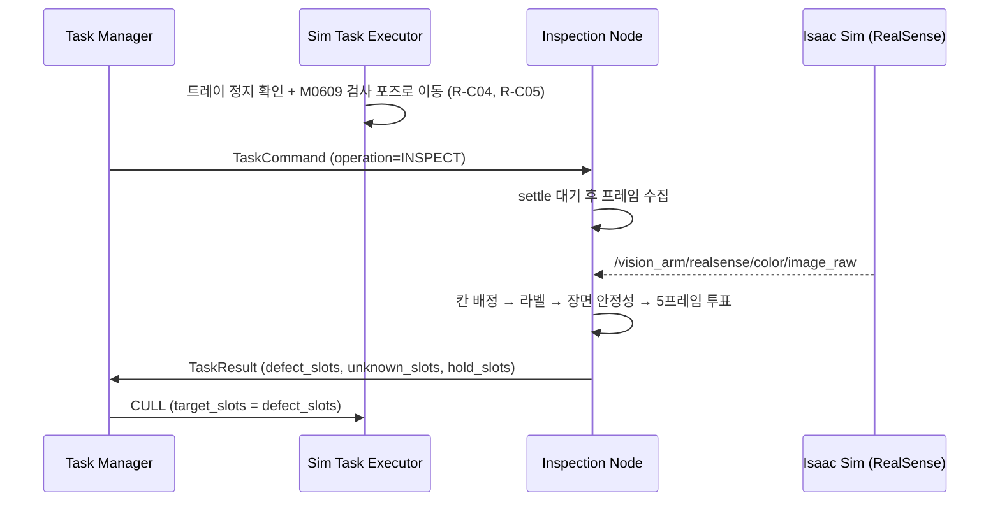

# Inspection Node 설계 정리 (v0.6.1 · 2026-09-22)

> **한 줄 요약:** 비전룸 안 컨베이어에 정지한 6구 트레이를 M0609 손목 RealSense로 찍어, `SLOT_01`~`SLOT_06` 칸별로 정상·불량·보류·미판정을 판정해 Task Manager에 돌려주는 ROS 2 노드입니다.
> **상태:** 로직 자체시험 24/24 통과(v008 기준). **월드가 v011로 바뀌었습니다** — 6구 트레이, 닫힌 비전룸(조명·카메라 포함)이 들어갔습니다. v008용 검사 포즈·슬롯 ROI·/clock 오버레이는 v011에 그대로 쓸 수 없어 **재생성이 필요**합니다 (10장). ROS 통신 시험은 9/23 우분투에서 진행.
> **팀에 부탁드릴 것:** 9장 「팀원별 확인 요청」의 합의 항목 (R-C01~R-C05, D5~D7)

---

## 1. 역할과 범위

- **하는 일:** `INSPECT` 명령을 받으면 트레이 6칸을 모두 검사하고 결과를 1회 발행
- **하지 않는 일:** 팔 이동, 솎아내기(CULL), 트레이 이동. 이것들은 Sim Task Executor·컨베이어 담당
- **검출 모델이 바뀌어도** TaskCommand / TaskResult 계약은 유지 (R-S14)



## 2. 검사 스테이션 (v011 월드 기준)

카메라는 고정 카메라가 아니라 **솎아내기용 M0609 손목의 RealSense D455** (1280x720, fx=634.1, 가로 화각 90.5°). 같은 로봇이 검사와 솎아내기를 모두 합니다. 컬러 카메라 prim: `/World/SmartFarm/Placed/M0609/Asset/onrobot_rg2ft/angle_bracket/realsense_d455/RSD455/Camera_OmniVision_OV9782_Color`

| 항목 | 값 (v011) | 비고 |
|---|---|---|
| 트레이 에셋 | `assets/palette_tray_with_romaine/romaine_pallet_6_v005_inspect.usd` | 랙 팔레트(`romaine_pallet_6_v005.usd`)와 형상 동일, 포기 색·라벨만 다름 |
| 트레이 크기 | **0.252 x 0.552 x 0.080 m**, **2열 x 3행 = 6칸**, 배율 (0.6, 1, 1) | 랙 팔레트와 같은 배율. v008의 0.294 m·8칸·x 0.7에서 변경 |
| 포기 | 6포기, **포기당 1.0 kg**, 트레이 1.0 kg, 데크 위로 약 0.11 m 노출 | 원뿔형 구멍에 39.5 mm 삽입, 조인트·부착 없음 (위로 들면 바로 빠짐) |
| 트레이 정지 위치 | 현재 배치: `Pallet_Inspect` (x +0.004, y −7.000), `Pallet_Inspect_01` (x +0.004, y −6.581), 긴 변 = 벨트 방향 | ⚠️ 받침 중심(−0.672, −7.626)에서 벨트 하류 0.68 m · 벨트 쪽 0.63 m. v008의 「로봇 앞 0.587 m」와 다름 → R-C04 재합의 |
| 검사 포즈 (deg) | ⏳ **재계산 필요** | v008 값 `[88.68, 44.68, 20.77, 0.02, 114.78, -91.58]`은 8구·0.587 m 위치 기준 |
| 카메라 높이 | ⏳ **재계산 필요** | 포기 노출 높이가 0.15 m → 0.11 m로 낮아짐 |
| 화면 여백 | ⏳ **재계산 필요** | 6칸 배치 기준으로 다시 투영 |
| 폐기함 | SortBox_1 = WASTE_BIN_A (중심 x −1.111), SortBox_2 = WASTE_BIN_B (중심 x −0.081) | 위치·크기가 v010에서 바뀜 (받침 중심에서 좌우 0.44 m / 0.59 m). 폐기 자세 재계산 필요 |

기존 촬영 포즈(벨트 낱개 로메인용)는 카메라가 식물 위 약 0.13 m라 한 포기만 보여서, 트레이 전체를 보는 **검사 포즈를 별도로** 만들었습니다. v008용 값의 원본은 `Collected_smartfarm_v008/vision/inspect_station.json`, 생성 스크립트는 `scripts/make_inspect_station.py`. **v011 폴더에는 `vision/inspect_station.json`이 없으므로** v011 기준으로 다시 생성해야 합니다.

### 2.1 비전룸 (v011)

컨베이어 옆에 벽을 둘러 만든 닫힌 촬영 공간입니다. 배경과 조명을 고정해 프레임 간 차이가 피사체에서만 생기게 합니다.

| 항목 | 값 | 비고 |
|---|---|---|
| 크기 | 바깥 **1.870 x 2.518 x 2.512 m**, 안쪽 1.839 x 2.487 x 2.496 m | 벽 두께 15.6 mm. 방 바깥 x −1.558 ~ +0.313, y −8.203 ~ −5.685 |
| 벽 | `BackWall_03`~`BackWall_06` 벽 4장 + `BackWall_07` 천장 | 튀어나온 면 0 mm, 모든 이음새 틈 0 mm, 바닥(z 0)에 밀착. 천장은 벽 위에 얹힘 |
| 컨베이어 통로 | `BackWall_03`(x −1.550), `BackWall_04`(x +0.305)에 **폭 1.19 m x 높이 1.02 m** | 컨베이어 단면 y −7.326 ~ −6.175 + 여유 20 mm, 높이 = 포기 꼭대기(0.96 m) + 60 mm. 충돌체도 구멍 모양 그대로 |
| 방 안 | M0609·받침대, SortBox_1/2, Lettuce 큐브 3개, `Pallet_Inspect`, `Pallet_Inspect_01` | `Pallet_Inspect_02/03`(x +0.606)은 방 밖 하류 대기열 |

**조명** (`smartfarm_v004_visionroom.usd`와 같은 설정)

| 조명 | 설정 |
|---|---|
| 천장 패널 `/World/VisionRoom/Lights/Panel_0` | RectLight 1.729 x 2.188 m (안쪽의 94% x 88%), intensity 9000, normalize 끔, 흰색, 천장 6 cm 아래(z 2.436)에서 아래로 |
| 링 라이트 `.../angle_bracket/vision_ring_light` | DiskLight 반지름 0.055 m, intensity 32000, 색 (1, 0.99, 0.97), 브래킷 아래 5.5 cm. RealSense와 같이 움직임 (팔 그림자 방지) |
| `L1_RectLight_1` | 꺼짐 (방 안에 있던 임시 조명, 천장 패널로 대체) |
| `DomeLight`, `L1_RectLight_2` | **켜 둠** — 농장 전체용. 방이 닫혀 있어 바깥 빛은 컨베이어 통로로만 약간 들어옴 |

**카메라** (모두 방 안, 뷰포트 카메라 목록에서 선택)

| 카메라 | 보는 곳 |
|---|---|
| `/OmniverseKit_Persp` | 씬을 열면 바로 방 안을 보는 기본 시점 |
| `/visionroom` | 방 모서리 높은 곳에서 컨베이어·로봇 전체 (f 14 mm) |
| `/World/VisionRoom/Cameras/M0609_Cam`, `M0609_Front` | 로봇 3/4 시점, 정면 |
| `/World/VisionRoom/Cameras/Inspect_Cam` | 방 안 트레이 2개와 Lettuce 큐브를 위에서 |

> 이 카메라들은 확인·데이터 수집용 관찰 카메라입니다. 노드 입력은 여전히 손목 RealSense(`/vision_arm/realsense/color/image_raw`)입니다.

## 3. ROS 2 인터페이스

| 방향 | 토픽 | 타입 | QoS |
|---|---|---|---|
| 구독 | `/inspection/command` | `smart_farm_interfaces/msg/TaskCommand` | RELIABLE, KEEP_LAST 10 |
| 발행 | `/inspection/result` | `smart_farm_interfaces/msg/TaskResult` | RELIABLE, KEEP_LAST 10 |
| 발행 | `/inspection/status` | `smart_farm_interfaces/msg/ExecutorStatus` | RELIABLE, TRANSIENT_LOCAL, KEEP_LAST 1 |
| 구독 | `/vision_arm/realsense/color/image_raw` | `sensor_msgs/msg/Image` (rgb8 등) | BEST_EFFORT (sensor_data) |
| 발행 | `/inspection/annotated` | `sensor_msgs/msg/Image` (bgr8, 디버그) | RELIABLE, KEEP_LAST 1 |
| 필요 | `/clock` | `rosgraph_msgs/msg/Clock` | use_sim_time=true |

> ⚠️ v008 월드에는 **/clock 발행이 없었습니다.** 비전 노드와 Nav2 모두 시간을 못 받는 문제라 `smartfarm_v008_ros_clock.usda` 오버레이로 `/World/VisionROS`에 Publish Clock 노드를 추가했습니다 (9/23 실행 확인 예정).
> ⚠️ **v011도 마찬가지로 /clock 발행 그래프가 없습니다** (씬 안의 ROS 그래프는 Nova Carter 센서용뿐). v008 오버레이는 v008 파일을 서브레이어로 쓰므로, **v011용 오버레이를 새로 만들어야** 합니다.

**메시지 필드** (노드가 시작할 때 실제 .msg와 자동 대조)
- TaskCommand: `task_id, command_id, operation, recipe_id, pallet_id, source, destination, target_slots`
- TaskResult: `task_id, command_id, operation, status, phase, reason, safe_to_navigate, reached_station, completed_units, defect_slots, unknown_slots`
- TaskResult 추가 요청: `hold_slots` — 없으면 로그·status detail에만 기록 (R-P02)
- ExecutorStatus: `executor, state, task_id, command_id, operation, phase, detail`

**상태 값:** `STARTING` → `READY` (모델·시계·영상 준비 완료) → `BUSY` (phase `COLLECTING_FRAMES`) → `READY` / `ERROR` / `PAUSED`

## 4. 판정 규칙

**클래스 → 판정 (팀 결정 9/21)**

| YOLO 클래스 | 판정 | 결과 목록 | 후속 |
|---|---|---|---|
| `lettuce_dark_green` | 정상 NORMAL | — | 없음 |
| `lettuce_brown` | 불량 DEFECT | `defect_slots` | CULL 대상 |
| `lettuce_yellow` | 보류 HOLD | `hold_slots` | 사이클 계속, CULL 아님 |

**처리 순서**
1. 명령 수신 → 저장만 하고 즉시 반환 (실제 처리는 타이머, R-S08)
2. `settle_sec` 이후 시각의 프레임만 채택 (트레이·팔 정지 대기)
3. 검출 박스를 중심점 기준으로 칸에 배정
4. 칸별 라벨 부여 (아래 표)
5. 장면 안정성 확인: 칸별 박스 중심이 `motion_tol` 이상 움직이면 투표 재시작 (`MOTION_RESET`)
6. 5프레임 다수결 (`vote_ratio` 0.6). 과반 미달·동률은 `SPLIT`
7. unknown이 하나라도 있으면 `SUCCEEDED` 금지 (R-S07)

**칸 라벨**

| 라벨 | 결과 | 의미 |
|---|---|---|
| NORMAL / DEFECT / HOLD | 정상 / 불량 / 보류 | 정상↔보류 엇갈림은 보류로 |
| MISSING | unknown | 칸에 검출 없음 (6칸은 항상 채워져 있으므로 이상) |
| LOWCONF | unknown | `conf_min` 미만 박스만 있음 |
| DUPLICATE | unknown | 한 칸에 분리된 강한 박스 2개 이상 |
| CONFLICT | unknown | 같은 개체에 불량 포함 판정 엇갈림 |
| UNKNOWN_CLASS / OFFCENTER / SPLIT | unknown | 매핑 없는 클래스 / 칸 가장자리 / 투표 분열 |

같은 개체 판정은 IoU가 아니라 **작은 박스 기준 겹침 비율** (`same_object_overlap` 0.6). 큰 포기 안의 잎이 따로 잡힐 때 IoU는 작게 나와 DUPLICATE로 오판되던 문제를 막기 위해서입니다 (v0.5.0).

## 5. 슬롯 매핑 (v011: 6칸)

- 칸 경계는 **실제 카메라 모델로 각 포기를 투영해 계산**한 명시적 ROI 사용 (`mode: explicit`). v008용 `config/inspection_v008.yaml`은 8칸 기준이므로 **v011용 설정(`inspection_v011.yaml`)을 새로 만들어야** 합니다.
- 칸 이름은 트레이 에셋의 포기 이름을 그대로 따릅니다 (R-C01). v0.6.1에서 6구 트레이 포기 이름을 **`Romaine_01`~`Romaine_06`으로 재번호**했습니다 (D7 결정, 기존 05·06·07·08 → 03·04·05·06). 랙용·검사용 에셋과 v011 씬 모두 반영.
- 번호 규칙: **열 우선, 홀수 = 트레이 x −0.125 줄, 짝수 = x +0.125 줄** (현재 배치에서 홀수 줄이 로봇 쪽)
- 배치 (트레이 기준, 긴 변 = 벨트 방향, 현재 `Pallet_Inspect` 방향):

```
            벨트 상류 (−x)                          벨트 하류 (+x)
벨트 건너편  | SLOT_06 | SLOT_04 | SLOT_02 |
로봇 쪽      | SLOT_05 | SLOT_03 | SLOT_01 |
```

| 칸 | 트레이 기준 위치 (x, y) | 기본 에셋 색 (`Pallet_Inspect`) | quality 라벨 | 기대 판정 |
|---|---|---|---|---|
| SLOT_01 | (−0.125, −0.189) | 녹색 | normal | NORMAL |
| SLOT_02 | (+0.125, −0.189) | 노랑 | yellow | HOLD |
| SLOT_03 | (−0.125, 0) | 갈색 | brown | DEFECT |
| SLOT_04 | (+0.125, 0) | 녹색 | normal | NORMAL |
| SLOT_05 | (−0.125, +0.189) | 노랑 | yellow | HOLD |
| SLOT_06 | (+0.125, +0.189) | 녹색 | normal | NORMAL |

(트레이 기준 좌표는 배율 적용 전 에셋 값. 씬에서는 x에 0.6이 곱해지고 Z축 90° 회전)

**v011 씬의 검사용 트레이 4개** (씬에서 파레트별로 색을 바꾼 것 포함, 라벨은 보이는 색과 일치)

| 트레이 | 위치 | 노랑 (HOLD) | 갈색 (DEFECT) | 기대 결과 |
|---|---|---|---|---|
| `Pallet_Inspect` | 방 안 | 02, 05 | 03 | defect [SLOT_03], hold [SLOT_02, SLOT_05] |
| `Pallet_Inspect_01` | 방 안 | 03, 05 | — | defect [], hold [SLOT_03, SLOT_05] |
| `Pallet_Inspect_02` | 방 밖 대기 | 02, 03, 05 | — | defect [], hold [SLOT_02, SLOT_03, SLOT_05] |
| `Pallet_Inspect_03` | 방 밖 대기 | 02, 05 | 03, 06 | defect [SLOT_03, SLOT_06], hold [SLOT_02, SLOT_05] |

- 색은 씬의 Lettuce 큐브와 같은 코드: 노랑 (0.85, 0.72, 0.12), 갈색 (0.38, 0.22, 0.08), 거칠기 0.7
- 각 포기에 `semantics:labels:quality` (normal / yellow / brown)가 있어 Replicator 정답 라벨로 바로 쓸 수 있습니다. 트레이는 `class: pallet`, 포기는 `class: romaine`. **씬에서 포기 색을 바꾸면 이 라벨도 같이 바꿔야** 정답 데이터가 어긋나지 않습니다

> 🔄 **알려진 한계:** 트레이를 180° 돌려 놓으면 칸이 **01↔06, 02↔05, 03↔04로 뒤바뀌어 조용히 오판**됩니다. 배치 방향을 항상 같게 하거나(R-C02) 방향 마커를 도입해야 합니다. 노드에는 방향 마커 확인 기능이 들어 있고 설정으로 켭니다.

## 6. 주요 설정값

| 키 | 기본값 | 뜻 |
|---|---|---|
| `conf_min` | 0.5 | 판정에 쓰는 최소 신뢰도 |
| `conflict_conf` | 0.35 | 이 이상인 다른 클래스 박스가 겹치면 CONFLICT 검토 |
| `frames_required` / `vote_ratio` | 5 / 0.6 | 투표 프레임 수 / 과반 기준 |
| `settle_sec` | 0.5 | 명령 후 이 시각 이후 프레임만 사용 (sim 시간) |
| `motion_tol` | 0.01 | 칸별 박스 중심 허용 변위 (정규화) |
| `session_timeout_sec` | 10.0 | 실제 경과 시간 기준. 초과 시 TIMEOUT / IMAGE_TIMEOUT |
| `image_stale_sec` / `clock_skew_max_sec` | 3.0 / 5.0 | 영상 끊김 / 영상 시각과 노드 시계 차이 한계 |
| `imgsz` / `half` | 640 / true | YOLO 추론 설정 |

시계는 두 가지를 나눠 씁니다: **프레임 유효성은 sim 시간**, **타임아웃은 실제 경과 시간(steady)**. 시뮬레이션이 느려져도 판정이 오염되지 않고, 멈춰도 노드가 무한 대기하지 않게 하기 위해서입니다 (R-S12).

## 7. 진단 코드 (status detail / result reason)

모든 코드에 **원인 후보와 담당**이 붙어 있어, 통합 시험 중 문제가 생기면 로그 한 줄로 누구에게 가야 할지 알 수 있습니다.

**준비·연결 문제 (READY가 안 될 때)**

| 코드 | 원인 후보 | 확인·담당 |
|---|---|---|
| MODEL_LOAD_FAILED | weights 경로, ultralytics 미설치, CUDA | 노드 시작 로그 (비전) |
| CLASS_MAP_MISMATCH | 다른 가중치 장착, class_map 오타 | detail의 목록 (비전) |
| MSG_FIELD_MISMATCH | smart_farm_interfaces 버전 차이·미재빌드 | `--print-contract` vs .msg (인터페이스) |
| QOS_INCOMPATIBLE | 상대 노드 QoS가 R-S11과 다름 | `ros2 topic info -v` (상대 노드) |
| NO_CLOCK | Isaac 미재생, /clock 그래프 없음 | `ros2 topic hz /clock` (Isaac) |
| NO_IMAGE / IMAGE_STALE | 토픽명 불일치, 도메인 ID 차이, 그래프 중단 | `ros2 topic list` (Isaac) |
| ZERO_STAMP / CLOCK_MISMATCH | 카메라가 시간 미기록 / use_sim_time 불일치 | Isaac / 비전 |

**명령 거절 (Task Manager 쪽 확인)**

| 코드 | 뜻 | 규칙 |
|---|---|---|
| BUSY | 결과 전에 새 명령 발행 | R-S02 |
| INVALID_COMMAND | INSPECT 아닌 operation | R-S01 |
| INVALID_ID | ID 형식 위반 | R-S05 |
| INSPECTION_NOT_READY | READY 전 명령 | R-S10 |
| IGNORED_TARGET_SLOTS | INSPECT에 target_slots가 옴 (무시하고 진행) | R-S13 |

**검사 중·결과**

| 코드 | 뜻 |
|---|---|
| MOTION_RESET | 트레이·카메라 움직임으로 투표 재시작 |
| ORIENTATION_CHECK / PALLET_ORIENTATION | 방향 마커 미확인 / 방향 불일치로 실패 |
| IMAGE_TIMEOUT | 시간 내 유효 프레임 부족 (R-P01, 표현 확정 대기) |
| UNKNOWN_SLOT | 미판정 칸 존재 → 로그의 칸별 투표 근거 확인 |
| INSPECTION_FAILED | 트레이 미검출, 디코딩 오류 등 |

## 8. 팀 규칙표

규칙은 노드 코드 안에 표로 들어 있고 `--print-contract`로 출력됩니다.

**R-S 규격 (02-interfaces 문서 기준, 14개)**
- R-S01 INSPECT만 처리 / R-S02 한 번에 한 명령 / R-S03 완료된 command_id 재수신 시 재실행 없이 이전 결과 재발행
- R-S04 결과는 요청의 ID를 그대로 반환 / R-S05 ID 형식 `TASK-YYYYMMDD-NNN`, `{task_id}-CMD-NNN`, `PALLET_NNN`
- R-S06 결과는 칸 단위, 미검출·중복·저신뢰는 unknown / R-S07 unknown 있으면 SUCCEEDED 금지
- R-S08 콜백은 저장만, 처리는 타이머 / R-S09 terminal 결과는 명령당 정확히 1회
- R-S10 READY = 모델·시계·영상 준비 / R-S11 QoS 규격 / R-S12 use_sim_time 통일, 타임아웃은 steady
- R-S13 target_slots는 CULL 전용 / R-S14 모델이 바뀌어도 계약 유지

**R-T 팀 결정 (9/21)**
- R-T01 brown = 불량 / R-T02 yellow = 보류, CULL 아님 / R-T03 dark_green = 정상
- R-T04 검사 트레이 6칸은 항상 채워짐 (빈 칸 = MISSING) — v011에서 8칸 → 6칸
- R-T05 비전 부스 → v011에서는 컨베이어를 감싸는 닫힌 비전룸(바깥 1.870 x 2.518 x 2.512 m, 통로 2곳)으로 구현됨 (2.1절). v008은 1.96 x 2.27 m

**R-P 임시 (확정 대기)**
- R-P01 영상 부족 타임아웃 표현 = TIMEOUT / IMAGE_TIMEOUT
- R-P02 TaskResult에 hold_slots 필드 추가 요청

## 9. 팀원별 확인 요청

| 대상 | 규칙 | 요청 내용 |
|---|---|---|
| **전체** | **D5** | **검사 시나리오 확인:** 규격은 「트레이 전 칸(v011: 6칸) INSPECT → 불량 칸 CULL」, 월드·44번 스크립트는 「벨트 낱개 로메인 분류」. 비전은 규격(트레이)으로 진행 중. 낱개 분류로 가면 노드 출력 구조가 바뀜 |
| 인터페이스 | R-P02 | TaskResult에 `hold_slots` 추가 + 최신 커밋 해시 공유 |
| Sim Task Executor | R-C01 | 칸 번호는 트레이 자체 기준 (`Romaine_0N` = `SLOT_0N`). CULL도 같은 표 사용 |
| PLACE 담당 | R-C02 | 트레이를 항상 같은 방향으로 놓기. 보장 못 하면 방향 마커 도입 |
| 컨베이어 | R-C04 | INSPECT_STATION 정지 위치 **재합의**: v008 기준 「로봇 앞 0.587 m」 ↔ v011 현재 배치 (받침 중심에서 하류 0.68 m, 벨트 쪽 0.63 m). 정지 위치가 정해져야 검사 포즈·ROI를 다시 계산할 수 있음 |
| 전체 | D7 ✅ | **결정 (9/22): 01~06 재번호.** 에셋·v011 씬 반영 완료 (`Romaine_01`~`06` = `SLOT_01`~`06`). **CULL 쪽 칸 표도 같은 번호로 변경 필요** |
| 비전 | — | v011용 재생성: 검사 포즈·ROI(`inspection_v011.yaml`)·`inspect_station.json`·/clock 오버레이 |
| Sim Task Executor | R-C05 | INSPECT 발행 전에 M0609를 검사 포즈에 정지시키기 (관절값은 inspect_station.json) |
| Task Manager | R-S02 등 | 결과 받기 전 새 명령 금지, INSPECT에는 target_slots 비우기 |
| 전체 | D6 | yellow 처리 통일: 44번 스크립트 설명(「yellow도 집어냄」)과 팀 규칙 R-T02(보류)가 다름. 규칙대로면 SortBox 2개가 모두 brown 폐기함(A/B 교대) |

## 10. 검증 현황

| 항목 | 상태 |
|---|---|
| 판정 로직·명령 규칙·시계·QoS 감지 (자체시험) | ✅ 24/24 통과 |
| 검사 포즈·ROI 기하 계산, 새 월드 파일 참조 | ✅ v008 기준 (IK 오차 0 mm, 카메라 위치 오차 0 mm, 참조 누락 0) · ⏳ **v011 기준 재계산 필요** |
| 정답 박스로 판정 사전 확인 | ✅ v008 시험 패턴에서 SLOT_03 = DEFECT, SLOT_06 = HOLD · ⏳ v011 6칸 패턴으로 재확인 필요 |
| v011 월드: 비전룸 벽 조립·통로 | ✅ 튀어나온 면 0 mm, 이음새 틈 0 mm, 벽과 겹치는 물체 없음, 참조 누락 없음 (컨베이어 A08/A49는 v008부터 없던 파일) |
| v011 월드: 트레이를 벨트 위에 놓았을 때 | ✅ 5초 물리: 트레이 0.02 mm, 포기 최대 0.9 mm 이동 (v010 동일 배치에서 확인) |
| v011 월드: 조명·관찰 카메라 렌더 | ✅ 5개 카메라 모두 방 안에서 정상 촬영 |
| 실제 렌더 화면이 계산과 맞는지 | ⏳ v011 포즈·ROI 재계산 후 `45_tray_dataset.py --mode check` |
| best.pt가 트레이에 통하는지 (도메인 차이) | ⏳ 평가셋 채점. v011은 비전룸 조명·6구 트레이라 v008 채점 결과를 그대로 쓸 수 없음 |
| ROS 통신·/clock | ⏳ 9/23 우분투 (v011용 /clock 오버레이 필요) |

> ✅ **v011 시험 트레이의 기대 결과 (정확히):** 기본 트레이 `Pallet_Inspect`는 SLOT_03 갈색, SLOT_02·SLOT_05 노랑이므로 `SUCCEEDED`, `defect_slots: [SLOT_03]`, `hold_slots: [SLOT_02, SLOT_05]`, `unknown_slots: []`. 나머지 트레이 3개의 기대 결과는 5장 표 참고
> (v008 시험 트레이 기준 기대 결과였던 `defect_slots: [SLOT_03]`, `hold_slots: [SLOT_06]`은 8구 트레이 전용)

**best.pt 관련 주의:** 지금 모델은 44번 스크립트 데이터(벨트에 누운 로메인 한 포기)로 학습됐습니다. INSPECT는 트레이에 선 6포기이고, v011에서는 비전룸 조명(천장 패널 + 링 라이트)과 배경까지 바뀌어서, v011 화면으로 채점한 결과로 그대로 쓸지 결정합니다. 재학습하더라도 클래스 순서(`dark_green, yellow, brown`)가 같아 추론 코드는 바뀌지 않습니다. v011 트레이에는 `quality` 라벨이 있어 Replicator로 정답 박스를 자동 생성할 수 있습니다.

## 11. 실행 방법

```bash
# 1) 월드 실행 (검사 포즈 + 시험 트레이 + /clock)
#    v011: D:\Collected_smartfarm_v011\Collected_smartfarm_v011.usd 를 기반으로
#    v011용 inspect_ros 오버레이를 새로 만든 뒤 그 파일을 지정 (아래는 v008 예시)
./run_vision.sh --world smartfarm_v008_inspect_ros.usda

# 2) 노드 실행
python inspection/inspection_node.py --ros-args \
  -p use_sim_time:=true -p config_path:=config/inspection_v008.yaml

# 3) 준비 상태 확인 (READY)
ros2 topic echo /inspection/status --qos-durability transient_local --qos-reliability reliable

# 4) 검사 명령
ros2 topic pub -w 1 --once /inspection/command smart_farm_interfaces/msg/TaskCommand \
  "{task_id: TASK-20260923-001, command_id: TASK-20260923-001-CMD-001, operation: INSPECT, pallet_id: PALLET_004}"

# 기타
python inspection/inspection_node.py --selftest        # ROS 없이 로직 시험
python inspection/inspection_node.py --print-contract  # 토픽·규칙·진단 코드 출력
```

## 12. 관련 파일

- `inspection/inspection_node.py` — 노드 본체 (단일 파일 약 1,500줄)
- `config/inspection_v008.yaml` — v008용 설정 (토픽 + 슬롯 ROI)
- `scripts/make_inspect_station.py` — 검사 포즈·시험 트레이·/clock·ROI 생성 (`--world-only`로 트레이 색·방향만 바꿈)
- `scripts/45_tray_dataset.py` — 검사 포즈 촬영 (check / eval / train)
- `tools/offline_harness.py` — 저장된 사진으로 채점·임계값 탐색·실패 사진첩
- `Collected_smartfarm_v008/vision/inspect_station.json` — 포즈·카메라·ROI·폐기함 자세 원본 (v008 전용)
- `docs/inspect_station.png` — 예상 카메라 화면 (v008 전용)
- **v011 월드:** `D:\Collected_smartfarm_v011\Collected_smartfarm_v011.usd` (공유용 `Collected_smartfarm_v011.zip`)
- **v011 검사용 트레이:** `assets/palette_tray_with_romaine/romaine_pallet_6_v005_inspect.usd` (랙용은 `romaine_pallet_6_v005.usd`)

## 13. 변경 이력

- **v0.6.1 (2026-09-22)** — D7 결정: 6구 트레이 칸 이름 01~06 재번호
  - 포기 이름 `Romaine_05·06·07·08` → `Romaine_03·04·05·06` (랙용·검사용 에셋, v011 씬의 파레트별 설정 모두)
  - 씬에서 바꾼 포기 색과 어긋나 있던 quality 라벨 4곳 수정 (_01의 02·03, _02의 03, _03의 06), 다른 파레트 재질을 가리키던 연결 1곳 정리
  - 검사용 트레이 4개별 기대 결과 추가, 180° 오판 대응표 갱신 (01↔06, 02↔05, 03↔04)
- **v0.6.0 (2026-09-22)** — 월드 v008 → v011 반영
  - 트레이: 8구(0.294 m, x 0.7) → **6구 `romaine_pallet_6_v005_inspect`** (0.252 x 0.552 x 0.080 m, x 0.6), 칸 SLOT_01·02·05·06·07·08, 포기 1.0 kg
  - 비전룸 추가: 벽 4장 + 천장 딱 맞게 조립, 컨베이어 통로 2곳, visionroom 조명(천장 패널 9000 + 링 라이트 32000), 관찰 카메라 5개
  - 시험 트레이 기대 결과: defect [SLOT_05], hold [SLOT_02, SLOT_07]
  - 재생성 필요 항목 표시: 검사 포즈, ROI, inspect_station.json, /clock 오버레이, 폐기 자세 (SortBox 위치 변경)
  - 합의 항목 추가: R-C04 정지 위치 재합의, D7 칸 이름
- v0.5.1 (2026-09-21) — v008 월드 기준 정리
