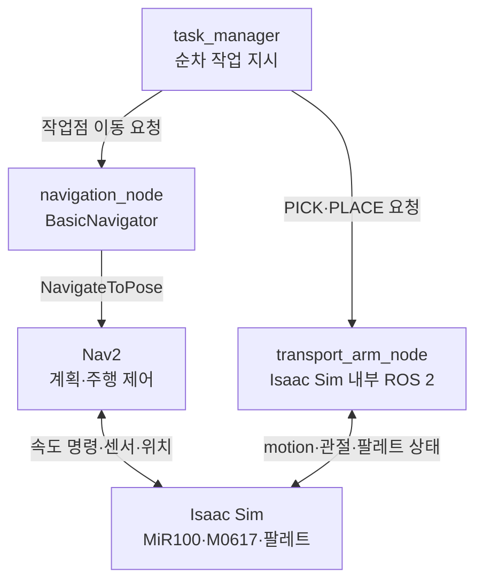

# 시스템 아키텍쳐

관련 이슈·To-do: 시스템 아키텍처 설계 (https://app.notion.com/p/3dd0f4c1b9cc8034930cd8efbb82dad7?pvs=21), SRD(시스템 요구서) 작성 (https://app.notion.com/p/SRD-3dc0f4c1b9cc80a38a4afab70d873348?pvs=21)
기록일: 2026년 9월 16일
날짜: 2026년 9월 16일
담당자: 봉승현
마지막 수정: 2026년 9월 19일 오전 9:39
분야: IsaacSim, ROS2
분류: 설계 결정
생성일: 2026년 9월 16일 오후 7:30
작성 상태: 작성 중

# 시스템 아키텍쳐

> **1차 MVP 기준:** 식물 팔레트를 단위로 MiR100·M0617이 랙과 인계 구간 사이를 순차 이동한다. 이동은 외부 ROS 2의 Nav2, 팔 제어는 Isaac Sim 내부 ROS 2 노드에서 수행한다. DB·팔레트 TF·별도 sim_adapter는 사용하지 않는다. 인터페이스 상세는 [인터페이스 설계](https://app.notion.com/p/3dd0f4c1b9cc801ba5eac9e5c6623d8d?pvs=21)를 참조한다.
> 

## 1. 범위와 용어

**식물 팔레트 및 슬롯 정의**

- **운반 단위**: 식물 8개체를 고정 슬롯에 싣고 포크로 이동하는 단위
- **논리 ID (ROS 계약)**: `PALLET_01` ~ `PALLET_04`, `PALLET_SEED`
- **식물 슬롯 ID**: `SLOT_01` ~ `SLOT_08`
- **Prim 경로 예시**: `/World/PlantPallets/PALLET_01` (명명 규칙 통일)

**고정 작업점 (Workstations)**

- **작업점 목록**: `RACK_L1`, `RACK_L2`, `RACK_L3`, `RACK_L4`, `SEED_PICKUP`, `INSPECT_ZONE`
- **좌표 확정**: 실제 `map` 좌표 및 팔 자세는 장면·도킹 시험 후 정립

**이동형 운반 설비 구성**

- **하드웨어 구성**: MiR100 + M0617 + 팔레트 전용 포크
- **운반 메커니즘**: `PICK` 완료 후 운송 자세로 팔레트를 지지하며 이동

**반출 인계 및 공정 이송**

- **반출 구간**: `INSPECT_ZONE` 내 정지 인계 구간
- **시퀀스**: M0617이 수확 팔레트 `PLACE` 후 포크 이탈 → 장면 내부 이송 동작으로 컨베이어 전달

**1차 MVP 제외 범위 (Out of Scope)**

- 데이터베이스(DB)
- 팔레트 위치 및 TF Topic 발행
- 별도 시뮬레이션 어댑터 (`sim_adapter`)
- `conveyor_node`
- M0609 검사 및 비전 판정
- 수경재배 수로 및 양액 제어

## 2. 전체 시스템 구조



- `task_manager`: 수확 팔레트 반출과 L2→L1·L3→L2·L4→L3·SEED_PICKUP→L4를 순차 지시한다. 하나의 결과를 받기 전 다음 작업을 지시하지 않는다. 초기 구현은 순차 흐름, 상태 머신은 후속 고도화다.
- `navigation_node`: Isaac Sim 외부에서 실행. 작업점 이름을 `map` 좌표의 `(x, y, yaw)`로 매핑하고 `BasicNavigator.goToPose()`로 Nav2에 목표를 준다. Nav2의 결과를 작업 결과로 변환한다. 직접 경로를 계산하거나 `/mir100/cmd_vel`을 발행하지 않는다.
- Nav2: 외부 ROS 2 스택. 지도·위치 추정·주행 센서 및 로봇 TF를 받아 계획하고, 속도 명령으로 MiR100을 움직인다. 최초 구현에서는 고정 지도와 초기 자세를 사용한다.
- `transport_arm_node`: Isaac Sim 프로세스에서 실행하는 ROS 2 노드. 고수준 PICK/PLACE 요청을 수신해 내부 `motion`을 프레임별로 진행한다. `motion`은 M0617 articulation에 `apply_action()`을 적용하고 `get_joint_positions()`로 현재값을 읽는다. 외부 관절 명령·관절 상태 Topic을 1차 필수 인터페이스로 두지 않는다.
- Isaac Sim 장면: 물리·센서·MiR100 주행 연결, 팔레트 초기 배치 및 장면 내부 컨베이어 운송을 담당한다. 추가 ROS 시뮬레이션 어댑터 노드를 두지 않는다.

### 2.1 노드별 입출력

| 구성 | 입력 | 처리 | 출력 |
| --- | --- | --- | --- |
| `task_manager` | 시작 요청, 각 이동·팔 작업 결과 | 고정 순서 진행, 요청 식별자 대조, 오류 시 중단 | 이동·PICK/PLACE 작업 명령, 전체 결과 로그 |
| `navigation_node` | command_id, task_id, destination | 고정 작업점 좌표 변환 → BasicNavigator 목표 전송·결과 확인 | 동일 ID의 이동 성공·실패 결과 |
| Nav2 | 목표 PoseStamped, 지도·TF·오도메트리·센서 | 경로 계획과 속도 제어 | NavigateToPose 피드백·결과, MiR100 속도 명령 |
| `transport_arm_node` | command_id, task_id, pallet_id, PICK/PLACE, station | motion으로 팔 관절 제어·동작 완료 판정 | 동일 ID의 팔 작업 성공·실패 결과 |
| Isaac Sim 장면 | Nav2 속도 명령, 내부 팔 제어 | 물리 장면·센서·컨베이어 동작 | Nav2용 로봇 정보; 내부 M0617 관절·팔레트 상태 |

### 2.2 컨베이어

M0617은 움직이는 벨트 대신 `INSPECT_ZONE`의 정지 인계 구간에 수확 팔레트를 내려놓고 포크를 뺀다. 장면 내부 동작이 팔레트를 벨트로 옮긴 뒤 화면 밖으로 운송한다. `task_manager`의 완료 판정은 인계 구간 PLACE까지이며, 벨트 출구 통과를 추적하지 않는다. 장면 내부 이동이 물리적 접촉인지 스크립트 이동인지 시험 기록에 구분한다.

## 3. 1차 작업 흐름

각 팔레트에 대해 **출발지 이동 → PICK·운송 자세 → 목적지 이동 → PLACE·안전 자세**를 수행한다. 다음 순서로 한 팔레트씩 처리한다.

1. `PALLET_01`: `RACK_L1` → `INSPECT_ZONE` 수확 팔레트 인계.
2. `PALLET_02`: `RACK_L2` → `RACK_L1`.
3. `PALLET_03`: `RACK_L3` → `RACK_L2`.
4. `PALLET_04`: `RACK_L4` → `RACK_L3`.
5. `PALLET_SEED`: `SEED_PICKUP` → `RACK_L4`.

`navigation_node`의 이동 성공 후에만 팔 명령을 보낸다. PICK의 운송 자세가 완료된 뒤에만 목적지 이동을 지시한다. 운반 중 포크 지지·파지의 안정성은 별도 물리 시험으로 확인한다. 불안정하면 MiR100 위 적재 위치에 내려놓고 다시 집는 절차를 추가해야 하며, 이는 현재 MVP 시퀀스에 포함되지 않는다.

## 4. ROS 2 인터페이스 요약

| 구간 | 방법 | 데이터 |
| --- | --- | --- |
| 시작 → task_manager | `/start_cycle` Service | scenario_id → accepted, task_id, reason; 수락은 전체 완료가 아님 |
| task_manager ↔ navigation_node | `/navigation/command`, `/navigation/result` Topic | command_id, task_id, destination → status, reason |
| task_manager ↔ transport_arm_node | `/transport_arm/command`, `/transport_arm/result` Topic | command_id, task_id, pallet_id, operation, station → status, reason |
| navigation_node ↔ Nav2 | BasicNavigator 내부 NavigateToPose Action | map 기준 목표 PoseStamped → 수락·피드백·결과 |
| Nav2 ↔ Isaac Sim | ROS 2 Bridge 및 장면 제어 그래프 | 속도 명령; /clock, 지도·위치 추정용 TF, 오도메트리·주행 센서 |
| transport_arm_node ↔ M0617 | Isaac Sim 내부 Python API | motion 계산·apply_action(); get_joint_positions() 및 필요 시 팔레트 prim 조회 |

작업 명령·결과 Topic은 1차에 `std_msgs/msg/String`의 JSON으로 시작하는 제안이다. 각 요청의 `command_id`를 결과에 되돌리고 한 번에 한 요청만 실행한다. 필드가 안정되면 사용자 정의 ROS 메시지로 바꿀 수 있다. Nav2 주행용 TF와 팔레트 TF는 서로 다르며, 팔레트 TF 제외가 Nav2 TF 제외를 뜻하지 않는다.

## 5. Isaac Sim 연동 및 성공 기준

### **이동 완료 및 위치 검증**

- **1차 판단 조건**: Nav2의 `TaskResult.SUCCEEDED` 수신
- **도킹 오차 확인**: `/amcl_pose` 등 지도(map) 기준 추정 위치로 별도 확인
- **주의 사항**:
    - `/odom`과 map 기준 고정 작업점 직접 비교 금지
    - 마지막 피드백 Pose는 최종 위치의 독립적 증거로 사용 불가

### **팔 동작 및 파지·안착 검증**

- **동작 완료 기준**: 내부 관절값 및 TCP 목표 수렴
- **물리적 파지·안착 확인**:
    - `PICK`(팔레트 들림) 및 `PLACE`(실제 안착)는 팔레트 prim 위치 등 내부 정보를 통한 제한적 자동 확인 또는 장면 시각 관찰로 별도 기록
    - *주의*: 관절 목표 도달만으로 실제 물리적 파지 성공을 보증하지 않음

### **이동형 베이스(MiR100 + M0617) 자세 반영**

- **베이스 자세 갱신**: M0617은 이동형이므로 도킹 완료 후 현재 팔 베이스 자세 갱신 필수
- **목표 좌표 일치**: 베이스 자세 갱신 후 작업점 목표 좌표와 일치 작업 수행

### **시험용 시작값 (성능 기준 미확정)**

- **초기 임시 설정값**:
    - 도킹 오차: 위치 5 cm / 방향 5°
    - 정지 시간: 0.5초
    - 관절 오차: 0.03 rad
- **추후 확정 사항**: 제한시간 및 최종 성공 판정 기준은 실측 및 장면 시험 후 확정

### **상태 데이터 관리 제약**

- **1차 제외 Topic**: 팔레트 TF·위치 Topic, 랙 점유 Topic 미발행
- **`task_manager` 메모리 관리**:
    - 명령 성공 결과에 기반해 기대 위치만 메모리에 갱신
    - 실제 측정 위치와 엄격히 구분하여 기록

## 6. 실행·초기화·검증

### **시스템 복원 및 환경 설정**

- **장면 복원**: 고정 장면 및 팔레트·로봇 초기 자세 복원
- **동력 및 통신**: MiR100 구동, 센서, ROS 2 Bridge 활성화

### **Nav2 및 주행 환경 검증**

- **연결성 확인**: 지도, 위치 추정, Nav2 실행 후 `/clock`, 지도, `/tf`, `/odom`, 주행 센서, 속도 명령 연결 확인
- **시간 동기화**: 모든 ROS 2 노드의 `use_sim_time` (시뮬레이션 시간) 일치 필수

### **노드 준비 및 제어 흐름**

- **노드 실행 순서**: `navigation_node` 및 Isaac Sim 내부 `transport_arm_node` 준비 후 `task_manager` 시작
- **명령 연결**: 수신자 노드 준비 완료 확인 후 작업 명령 전송

### **시험 절차 및 통합 순환**

- **단위 시험**: MiR100 이동 및 M0617 `PICK`/`PLACE` 개별 단독 시험
- **공정 연결**: 수확 팔레트 인계부터 4단 랙 순환 작업까지 통합 연결 실행

### **반복 검증 및 기록**

- **조건**: 동일한 초기 장면 환경에서 반복 시험 수행
- **기록 분리**: ROS 2 단계별 수행 결과와 실제 물리적 팔레트 배치·낙하 여부를 구분하여 기록

### **에러 핸들링 및 상태 재설정**

- **복구 절차**: 중단 또는 실패 발생 시 시뮬레이션 장면과 `task_manager` 메모리 상태를 동시에 재설정
- **제약 사항**: 1차 범위 내 중간 자동 재개 기능 미구현 (수동 초기화 후 재시험)

## 7. 2차 목표

### **노드별 역할 및 기능 (`inspection_arm_node` & `vision_node`)**

- **`inspection_arm_node`**:
    - M0609 로봇 팔의 검사 자세 제어
    - 검사 결과에 따른 불량 개체 작업 수행
- **`vision_node`**:
    - 카메라 영상 기반 팔레트 내 8개 슬롯 식물 검출
    - 색상 기반 식물 상태/품질 분류
    - **예외 처리**: 미검출 슬롯 발생 시 절대로 '정상'으로 처리하지 않음

### **공정 시퀀스 및 제어 연동 (2차 설계 범위)**

- **연계 공정**: 수확 팔레트 인계 → 정지 상태 내 검사 및 개체 작업 → 벨트 진입
- **상태 제어**: 검사 결과 데이터 저장 방식 및 컨베이어 상태 제어 로직 확정

## 8. 확정 전 확인

### **장면·구동 및 Nav2 환경 구축**

- **MiR100 연결**: 속도 입력(Cmd Vel), 로봇 TF, 오도메트리, LiDAR 센서 연결 활성화
- **주행 파이프라인**: 지도(map) 로드, 위치 추정(AMCL) 설정 후 Nav2 파이프라인 시작
- **시간 동기화**: ROS 2 노드 및 시뮬레이션 환경 간 `use_sim_time` 동기화

### **작업점 및 M0609 팔 제어 설정**

- **작업점 확정**: 실제 `map` 좌표 및 팔 목표 자세(TCP Target) 장면 시험 후 확정
- **M0609 설정**: URDF 모델 로드 및 RMPflow 컨트롤러 연결
- **베이스 자세 갱신**: MiR100 주행·도킹 완료 후 M0617의 현재 베이스 위치/자세 실시간 갱신

### **물리 검증 및 완료 기준**

- **운반 안정성**: 이동 중 팔레트 이탈·흔들림 검증
- **PICK/PLACE 물리 성공 기준**:
    - 단순 관절 도달 외 실제 팔레트 들림(`PICK`) 및 안착(`PLACE`) 물리 상태 검증
    - 작업 단위별 제한시간(Timeout) 설정 및 적용

### **통신 및 상태 관리 정책**

- **`/start_cycle` 처리**: 수락 응답(`accepted=true`)과 최종 공정 결과 로그를 엄격히 분리하여 관리
- **Topic 명령 제약**:
    - 중복 명령 수신 시 `BUSY` / `FAILED` 처리
    - 응답 지연 시 `TIMEOUT` 정책 적용

### **단계별 구현 순서**

1. 장면 · 지도 · 센서 설정
2. Nav2 이동 단독 시험
3. M0617 내부 `PICK`/`PLACE` 단독 시험
4. 운반 중 안정성 검증
5. 수확 팔레트 인계 구현
6. 4단 랙 순환 공정 완성
7. 반복 시험 및 결과 기록
8. 컨베이어 연동 시연

### **개발 및 구현 참고 요소**

- **Nav2**: `BasicNavigator` API 활용
- **매니퓰레이터**: 기존 M0609 `PICK`/`PLACE` Reference Code 참조
- **시뮬레이터 연동**: Isaac Sim Nav2 integration 구조 준용

---

디렉토리 구성

```
ROKEY_P3_A1/
├── README.md
├── docs/
│   ├── 01-architecture.md
│   ├── 02-interfaces.md
│   └── 03-integration-test.md
│
└── cobot3_ws/
    ├── src/                              # ROS 2 패키지
    │   ├── smart_farm_interfaces/
    │   │   ├── srv/StartCycle.srv
    │   │   ├── CONTRACT.md
    │   │   ├── CMakeLists.txt
    │   │   └── package.xml
    │   ├── smart_farm_task/              # 추가: 외부 ROS 2
    │   │   └── smart_farm_task/
    │   │       ├── task_manager.py
    │   │       └── protocol.py
    │   ├── smart_farm_navigation/        # 추가: 외부 ROS 2
    │   │   ├── smart_farm_navigation/
    │   │   │   └── navigation_node.py
    │   │   ├── config/stations.yaml
    │   │   ├── config/nav2_params.yaml
    │   │   ├── maps/
    │   │   └── launch/
    │   ├── color_vision/                 # feature/urdf 기존 코드; 2차 활용 검토
    │   └── nova_carter/                  # feature/urdf 기존 Nav2 참고 코드
    │
    └── isaacpjt/                         # Isaac Sim 실행 코드·에셋
        ├── smart_farm/                   # 추가: 이번 프로젝트의 통합 실행 위치
        │   ├── assets/                   # 로봇·포크 USD/URDF
        │   ├── scenes/
        │   ├── config/                   # 랙 PICK 자세 등 장면 설정
        │   └── scripts/                  # Isaac Sim 단독 실행·검증 스크립트
        ├── M0609/                        # 기존 로봇 모델·제어 참고 자료
        └── basic/                        # Isaac Sim 학습 예제
```